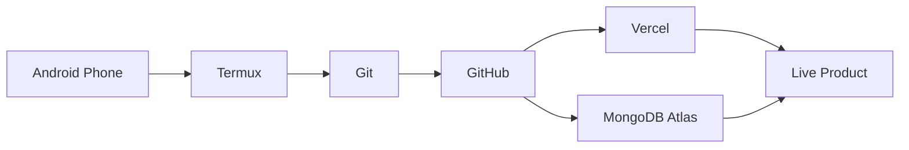

<!--
README.md for GitHub Profile: Manashjyoti-Bora/Manashjyoti-Bora
Ready to paste directly into your profile README.md
-->

<div align="center">


<a href="https://git.io/typing-svg">
  
</a>

<br />


<br /><br />

<a href="https://manashjyoti-bora.vercel.app"></a>
<a href="https://www.linkedin.com/in/manashjyoti-bora-323b97405"></a>
<a href="mailto:manashjyotibora122@gmail.com"></a>

</div>

---

## `$ whoami`

```bash
manashjyoti@android-cloud:~$ whoami
Security-aware Full Stack Developer

manashjyoti@android-cloud:~$ mission
Build production-style web apps with clean UI, secure auth, real product logic,
responsive dashboards, cloud deployment and recruiter-ready engineering proof.

manashjyoti@android-cloud:~$ current_status
Open to Web Developer / Frontend Developer / Full Stack Developer internships and junior roles.
```

I’m **Manashjyoti Bora**, a Full Stack Software Developer focused on building **secure, polished and production-style web applications** with **React, Next.js, TypeScript, Node.js and MongoDB**.

My edge is simple: I build like a product engineer, think like a security-aware developer, and execute with an uncommon **Android-to-Cloud workflow** using **Termux, Git, GitHub, Vercel and MongoDB Atlas**.

---

## `~/core_identity`

<table>
<tr>
<td width="50%">

### 🧬 Engineering DNA

- Full-stack product engineering
- Security-aware authentication
- Responsive dashboard interfaces
- Clean component architecture
- Server-side validation and business logic
- Deployed, reviewable, recruiter-ready apps
- Android-first development workflow

</td>
<td width="50%">

### ⚡ Current Focus

- Next.js App Router
- TypeScript-first frontend systems
- MongoDB-backed full-stack apps
- JWT + HTTP-only cookie auth
- Admin dashboards and protected routes
- Premium portfolio and personal branding
- Internship / junior developer opportunities

</td>
</tr>
</table>

---

## `~/featured_projects --production-style`

<table>
<tr>
<td width="50%" valign="top">

## 🛒 NexusMart

**Secure full-stack e-commerce platform with real auth, MongoDB persistence, admin controls and server-validated checkout.**

<a href="https://nexusmart-dusky.vercel.app"></a>
<a href="https://github.com/Manashjyoti-Bora/nexusmart"></a>

**Stack:** Next.js, TypeScript, MongoDB Atlas, JWT, bcrypt, Zod, Tailwind CSS

**Built with:**
- Secure signup/login using bcrypt
- JWT sessions in HTTP-only cookies
- Cart, checkout and order history
- Server-computed order totals
- Role-gated admin panel
- Zod validation on client and server
- Security headers and rate-limited login protection

</td>
<td width="50%" valign="top">

## 🌌 Portfolio Platform

**Cinematic developer platform blending motion design, 3D, AI, command palette and security-aware architecture.**

<a href="https://manashjyoti-bora.vercel.app"></a>
<a href="https://github.com/Manashjyoti-Bora/portfolio-website"></a>

**Stack:** Next.js 14, TypeScript, Tailwind CSS, GSAP, Framer Motion, Three.js

**Built with:**
- Cinematic animations and scroll storytelling
- Lazy-loaded 3D scene
- Command palette and terminal interactions
- AI concierge chatbot
- Live GitHub dashboard
- SEO, accessibility and security headers

</td>
</tr>
<tr>
<td width="50%" valign="top">

## 💼 DevHire Pro ATS

**HR-tech dashboard with real-time job filtering and visual application pipeline tracking.**

<a href="https://github.com/Manashjyoti-Bora/devhire-pro-ats"></a>

**Stack:** React, Vite, JavaScript, CSS

**Built with:**
- Real-time keyword, skill and location filtering
- Memoized rendering for smooth interactions
- Application pipeline tracker
- Glassmorphic light/dark dashboard UI
- Fully responsive layout
- Pure filter logic for predictable behavior

</td>
<td width="50%" valign="top">

## 📌 TaskFlow Enterprise

**Agile Kanban workflow system with priority tagging, centralized state and sprint-style task visibility.**

<a href="https://github.com/Manashjyoti-Bora/taskflow-enterprise"></a>

**Stack:** React, JavaScript, CSS, Centralized State

**Built with:**
- Dynamic To Do → In Progress → Done workflow
- Priority tagging with visual indicators
- Centralized task movement state
- Sprint-style progress visibility
- Professional responsive dark dashboard
- Workflow-first data modeling

</td>
</tr>
</table>

---

## `~/tech_stack --active`

<div align="center">

### Frontend


### Backend / Database / Auth


### Tools / Cloud / Workflow


</div>

---

## `~/security_mindset`

```ts
const engineeringMindset = {
  authentication: ["bcrypt password hashing", "JWT sessions", "HTTP-only cookies"],
  validation: ["Zod schemas", "server-side validation", "safe mutations"],
  authorization: ["protected routes", "role-gated admin panels", "server redirects"],
  dataIntegrity: ["server-computed totals", "never trust client input"],
  frontend: ["responsive UI", "accessibility", "reduced-motion support"],
  deployment: ["Vercel", "GitHub", "MongoDB Atlas", "environment variables"],
  philosophy: "Build products that look premium, behave reliably and fail safely."
};
```

---

## `~/android_to_cloud_workflow`



> I build, version-control and deploy projects from an Android-first workflow. The stack may be lightweight, but the execution is serious: Git, GitHub, Vercel, MongoDB Atlas and production-style documentation.

---

## `~/github_signal`

<div align="center">


<br /><br />


</div>

---

## `~/recruiter_summary`

```text
I build projects that demonstrate real product engineering, not just UI cloning.

NexusMart proves full-stack auth, database persistence, checkout logic, validation and admin authorization.
DevHire Pro proves dashboard UX, real-time filtering and performance-conscious rendering.
TaskFlow proves workflow modeling, centralized state and responsive productivity UI.
My portfolio proves motion design, frontend architecture, SEO, accessibility and deployment polish.
```

---

## `sudo hire-me`

```bash
$ sudo hire-me --role="Frontend / Full Stack Intern / Junior Developer"

[✓] React / Next.js product development
[✓] TypeScript-first mindset
[✓] Secure authentication patterns
[✓] MongoDB-backed applications
[✓] Responsive dashboard interfaces
[✓] GitHub + Vercel deployment workflow
[✓] Fast learner with uncommon Android-to-Cloud execution

status: ready_to_contribute
```

---

## `~/connect`

<div align="center">

<a href="https://manashjyoti-bora.vercel.app"></a>
<a href="https://github.com/Manashjyoti-Bora"></a>
<a href="https://www.linkedin.com/in/manashjyoti-bora-323b97405"></a>
<a href="mailto:manashjyotibora122@gmail.com"></a>

<br /><br />


</div>
