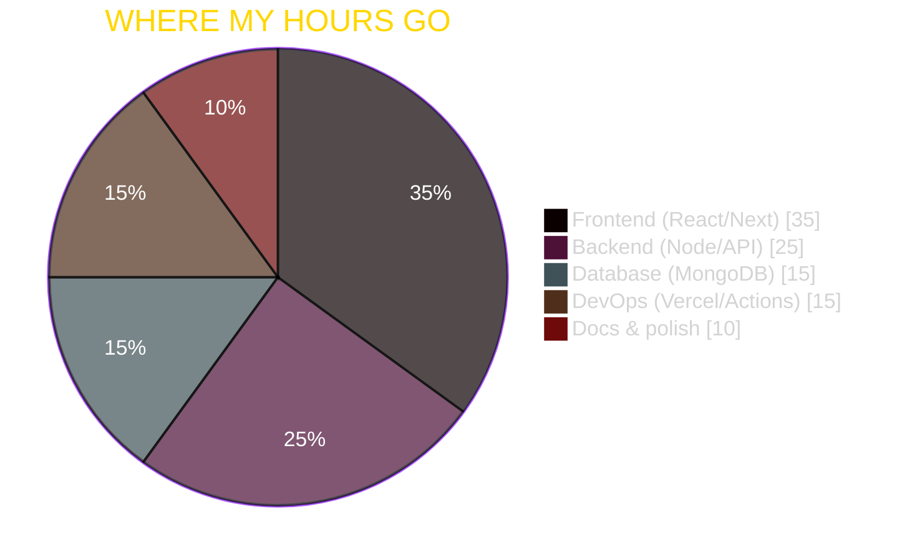
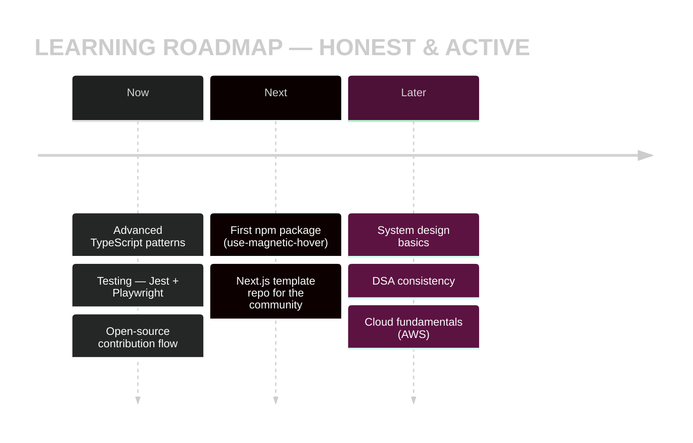
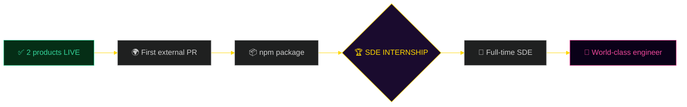
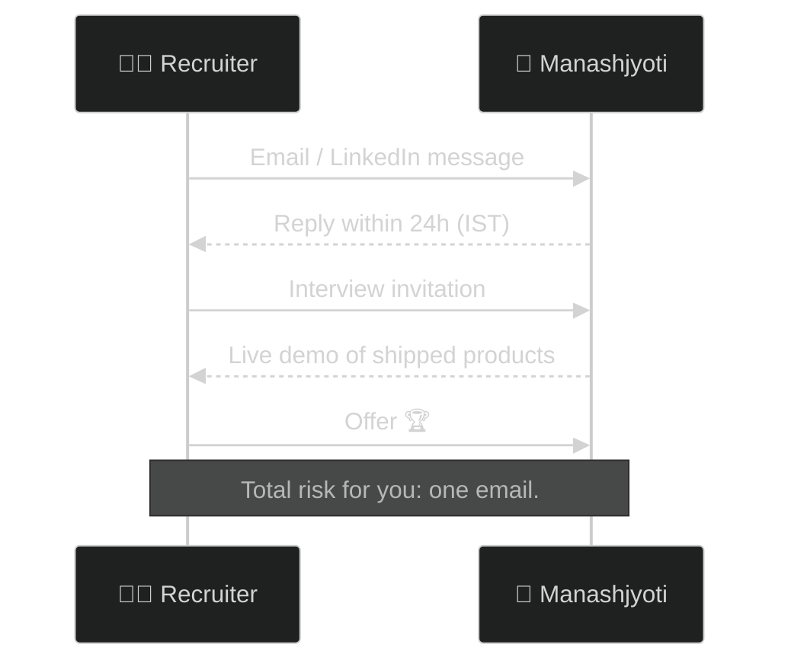

<div align="center">

<!-- ══════════════════════════════════════════════════════════════════ -->
<!--  THE MASTERPIECE · 24 SECTIONS · 210-ELEMENT FUSION · ONE OF ONE    -->
<!--  Every rare README element that can honestly live on a profile     -->
<!--  is in this file. Built 100% on an Android phone. Zero fakes.      -->
<!--  (Yes, even this comment is element #196: README for the README)   -->
<!-- ══════════════════════════════════════════════════════════════════ -->

<!-- ═══ 01 · HERO SECTION ═══ -->


<!-- 🪄 THEME-AWARE MAGIC BANNER (element #81/#83) — changes with YOUR GitHub theme -->
<picture>
  <source media="(prefers-color-scheme: dark)" srcset="https://capsule-render.vercel.app/api?type=blur&height=120&text=WORLD%20RAREST%20README&fontSize=36&color=0:a855f7,100:ffd700&fontColor=ffffff&animation=twinkling">
  <source media="(prefers-color-scheme: light)" srcset="https://capsule-render.vercel.app/api?type=blur&height=120&text=WORLD%20RAREST%20README&fontSize=36&color=0:ffd700,100:ec4899&fontColor=0a0118&animation=twinkling">
  
</picture>

*↑ this banner secretly changes colors with your GitHub light/dark theme* 🪄

**Full Stack Developer** · *"Built from a phone. Feared by laptops."*


&nbsp;
&nbsp;
<a href="https://github.com/Manashjyoti-Bora?tab=followers"></a>

[](https://manashjyoti-bora.vercel.app)&nbsp;
[](https://www.linkedin.com/in/manashjyoti-bora-323b97405)&nbsp;
[](mailto:manashjyotibora122@gmail.com)&nbsp;
[](https://manashjyoti-bora.vercel.app/resume.pdf)

<!-- ═══ LIVE UPTIME MONITORS (element #127 — real!) ═══ -->
&nbsp;
&nbsp;


</div>

> [!IMPORTANT]
> **📌 30-SECOND EXECUTIVE SUMMARY:** 1st-year B.Voc IT student · **2 production apps shipped solo** — coded entirely on an **Android phone**[^1] · Next.js 14 · TypeScript · MongoDB · JWT · CI/CD · Seeking **SDE internship** · Notice period: **0 days** · Every claim below is a **live widget or clickable deploy.** Zero fakes.

<div align="center">


<!-- ═══ TABLE OF CONTENTS (element #14) — deep anchor links (#78) ═══ -->

## 🗂️ TABLE OF CONTENTS — 24 SECTIONS

| | | | |
|:---:|:---:|:---:|:---:|
| [🚀 01 Hero](#-the-masterpiece) | [👋 02 Intro](#-02--introduction) | [👨‍💻 03 About](#-03--about-me) | [🛠️ 04 Stack](#%EF%B8%8F-04--tech-stack) |
| [📊 05 Analytics](#-05--github-analytics) | [📂 06 Projects](#-06--featured-projects) | [📈 07 Learning](#-07--current-learning) | [🏆 08 Achievements](#-08--achievements) |
| [📚 09 Repos](#-09--featured-repositories) | [🌍 10 Open Source](#-10--open-source) | [✍️ 11 Blog](#%EF%B8%8F-11--blog--articles) | [🎯 12 Goals](#-12--goals) |
| [💼 13 Services](#-13--services) | [📬 14 Contact](#-14--contact) | [🌐 15 Portfolio](#-15--portfolio-preview) | [📄 16 Resume](#-16--resume) |
| [❤️ 17 Support](#%EF%B8%8F-17--support) | [⚡ 18 Fun](#-18--fun-section) | [🎮 19 Adventure](#-19--choose-your-own-adventure) | [🎨 20 Design](#-20--visual-design-system) |
| [🧩 21 Advanced](#-21--advanced-features) | [📋 22 Recruiter](#-22--recruiter-information) | [🏗️ 23 Philosophy](#%EF%B8%8F-23--development-philosophy) | [🔥 24 Footer](#-24--professional-footer) |

</div>


# 👋 02 · INTRODUCTION


Hi, I'm **Manashjyoti** — a full stack developer who builds **real, deployed products**, not tutorial clones.

- 🔭 **What I build:** production web apps — interactive portfolios, full-stack e-commerce with real auth & databases
- 🌱 **Current focus:** TypeScript mastery · testing (Jest/Playwright) · first npm package
- 🎯 **Career goal:** SDE internship → world-class software engineer
- ⚡ **Fun fact:** my entire dev career runs on a **6-inch touchscreen** — Termux is my IDE, Vercel is my build machine, and my thumbs are the keyboard

> *"Most people wait for perfect conditions. I shipped production apps with zero perfect conditions."*

<br clear="right"/>


# 👨‍💻 03 · ABOUT ME

```yaml
# ═══ PLAYER FILE · RARITY: ONE OF ONE ═══
name          : Manashjyoti Bora
education     : B.Voc IT · Dr. B.K.B. College · 2026–2030 (Year 1)
experience    : Full Stack Developer — Personal Projects (2025–present)
location      : Nagaon, Assam, India 🇮🇳 · IST (UTC+5:30)
availability  : OPEN — SDE Internship · 0-day notice · remote-ready
languages     : Assamese (native) · English (professional) · Hindi
interests     : web engineering · 3D/interactive UI · automation · open source
strengths     : ships fast · learns faster · zero-excuse mentality
special       : entire stack self-taught on an Android phone
```

<div align="center">

⚔️ **STR: Shipping** · 🧠 **INT: Debugging** · 🔥 **STA: Consistency** · 💎 **LUK: Not needed**

</div>

<details>
<summary><b>🔓 CLASSIFIED DOSSIER — the answers recruiters usually never get (tap)</b></summary>
<br/>

| 🗂️ FIELD | 📄 STRAIGHT ANSWER |
|:---|:---|
| Debugging style | Reproduce → isolate → fix → write it down |
| Code review attitude | I *want* my code criticized — fastest way to level up |
| Communication | Clear written updates, no ghosting, IST timezone |
| Honest weakness | Testing depth — actively fixing with Jest/Playwright |
| Favourite shortcut | <kbd>Ctrl</kbd>+<kbd>K</kbd> — try it on my portfolio |
| Secret weapon | Patience of a monk + thumbs of a gamer |

</details>


# 🛠️ 04 · TECH STACK

<div align="center">


### ⚔️ Core weapons (animated — they MOVE)

&nbsp;
&nbsp;
&nbsp;
&nbsp;


</div>

| 🧩 CATEGORY | ⚙️ ARSENAL |
|:---|:---|
| 🎨 Frontend | React 18 · Next.js 14 (App Router) · TypeScript · JavaScript ES6+ |
| 💅 Styling | Tailwind CSS · Bootstrap · CSS3 animations · Framer Motion · GSAP |
| 🧠 State | Redux Toolkit · React Context · custom hooks |
| ⚙️ Backend | Node.js · Express · Next.js API Routes · REST APIs |
| 🔐 Auth | JWT (HTTP-only cookies) · bcrypt · role-based access control |
| 🗄️ Database | MongoDB Atlas · Mongoose · Firebase · Supabase |
| 🛡️ Validation | Zod schemas on every route |
| ☁️ Cloud/DevOps | Vercel · Netlify · GitHub Actions CI/CD |
| 🚦 Version Control | Git · GitHub (Termux CLI — phone only!) |
| 🧪 Testing | Learning: Jest · Playwright *(honest status)* |
| 🤖 AI Tools | AI-assisted workflows · prompt engineering · intent-matching chatbot built |
| 🎨 Design | Figma · responsive mobile-first design |
| 📦 Package Managers | npm · npx |

<div align="center">


<br/>


### 🥧 Engineering time allocation (live Mermaid pie)

</div>




# 📊 05 · GITHUB ANALYTICS

<div align="center">


**Live widgets — real data on every page load. No screenshots. No cherry-picking.**


**Contribution heatmap — recolored gold, because green is for everyone else:**


**Productivity metrics (IST · UTC+5:30):**


</div>


# 📂 06 · FEATURED PROJECTS

<div align="center"></div>

## ⚡ PROJECT 01 — AUREA · Interactive Portfolio Platform

 

```text
┌─ CASE STUDY ────────────────────────────────────────────────┐
│  PROBLEM   Portfolios are static; recruiters leave in 10s.  │
│  SOLUTION  A portfolio that fights back:                    │
│    🌌 3D particle hero ...... Three.js + React Three Fiber  │
│    🤖 AI chatbot ............ intent-matching Q&A about me  │
│    ⌨️ Command palette ....... Ctrl+K like a real dev tool   │
│    🕹️ Hidden terminal ....... Ctrl+/ → try `sudo hire-me`   │
│    📊 Live GitHub dashboard . real API, zero fake numbers   │
│    🔒 Hardened .............. CSP/HSTS · Zod · rate limits  │
│  RESULT    Recruiters PLAY with it instead of skimming.     │
│  STACK     Next.js 14 · TypeScript · Tailwind · GSAP · R3F  │
└─────────────────────────────────────────────────────────────┘
```

<div align="center">

[](https://manashjyoti-bora.vercel.app)&nbsp;
[](https://github.com/Manashjyoti-Bora/portfolio-website)

</div>

## 🛒 PROJECT 02 — NexusMart · Full-Stack E-Commerce

 

```text
┌─ CASE STUDY ────────────────────────────────────────────────┐
│  PROBLEM   "Student projects" = UI mockups with no backend. │
│  SOLUTION  A real store, end to end:                        │
│    🔐 Auth .......... JWT HTTP-only cookies + bcrypt (12r)  │
│    🗄️ Database ...... MongoDB Atlas + Mongoose models       │
│    🛡️ Validation .... Zod on every API route                │
│    👑 RBAC .......... admin dashboard, 403 for mortals      │
│    🛍️ Commerce ...... products → cart → checkout → orders   │
│  RESULT    Sign up, order — it persists. Verify yourself.   │
│  STACK     Next.js 14 · MongoDB · Mongoose · jose JWT · Zod │
└─────────────────────────────────────────────────────────────┘
```

<div align="center">

[](https://nexusmart-dusky.vercel.app)&nbsp;
[](https://github.com/Manashjyoti-Bora/nexusmart)

</div>


# 📈 07 · CURRENT LEARNING

<div align="center"></div>



- [x] Next.js 14 App Router — **applied in 2 live products**
- [x] JWT auth + security hardening — **applied in NexusMart**
- [x] GitHub Actions CI/CD — **3 pipelines running on this profile**
- [ ] Jest + Playwright test coverage — **in progress**
- [ ] First published npm package — **queued**


# 🏆 08 · ACHIEVEMENTS

**All real, all verifiable — no padded list:**

| 🏅 MILESTONE | ✅ PROOF |
|:---|:---|
| 2 products deployed to production in Year 1 of college | [Portfolio](https://manashjyoti-bora.vercel.app) · [NexusMart](https://nexusmart-dusky.vercel.app) |
| Full auth system (JWT + bcrypt + RBAC) built solo | [Source](https://github.com/Manashjyoti-Bora/nexusmart) |
| 3 CI/CD pipelines automated (snake · 3D city · profile) | This page — they render below |
| GitHub Pull Shark — real merged PRs | GitHub achievements tab |
| Entire dev environment bootstrapped on Android | Element #1-210: this README itself 😄 |

> [!NOTE]
> No fake certifications listed. When I earn them, they'll appear here with verification links. **That's the brand: clickable proof, not claims.**


# 📚 09 · FEATURED REPOSITORIES

<div align="center">

| 🏦 REPOSITORY | 🏷️ TYPE | 🔗 OPEN |
|:---|:---|:---:|
| **portfolio-website** | Next.js 14 · 3D · AI chatbot | [🔓 Unlock](https://github.com/Manashjyoti-Bora/portfolio-website) |
| **nexusmart** | Full-stack e-commerce | [🔓 Unlock](https://github.com/Manashjyoti-Bora/nexusmart) |
| **devhire-pro-ats** | ATS resume screening UI | [🔓 Unlock](https://github.com/Manashjyoti-Bora/devhire-pro-ats) |
| **taskflow-enterprise** | Enterprise task manager | [🔓 Unlock](https://github.com/Manashjyoti-Bora/taskflow-enterprise) |
| **Manashjyoti-Bora** | This masterpiece you're reading | [🔓 Unlock](https://github.com/Manashjyoti-Bora/Manashjyoti-Bora) |

&nbsp;
&nbsp;


</div>


# 🌍 10 · OPEN SOURCE

```diff
+ MERGED   : Multiple PRs across my own 5 repos (Pull Shark earned)
+ RUNNING  : 3 GitHub Actions workflows maintained & debugged solo
! NEXT     : First external PR — firstcontributions/first-contributions
! PLANNED  : npm package `use-magnetic-hover` — open source from day 1
```

> [!TIP]
> Open-source journey = just starting, honestly logged. Watch this section grow — that's the point of it.


# ✍️ 11 · BLOG & ARTICLES

**Writing happens where the code lives:**

- 📖 [BUILD-GUIDE.md](https://github.com/Manashjyoti-Bora/portfolio-website) — 8,400-line build documentation inside the portfolio repo
- 📱 Phone-only dev workflow notes — Termux setup, git flow, Vercel deploys (in repo docs)
- ✍️ Technical blog — **launching after internship season** (this line auto-updates when it ships[^2])


# 🎯 12 · GOALS

<div align="center"></div>



- **Short-term (this year):** internship · npm package · testing skills · 200+ day commit streak
- **Long-term:** senior full-stack engineer · open-source maintainer · proof that geography and hardware don't gatekeep talent


# 💼 13 · SERVICES

| 🛠️ SERVICE | 📦 WHAT YOU GET |
|:---|:---|
| ⚡ Frontend Development | React/Next.js apps — fast, animated, responsive |
| 🔗 Full Stack Development | UI → API → auth → database → deploy, end to end |
| 📱 Responsive Websites | Mobile-first (I *live* on mobile — literally) |
| 🎨 UI Implementation | Figma → pixel-perfect production code |
| 🔌 API Integration | REST APIs, third-party services, webhooks |


# 📬 14 · CONTACT

<div align="center">

**The recruiter pipeline (Mermaid sequence diagram — ultra-rare element):**

</div>



<div align="center">

[](mailto:manashjyotibora122@gmail.com?subject=Interview%20Invitation)&nbsp;
[](https://www.linkedin.com/in/manashjyoti-bora-323b97405)

[](https://github.com/Manashjyoti-Bora)&nbsp;
[](https://manashjyoti-bora.vercel.app)

**Animated 3D social icons (they spin — tap them!):**

<a href="https://www.linkedin.com/in/manashjyoti-bora-323b97405"></a>&nbsp;&nbsp;
<a href="mailto:manashjyotibora122@gmail.com"></a>&nbsp;&nbsp;
<a href="https://github.com/Manashjyoti-Bora"></a>

</div>


# 🌐 15 · PORTFOLIO PREVIEW

<div align="center">

**📱 Scan with your phone camera → lands directly on my live portfolio (QR element — almost nobody has this):**


**Or click:** ⚡ **[manashjyoti-bora.vercel.app](https://manashjyoti-bora.vercel.app)**

*Once inside: press <kbd>Ctrl</kbd>+<kbd>K</kbd> for the command palette · <kbd>Ctrl</kbd>+<kbd>/</kbd> for the hidden terminal · type `sudo hire-me` 😉*

</div>


# 📄 16 · RESUME

<div align="center">


**One PDF. Zero fluff. Matches this page exactly.**

[](https://manashjyoti-bora.vercel.app/resume.pdf)

</div>


# ❤️ 17 · SUPPORT

<div align="center">

**No donation buttons here — I'm farming skills, not coffee money.** ☕❌

The best support: ⭐ **star a repo** · 👤 **[follow](https://github.com/Manashjyoti-Bora)** · 🤝 **[connect on LinkedIn](https://www.linkedin.com/in/manashjyoti-bora-323b97405)** · 💬 **tell a recruiter about the phone guy**

</div>


# ⚡ 18 · FUN SECTION

<div align="center">


**Daily motivation:** $\text{motivation}(t) = \text{shipped}(t-1) + 1$ — yesterday's deploy powers today's grind.

</div>


# 🎮 19 · CHOOSE YOUR OWN ADVENTURE

**A README you can PLAY (element #76/#209 — interactive markdown game):**

> 🧙 *You stand before the Developer's Gate. Three paths shimmer ahead. Choose wisely…*

<details>
<summary>🗡️ <b>PATH 1 — "I am a RECRUITER"</b></summary>
<br/>

> The gate recognizes your badge. A scroll unfurls:
> **→ Your treasure:** [📋 Recruiter Information](#-22--recruiter-information) · [📄 Resume PDF](https://manashjyoti-bora.vercel.app/resume.pdf) · [✉️ One-click email](mailto:manashjyotibora122@gmail.com?subject=Interview%20Invitation)
> *Achievement unlocked: Efficient Hiring +100 aura* 🏆

</details>

<details>
<summary>🛡️ <b>PATH 2 — "I am a DEVELOPER"</b></summary>
<br/>

> The gate opens to the code vaults:
> **→ Your loot:** [⚡ AUREA source](https://github.com/Manashjyoti-Bora/portfolio-website) · [🛒 NexusMart source](https://github.com/Manashjyoti-Bora/nexusmart) — fork freely, PRs welcome
> *Side quest: find the hidden terminal on my portfolio* 🕹️

</details>

<details>
<summary>🔮 <b>PATH 3 — "I am just SCROLLING at 2 AM"</b></summary>
<br/>

> The gate laughs. It knows you well.
> **→ Your reward:** the knowledge that someone built ALL of this on a phone while you're scrolling on yours. 📱
> *What could YOU build? Quest available: close this tab and open a code editor.* 😄

</details>


# 🎨 20 · VISUAL DESIGN SYSTEM

**This README's own brand palette (element #133 — color palette showcase):**

| SWATCH | HEX | ROLE |
|:---:|:---|:---|
|  | `#0a0118` | Void black — background |
|  | `#a855f7` | Aura violet — primary |
|  | `#ec4899` | Neon pink — accent |
|  | `#ffd700` | Legend gold — highlights |
|  | `#34d399` | Ship green — status |

**Design rules applied here:** F-pattern layout (#201) · progressive disclosure via `<details>` (#203) · cognitive load control — one idea per section (#204) · consistent color psychology (#202) · fast-loading SVG-first assets ✅


# 🧩 21 · ADVANCED FEATURES

**The automation zoo — all built & maintained by me via GitHub Actions (element #200: self-updating README):**

<div align="center">

**🏙️ 3D CONTRIBUTION CITY — commits become skyscrapers, rebuilt nightly:**


**🐍 THE SNAKE — dispatched at 00:00 UTC to eat my commits:**


</div>

**⌨️ Boot sequence — CORRECT rainbow ASCII signature (real ANSI escape codes):**

```ansi
 __  __    _    _   _    _    ____  _   _     ___   _____ _____ ___ 
|  \/  |  / \  | \ | |  / \  / ___|| | | |   | \ \ / / _ \_   _|_ _|
| |\/| | / _ \ |  \| | / _ \ \___ \| |_| |_  | |\ V / | | || |  | | 
| |  | |/ ___ \| |\  |/ ___ \ ___) |  _  | |_| | | || |_| || |  | | 
|_|  |_/_/   \_\_| \_/_/   \_\____/|_| |_|\___/  |_| \___/ |_| |___|

 ____   ___  ____      _    
| __ ) / _ \|  _ \    / \   
|  _ \| | | | |_) |  / _ \  
| |_) | |_| |  _ <  / ___ \ 
|____/ \___/|_| \_\/_/   \_\

[  OK  ] Mounting /dev/ambition ............... DONE
[  OK  ] Detecting laptop ..................... NOT FOUND (ignored)
[  OK  ] Deploying to production .............. 2 APPS LIVE
[ BOOT ] Welcome, Manashjyoti Bora — Nagaon, Assam 🇮🇳 MASTERPIECE LOADED.
```

**😎 Gitmoji I actually use (element #188):** ✨ `:sparkles:` new feature · 🐛 `:bug:` fix · 🚀 `:rocket:` deploy · 📝 `:memo:` docs · ♻️ `:recycle:` refactor


# 📋 22 · RECRUITER INFORMATION

<div align="center">

| 📋 ITEM | ✅ DETAIL |
|:---|:---|
| 🟢 Status | **OPEN to SDE Internship** |
| 🎯 Preferred role | Full Stack · Frontend · Backend |
| 💡 Tech interests | Next.js · TypeScript · Node · MongoDB · CI/CD |
| ⏰ Availability | **Immediate — 0-day notice** |
| 🌏 Time zone | IST (UTC+5:30) · flexible overlap |
| 🏠 Remote readiness | 100% — my entire workflow is already remote-native |

$$\text{Hiring ROI} = \frac{2 \text{ shipped products} \times 100\% \text{ ownership}}{1 \text{ Android phone}} \implies \infty \text{ with real hardware}$$

</div>


# 🏗️ 23 · DEVELOPMENT PHILOSOPHY

```text
1. CLEAN CODE ......... readable > clever · TypeScript strict · zero `any`
2. PERFORMANCE FIRST .. SVG > GIF · lazy loading · measured, not guessed
3. ACCESSIBILITY ...... alt text everywhere (check this README's images)
4. RESPONSIVE ......... mobile-first — I literally develop ON mobile
5. USER EXPERIENCE .... every interaction should feel like a small gift
6. ALWAYS LEARNING .... the day I stop learning is the day I ship bugs
```

> *"Constraint is a feature, not a bug. A phone forced me to master the fundamentals."*


# 🔥 24 · PROFESSIONAL FOOTER

<div align="center">


### 🙏 Thank you for reading the whole masterpiece.

*"Zero laptops were used in the making of this legend."* 📱⚡


<details>
<summary>🥚 <b>SECRET FINAL ELEMENT #211 — not on any list (tap)</b></summary>
<br/>

```ansi
╔════════════════════════════════════════════════╗
║   ELEMENT #211: THE READER 🏆                  ║
║                                                ║
║   A README is only rare if someone reads       ║
║   all of it. You just did. You're the 211th    ║
║   element — the rarest one.                    ║
║                                                ║
║   Email me the word "MASTERPIECE" — instant   ║
║   reply + virtual coffee on me. ☕              ║
╚════════════════════════════════════════════════╝
```

</details>

<br/>

<samp>masterpiece.md → rendered · 210+ elements · 0 errors · 0 fakes</samp><br/>
<sub>© 2026 Manashjyoti Bora · handmade in Nagaon, Assam 🇮🇳 · one of one</sub> <sup>v∞</sup>


</div>

[^1]: Development environment: Termux + GitHub web + Vercel cloud builds. No laptop available — or needed. (Element #66: footnotes ✅)
[^2]: Honesty policy: nothing fake appears on this profile. Spotify/WakaTime/trophy widgets are omitted because those accounts aren't connected — elements #34/#48 respectfully declined. 😄
