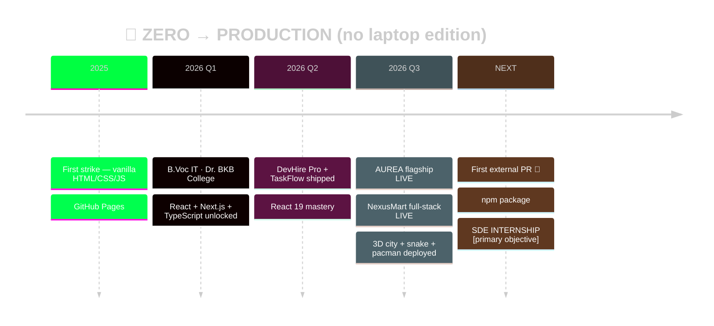

<div align="center">

<!-- ═══ CYBERPUNK VENOM BANNER (matrix-green) ═══ -->


<!-- ═══ MATRIX RAIN glitch header ═══ -->


<!-- ═══ CYBERPUNK TERMINAL TYPING ═══ -->
[](https://manashjyoti-bora.vercel.app)

<!-- ═══ LIVE COUNTERS ═══ -->


[](https://github.com/Manashjyoti-Bora?tab=followers)

</div>

```ansi
 ██████╗ ██████╗ ███╗   ██╗██╗     ██╗███╗   ██╗███████╗
██╔═══██╗██╔══██╗████╗  ██║██║     ██║████╗  ██║██╔════╝
██║   ██║██╔══██╗██║╚██╗██║██║     ██║██║╚██╗██║██╔══╝
╚██████╔╝██║  ██║██║ ╚████║███████╗██║██║ ╚████║███████╗
 ╚═════╝ ╚═╝  ╚═╝╚═╝  ╚═══╝╚══════╝╚═╝╚═╝  ╚═══╝╚══════╝
        full stack developer · ships from a phone 📱
```

> [!IMPORTANT]
> **⚡ 10-SECOND AUDIT:** Every claim on this page is a live, clickable deployment. Fastest proof → [**nexusmart-dusky.vercel.app**](https://nexusmart-dusky.vercel.app): create an account, place an order. That's my MongoDB + JWT backend you just used. **No laptop was ever involved.**


<!-- ═══ GITHUB METRICS DASHBOARD (elite #5!) ═══ -->
##  Mission Control — Live Telemetry

<div align="center">


</div>


<!-- ═══ ADVANCED CONTRIBUTION VISUALIZATIONS: 3D + SNAKE + PACMAN + HEATMAP (elite #1-4!) ═══ -->
##  The Contribution Multiverse

### 🏙️ Dimension 1 — 3D Night-Rainbow City *(every commit builds a tower)*


### 🐍 Dimension 2 — The Snake *(devours my commits daily)*


### 👾 Dimension 3 — PAC-MAN *(chomping through the graph)*


### 🌌 Dimension 4 — Season Flow *(3D city that changes with seasons)*


### 🔥 Dimension 5 — Classic Heatmap


<!-- ═══ ANIMATED TECH STACK + SKILL ORBIT-STYLE ═══ -->
##  Arsenal

<div align="center">


*↑ live orbit — the atoms actually spin*


</div>

```ansi
REACT/NEXT.JS  ████████████████░░░░  80%  primary weapon
TYPESCRIPT     ████████████████░░░░  80%  daily carry
TAILWIND       ██████████████████░░  90%  fluent
NODE/MONGO     ██████████████░░░░░░  70%  production-proven
CONSISTENCY    ████████████████████  MAX  ⚠ the real exploit
```


<!-- ═══ FEATURED PROJECTS ═══ -->
##  Deployed Payloads

<table>
<tr>
<td width="50%" valign="top">

### ✨ AUREA `FLAGSHIP · LIVE`

[](https://manashjyoti-bora.vercel.app)
[](https://github.com/Manashjyoti-Bora/portfolio-website)

> Three.js particle universe · GSAP choreography · ⌘K palette · **hidden terminal** · AI concierge · live GitHub telemetry · CSP hardened.

**Cheat codes:** <kbd>Ctrl</kbd>+<kbd>K</kbd> · <kbd>Ctrl</kbd>+<kbd>/</kbd> · <kbd>iddqd</kbd> · <kbd>↑↑↓↓←→←→BA</kbd>

</td>
<td width="50%" valign="top">

### 🛒 NEXUSMART `FULL-STACK · LIVE`

[](https://nexusmart-dusky.vercel.app)
[](https://github.com/Manashjyoti-Bora/nexusmart)

> MongoDB Atlas · JWT + bcrypt in HTTP-only cookies · rate-limited auth · **server-computed totals** (tamper-proof) · role-gated admin · Zod everywhere.

**Live test:** signup → cart → order. Real DB writes.

</td>
</tr>
<tr>
<td width="50%" valign="top">

### 💼 DEVHIRE PRO
[](https://github.com/Manashjyoti-Bora/devhire-pro-ats)
> ATS with triple real-time filter (keyword×skill×location), memoized React 19.

</td>
<td width="50%" valign="top">

### 📋 TASKFLOW
[](https://github.com/Manashjyoti-Bora/taskflow-enterprise)
> Kanban suite — dynamic columns, priority tags, centralized state, zero reloads.

</td>
</tr>
</table>


<!-- ═══ ANIMATED ROADMAP / TIMELINE ═══ -->
##  The Origin Arc



| 🎓 Education | 💼 Experience |
|---|---|
| **B.Voc Information Technology** · Dr. BKB College, Nagaon, Assam · 2026–2030 | **Full Stack Developer** (self-driven) · 4+ production apps end-to-end · 2025–now |


<!-- ═══ GOALS + QUOTES + EASTER EGG ═══ -->
##  Next Objectives

- [x] ~~Flagship portfolio~~ `SHIPPED ✔`
- [x] ~~Full-stack product w/ real DB + auth~~ `SHIPPED ✔`
- [x] 365-day streak `RUNNING 🔥`
- [ ] First external open-source PR `TARGET LOCKED 🎯`
- [ ] First npm package `IN QUEUE`
- [ ] SDE Internship `PRIMARY OBJECTIVE — recruiters, this is your cue 😏`

<div align="center">


<details>
<summary>🥚 <b>[CLASSIFIED — tap to decrypt]</b></summary>
<br>

```text
 ╔════════════════════════════════════════════════╗
 ║  DECRYPTION COMPLETE 🎉                        ║
 ║                                                ║
 ║  The entire operation you just scrolled —      ║
 ║  3D city, snake, pacman, two live products —   ║
 ║  was built without ever touching a laptop.     ║
 ║                                                ║
 ║  If a phone can do THIS...                     ║
 ║  imagine what I'd do with your dev machine. 😏 ║
 ║                                                ║
 ║  → manashjyotibora122@gmail.com                ║
 ╚════════════════════════════════════════════════╝
```

*Second egg lives at my portfolio — type* <kbd>iddqd</kbd> 👀

</details>

<br>

<!-- ═══ UPLINK ═══ -->
[](https://manashjyoti-bora.vercel.app)
[](https://manashjyoti-bora.vercel.app/resume.pdf)
[](https://www.linkedin.com/in/manashjyoti-bora-323b97405)
[](mailto:manashjyotibora122@gmail.com)


`© 2026 MANASHJYOTI BORA` · `SHIPS FROM A PHONE 📱` · `UPLINK ALWAYS ONLINE`


</div>
