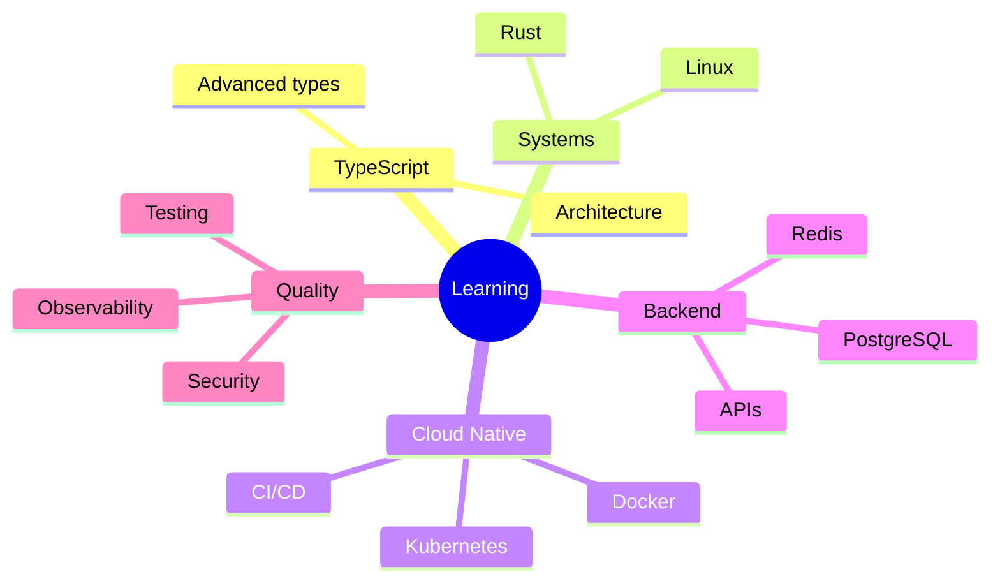
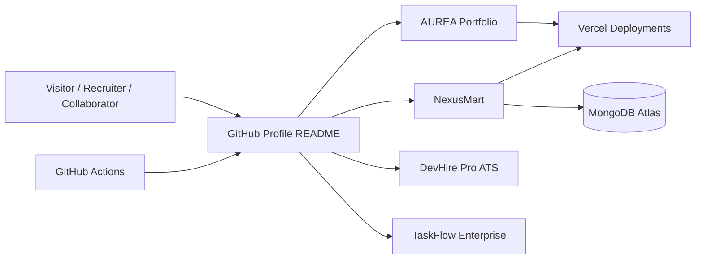
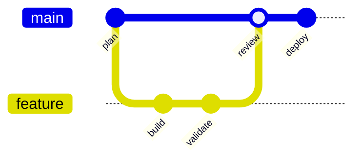

<!--
==============================================================================
MANASHJYOTI BORA — ALL-IN-ONE GITHUB PROFILE README
Generated from public GitHub information on 2026-07-12 (Asia/Kolkata).

Topic manifest: 1,156 supplied entries / 1,155 unique labels.
The label "Links" occurs twice in the supplied source and is preserved twice.
Normalized topic-list SHA-256: 6ea2f9dee2b4013a315cf68c9bf8ec10c327fe580e05a6cdf9d9a3c7b4327f45

IMPORTANT
- The engineering atlas is a coverage/reference index, not a claim of mastery.
- Verified skills/projects are separated from learning and reference topics.
- GitHub blocks scripts and strips some HTML/CSS; all primary content remains usable.
==============================================================================
-->

<a id="top"></a>

<div align="center">

<picture>
  <source media="(prefers-color-scheme: dark)" srcset="https://capsule-render.vercel.app/api?type=waving&color=0:7C3AED,50:2563EB,100:06B6D4&height=240&section=header&text=Manashjyoti%20Bora&fontSize=52&fontColor=ffffff&animation=twinkling&fontAlignY=35&desc=Full%20Stack%20Developer%20%E2%80%A2%20Android%20to%20Cloud%20%E2%80%A2%20Nagaon%2C%20Assam&descAlignY=57&descSize=18">
  
</picture>

<a href="https://github.com/Manashjyoti-Bora">
  
</a>

# Hey, I'm Manashjyoti Bora 👋

### Full Stack Developer · React · Next.js · TypeScript · Node.js

**Building secure, production-style web applications—from Android to Cloud.**


<p>
  <a href="https://manashjyoti-bora.vercel.app"></a>
  <a href="https://www.linkedin.com/in/manashjyoti-bora"></a>
  <a href="mailto:manashjyotibora122@gmail.com"></a>
  <a href="https://github.com/Manashjyoti-Bora?tab=followers"></a>
</p>

<p>
  
  
  
  
  
</p>

<p>
  <a href="https://github.com/Manashjyoti-Bora/Manashjyoti-Bora/actions/workflows/snake.yml"></a>
  <a href="https://github.com/Manashjyoti-Bora/Manashjyoti-Bora/actions/workflows/pacman.yml"></a>
  <a href="https://github.com/Manashjyoti-Bora/Manashjyoti-Bora/actions/workflows/3d-contrib.yml"></a>
</p>

[**View Portfolio**](https://manashjyoti-bora.vercel.app) ·
[**Explore Repositories**](https://github.com/Manashjyoti-Bora?tab=repositories) ·
[**Discuss an Opportunity**](mailto:manashjyotibora122@gmail.com)

</div>

> [!NOTE]
> **Public profile snapshot (12 July 2026):** Full Stack Developer in Nagaon, Assam, India; open to work/internships; 5 public repositories. Dynamic GitHub cards may change automatically.

> [!IMPORTANT]
> The **1,156-topic Engineering Atlas** near the end preserves every label supplied for this README. Indexed topics are interests, documentation capabilities, or future reference areas—not automatic claims that every technology is used in production.

---

## 📑 Table of Contents

<details open>
<summary><strong>Navigate the profile</strong></summary>

- [About Me](#-about-me)
- [Value Proposition](#-value-proposition)
- [Featured Projects](#-featured-projects)
- [Verified Stack](#%EF%B8%8F-verified-stack)
- [Currently Learning](#-currently-learning)
- [Engineering Principles](#-engineering-principles)
- [Architecture and Workflow](#%EF%B8%8F-architecture-and-workflow)
- [GitHub Analytics](#-github-analytics)
- [Contribution Animations](#-contribution-animations)
- [Profile Repository Setup](#-profile-repository-setup)
- [Roadmap](#%EF%B8%8F-roadmap)
- [Open Source and Collaboration](#-open-source-and-collaboration)
- [Security, Privacy, and Accessibility](#-security-privacy-and-accessibility)
- [Contact and Support](#-contact-and-support)
- [Profile FAQ](#-profile-faq)
- [1,156-Topic Engineering Atlas](#-1156-topic-engineering-atlas)
- [License and Attribution](#-license-and-attribution)

</details>

---

## 👨‍💻 About Me

```ts
const manashjyoti = {
  name: "Manashjyoti Bora",
  location: "Nagaon, Assam, India",
  role: "Full Stack Developer",
  focus: ["React", "Next.js", "TypeScript", "Node.js"],
  building: "Secure, production-style web applications",
  originStory: "Started coding on Android with Termux",
  availability: ["Full-time roles", "Internships", "Open-source collaboration"],
  mindset: "Code. Build. Ship. Learn. Repeat.",
} as const;
```

Hi! I turn ideas into responsive, maintainable web products. My public work currently centers on full-stack TypeScript/JavaScript applications, practical authentication, product-focused interfaces, animation, and deployment to the web.

- 🔭 Building full-stack projects and improving production-readiness.
- 🌱 Learning advanced TypeScript, Rust, containers, Kubernetes, and cloud-native practices.
- 👯 Interested in open source, React/Next.js collaboration, internships, and hackathons.
- 💬 Ask me about React, Next.js, TypeScript, Node.js, Tailwind CSS, MongoDB, or shipping from constrained environments.
- 📱 Started coding from an Android phone using Termux before having a laptop.
- 🗓 Joined GitHub in February 2025.
- 🌐 Portfolio: [manashjyoti-bora.vercel.app](https://manashjyoti-bora.vercel.app)

<details>
<summary><strong>🌍 A multilingual hello</strong></summary>

| Language | Greeting |
|---|---|
| অসমীয়া | নমস্কাৰ! |
| English | Hello! |
| हिन्दी | नमस्ते! |
| বাংলা | নমস্কার! |
| Español | ¡Hola! |
| Français | Bonjour ! |
| العربية | مرحباً! |

</details>

---

## 🎯 Value Proposition

> **I build polished web experiences with a product mindset, connecting modern React interfaces to secure application logic and deployable infrastructure.**

| Dimension | What I bring |
|---|---|
| Target teams | Product, startup, web engineering, and open-source teams |
| Core value | Frontend quality plus practical full-stack ownership |
| Demonstrated work | Portfolio, e-commerce, ATS/job portal, and Kanban productivity apps |
| Differentiator | Resourcefulness—building and deploying from Android/Termux to the cloud |
| Current goal | A full-time role or internship with strong learning and delivery opportunities |

### Capabilities at a glance

| Capability | Demonstrated through |
|---|---|
| Responsive frontend engineering | React, Next.js, TypeScript, Tailwind CSS, modern CSS |
| Full-stack product delivery | Next.js server features, MongoDB/Mongoose, deployment to Vercel |
| Authentication and validation | JWT/Jose, bcrypt, HTTP-only cookies, server authorization, Zod |
| Motion and 3D experiences | Framer Motion, GSAP, Three.js, React Three Fiber |
| Product interfaces | E-commerce, portfolio, applicant tracking, and Kanban workflows |
| Developer experience | Structured documentation, environment examples, linting, formatting, and Git workflows |

### How I work

1. Understand the user problem and acceptance criteria.
2. Design the data, UI states, validation, and security boundaries.
3. Build in small, testable increments.
4. Check responsive behavior, accessibility, errors, and performance.
5. Deploy, observe, document, and improve.

---

## 🚀 Featured Projects

### 1. AUREA — Developer Portfolio

**Next.js 14 · TypeScript · Tailwind CSS · Framer Motion · GSAP · Three.js**

A premium developer portfolio featuring a 3D hero, command palette, AI chatbot experience, live GitHub dashboard, responsive motion, and a production-style presentation.

[](https://github.com/Manashjyoti-Bora/portfolio-website)
[](https://manashjyoti-bora.vercel.app)

### 2. NexusMart — Full-Stack E-commerce

**Next.js App Router · TypeScript · MongoDB Atlas · JWT · bcrypt · Zod**

Full-stack commerce application with authentication through HTTP-only cookies, product/cart/checkout flows, role-gated administration, MongoDB persistence, and validation on mutations.

[](https://github.com/Manashjyoti-Bora/nexusmart)
[](https://nexusmart-dusky.vercel.app)

### 3. DevHire Pro — Job Portal and ATS

**React 19 · Vite · JavaScript · Modern CSS**

Applicant tracking experience with multi-attribute filtering, light/dark glassmorphic themes, application pipeline states, and memoized rendering.

[](https://github.com/Manashjyoti-Bora/devhire-pro-ats)

### 4. TaskFlow Enterprise — Agile Productivity

**React · Vite · JavaScript · Centralized UI state**

Kanban-style productivity suite with dynamic task movement, priority tagging, sprint-oriented views, and a no-reload interaction model.

[](https://github.com/Manashjyoti-Bora/taskflow-enterprise)

### Repository cards

<div align="center">
  <a href="https://github.com/Manashjyoti-Bora/portfolio-website"></a>
  <a href="https://github.com/Manashjyoti-Bora/nexusmart"></a>
  <a href="https://github.com/Manashjyoti-Bora/devhire-pro-ats"></a>
  <a href="https://github.com/Manashjyoti-Bora/taskflow-enterprise"></a>
</div>

> Project descriptions and technologies above were checked against public repository metadata, source trees, and package manifests on 12 July 2026.

### Project comparison

| Project | Primary problem | Product focus | Technical focus | Source | Demo |
|---|---|---|---|---|---|
| AUREA | Present developer work as an interactive product | Portfolio and discovery | Motion, 3D, theming, accessibility, SEO | [Repository](https://github.com/Manashjyoti-Bora/portfolio-website) | [Portfolio](https://manashjyoti-bora.vercel.app) |
| NexusMart | Deliver a realistic end-to-end shopping flow | Commerce and administration | Auth, validation, persistence, protected routes | [Repository](https://github.com/Manashjyoti-Bora/nexusmart) | [Live](https://nexusmart-dusky.vercel.app) |
| DevHire Pro | Reduce friction in job discovery and application tracking | Search and ATS workflow | Multi-attribute filtering, memoization, theming | [Repository](https://github.com/Manashjyoti-Bora/devhire-pro-ats) | Repository demo |
| TaskFlow Enterprise | Make staged work and priorities visible | Kanban productivity | State modeling, task movement, responsive dashboard | [Repository](https://github.com/Manashjyoti-Bora/taskflow-enterprise) | Repository demo |

---

## 🛠️ Verified Stack

### Used in public projects

<p align="center">
  
</p>

| Area | Technologies demonstrated or declared in public work |
|---|---|
| Languages | JavaScript, TypeScript, HTML, CSS |
| UI | React 18/19, Next.js 14 App Router, Tailwind CSS, modern CSS |
| Motion/3D | Framer Motion, GSAP, Three.js, React Three Fiber |
| Server/data | Next.js server features, Node.js ecosystem, MongoDB/Mongoose |
| Auth/validation | JWT/Jose, bcrypt, HTTP-only cookies, Zod |
| Forms/UI tools | React Hook Form, Lucide React |
| Tooling | Vite, TypeScript strict mode, ESLint, Prettier, PostCSS, npm, Git |
| Delivery | Vercel, GitHub Actions, Termux-based mobile development |

### Technology badges


---

## 🌱 Currently Learning



| Now | Next | Exploring |
|---|---|---|
| Advanced TypeScript | Automated testing depth | Rust and systems concepts |
| Full-stack architecture | Docker and Kubernetes | Cloud-native patterns |
| Secure authentication | PostgreSQL and Redis | AI-assisted product features |

---

## 🧭 Engineering Principles

- **Users first:** clear flows, responsive layouts, useful empty/error/loading states.
- **Secure defaults:** server-side authorization, input validation, protected cookies, least privilege, and secret hygiene.
- **Accessible interfaces:** semantic HTML, keyboard support, visible focus, contrast, alt text, and reduced motion.
- **Maintainable code:** typed boundaries, small modules, predictable naming, formatting, linting, and documentation.
- **Measured performance:** optimize only after profiling; track Core Web Vitals and bundle weight.
- **Reliable delivery:** repeatable builds, Git workflows, CI checks, preview deployments, and rollback awareness.
- **Honest documentation:** distinguish shipped capabilities, experiments, learning goals, and future ideas.

### Accessibility target

The goal is WCAG-aligned UI with semantic HTML, ARIA only when necessary, keyboard navigation, screen-reader-friendly labels, color contrast, focus management, skip links, captions, and `prefers-reduced-motion` support.

### Security baseline

Validate untrusted input, authorize on the server, protect credentials, use TLS, avoid secrets in Git history, set safe cookie/header policies, rate-limit risky operations, keep dependencies reviewed, and report vulnerabilities privately.

---

## 🏗️ Architecture and Workflow

### Public project ecosystem



### Development workflow



```bash
git switch -c feat/short-description
npm install
npm run dev
npm run lint
npm run typecheck   # when available
npm run build
git commit -m "feat(scope): concise description"
```

### Quality checklist

- [ ] Main user flow works from a clean installation.
- [ ] Loading, empty, success, error, and permission states are handled.
- [ ] Layout works on mobile, tablet, and desktop.
- [ ] Keyboard, focus, labels, contrast, and reduced motion are checked.
- [ ] Inputs are validated; authorization is enforced server-side.
- [ ] No secrets or personal test data are committed.
- [ ] Build, lint, types, and relevant tests pass.
- [ ] README, environment example, screenshots, and deployment notes are current.

---

## 📊 GitHub Analytics

<div align="center">
  
  
  <br>
  
  <br>
  
  <br>
  <img width="95%" alt="GitHub profile tr
