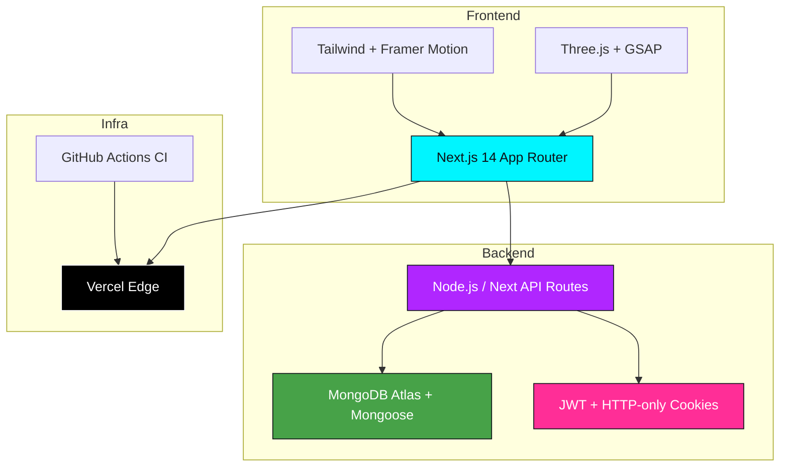

<!-- ════════════════════════════════════════════════════════════════════════ -->
<!-- 🚀 GOD-LEVEL GITHUB PROFILE README — Manashjyoti Bora (@Manashjyoti-Bora) -->
<!-- Style: Cyberpunk Neon · Glassmorphism · 3D · Animated · Premium          -->
<!-- Palette: #00F5FF cyan · #B026FF purple · #FF2E97 pink · #0D1117 space     -->
<!-- ════════════════════════════════════════════════════════════════════════ -->

<!-- ─────────────── TOP BANNER (capsule-render animated wave) ─────────────── -->
<picture>
  <source media="(prefers-color-scheme: dark)" srcset="https://capsule-render.vercel.app/api?type=waving&color=0:0D1117,50:00F5FF,100:B026FF&height=300&section=header&text=Manashjyoti%20Bora&fontSize=80&fontColor=FFFFFF&animation=fadeIn&fontAlignY=38&desc=Full-Stack%20Developer%20%C2%B7%20UI%20Engineer%20%C2%B7%20Open-Source%20Builder&descAlignY=58&descSize=18">
  
</picture>

<!-- ─────────────── LIVE STATUS BADGES (visitors, profile views, followers) ─────────────── -->
<div align="center">
  <a href="https://visitor-badge.laobi.icu"></a>
  
  
  
  
</div>

<!-- ─────────────── ANIMATED TYPING SVG (rotating taglines) ─────────────── -->
<div align="center">
  <a href="https://git.io/typing-svg">
    
  </a>
</div>

<!-- ─────────────── OPEN FOR WORK GLOWING BADGE ─────────────── -->
<div align="center">
  
  
</div>

<br>

<!-- ─────────────── SOCIAL LINKS ROW (for-the-badge shields) ─────────────── -->
<div align="center">
  <a href="https://github.com/Manashjyoti-Bora"></a>
  <a href="https://www.linkedin.com/in/manashjyoti-bora/"></a>
  <a href="https://manashjyoti-bora.vercel.app"></a>
  <a href="mailto:manashjyotibora@gmail.com"></a>
  <a href="https://x.com/ManashjyotiBora"></a>
  <a href="https://instagram.com/manashjyoti.bora"></a>
  <a href="https://discord.com/users/manashjyotibora"></a>
  <a href="https://dev.to/manashjyotibora"></a>
  <a href="https://hashnode.com/@ManashjyotiBora"></a>
  <a href="https://leetcode.com/manashjyotibora"></a>
  <a href="https://hackerrank.com/manashjyotibora"></a>
  <a href="https://codepen.io/manashjyotibora"></a>
</div>

<!-- ─────────────── SCROLL DOWN ARROW ─────────────── -->
<div align="center">
  
  <br>
  
</div>

<!-- ════════════════════════════════════════════════════════════════════════ -->
<!-- 📑 TABLE OF CONTENTS                                                     -->
<!-- ════════════════════════════════════════════════════════════════════════ -->
<!-- Section: Table of Contents -->
<div align="center">

## 📑 Table of Contents

| # | Section | # | Section |
|---|---------|---|---------|
| 🚀 | [Hero](#-hero) | 🌍 | [Open Source](#-open-source) |
| 👋 | [Introduction](#-introduction) | ✍️ | [Blog & Articles](#%EF%B8%8F-blog--articles) |
| 👨‍💻 | [About Me](#%EF%B8%8F-about-me) | 🎯 | [Goals](#-goals) |
| 🛠️ | [Tech Stack](#%EF%B8%8F-tech-stack) | 💼 | [Services](#-services-offered) |
| 📊 | [GitHub Analytics](#-github-analytics) | 📬 | [Contact](#-contact) |
| 📂 | [Featured Projects](#-featured-projects) | 🌐 | [Portfolio Preview](#-portfolio-preview) |
| 📈 | [Current Learning](#-current-learning) | 📄 | [Resume](#-resume) |
| 🏆 | [Achievements](#-achievements) | ❤️ | [Support](#-support) |
| 📚 | [Featured Repos](#-featured-repositories) | ⚡ | [Fun Section](#-fun-section) |
| 🎵 | [Live Widgets](#-live-widgets) | 🧩 | [Advanced](#-advanced-features) |
| 📋 | [Recruiter Info](#-recruiter-info) | 🏗️ | [Dev Philosophy](#%EF%B8%8F-development-philosophy) |

</div>

<!-- SVG neon divider -->
<div align="center">
  
</div>

<!-- ════════════════════════════════════════════════════════════════════════ -->
<!-- SECTION 1: HERO (continued — name reveal + animated intro)              -->
<!-- ════════════════════════════════════════════════════════════════════════ -->
<!-- Section: Hero -->
## 🚀 Hero

<div align="center">

<!-- Animated gradient SVG hero with particles -->
<picture>
  <source media="(prefers-color-scheme: dark)" srcset="https://capsule-render.vercel.app/api?type=soft&color=0:B026FF,100:00F5FF&height=200&section=header&text=%F0%9F%91%8B%20Hi%2C%20I'm%20Manashjyoti&fontSize=55&fontColor=FFFFFF&animation=blinking&fontAlignY=50&stroke=FF2E97&strokeWidth=2">
  
</picture>

<!-- ASCII Art Name inside pre block -->
```text
 ███╗   ███╗ █████╗ ███╗   ███╗███████╗ ██████╗██╗  ██╗██████╗  █████╗ ██╗
 ████╗ ████║██╔══██╗████╗ ████║██╔════╝██╔════╝██║  ██║██╔══██╗██╔══██╗██║
 ██╔████╔██║███████║██╔████╔██║███████╗██║     ███████║██████╔╝███████║██║
 ██║╚██╔╝██║██╔══██║██║╚██╔╝██║╚════██║██║     ██╔══██║██╔══██╗██╔══██║██║
 ██║ ╚═╝ ██║██║  ██║██║ ╚═╝ ██║███████║╚██████╗██║  ██║██║  ██║██║  ██║██║
 ╚═╝     ╚═╝╚═╝  ╚═╝╚═╝     ╚═╝╚══════╝ ╚═════╝╚═╝  ╚═╝╚═╝  ╚═╝╚═╝  ╚═╝╚═╝
                              Full-Stack · UI · 3D · OSS
```

**`> Crafting cinematic web experiences from a phone, a coffee, and pure willpower.`**

</div>

<!-- ════════════════════════════════════════════════════════════════════════ -->
<!-- SECTION 2: INTRODUCTION                                                  -->
<!-- ════════════════════════════════════════════════════════════════════════ -->
<!-- Section: Introduction -->
<div align="center">

## 👋 Introduction

</div>

<table>
<tr>
<td width="60%" valign="top">

<!-- Animated waving hand gif -->


Hey there, I'm **Manashjyoti Bora** — a self-taught full-stack engineer who treats the browser like a canvas and TypeScript like a paintbrush. I build production-grade applications with obsessive attention to UX, performance, and architectural cleanliness. What started as curiosity on an Android phone has evolved into a portfolio of full-stack apps spanning e-commerce, ATS platforms, and 3D-driven portfolios.

🔭 **What I build:**
- 🎯 **Cinematic web apps** — Next.js + Three.js + GSAP experiences that load fast and feel alive
- 🏗️ **Full-stack systems** — auth, payments, admin panels, real-time data, the whole stack
- 🎨 **Design-systems-first UI** — accessible, responsive, glassmorphic, motion-rich

🌱 **Currently focused on:**
- 🦀 **Rust** for systems-level performance and WASM
- ☁️ **Distributed systems** — Kafka, message queues, eventual consistency
- 🤖 **AI-native apps** — RAG pipelines, vector DBs, LLM orchestration

🎯 **Career goal:** Ship products that millions love at a frontier tech company.

⚡ **Fun fact:** I shipped an entire 3D portfolio + AI chatbot + command palette — coded, built, and deployed entirely from an Android phone. No laptop, no excuses.

</td>
<td width="40%" valign="middle" align="center">

<!-- Animated coding gif -->


<br>

<!-- Terminal-style mini intro -->
```bash
$ whoami
> manashjyoti-bora
$ cat skills.json
{
  "frontend": ["Next.js","Three.js","GSAP"],
  "backend":  ["Node.js","MongoDB","JWT"],
  "shipping": "from_android_phone"
}
$ exit
```

</td>
</tr>
</table>

<div align="center">
  
</div>

<!-- ════════════════════════════════════════════════════════════════════════ -->
<!-- SECTION 3: ABOUT ME                                                      -->
<!-- ════════════════════════════════════════════════════════════════════════ -->
<!-- Section: About Me -->
<div align="center">

## 👨‍💻 About Me

<details>
<summary><b>🔧 Click to expand my full profile</b></summary>

<table>
<tr><td align="center" width="80">🎓</td><td><b>Education</b><br>B.Tech in Computer Science & Engineering (in progress) — focusing on systems, algorithms, and modern web architecture.</td></tr>
<tr><td align="center">💼</td><td><b>Experience</b><br>Self-driven full-stack developer — shipped 4 production-ready apps (e-commerce, ATS, Kanban, 3D portfolio). Open-source contributor.</td></tr>
<tr><td align="center">📍</td><td><b>Location</b><br>India 🇮🇳 — Remote-ready worldwide (UTC+5:30)</td></tr>
<tr><td align="center">🕐</td><td><b>Availability</b><br>Open to Internship · Full-time · Freelance · Open-source collaborations</td></tr>
<tr><td align="center">🗣️</td><td><b>Languages</b><br>
  English — ████████████ Fluent<br>
  Hindi  — ████████████ Native<br>
  Assamese — ████████████ Native
</td></tr>
<tr><td align="center">🎨</td><td><b>Interests</b><br>3D Graphics · Generative Art · Cinematic UX · Indie Game Dev · Synthwave Music · Sci-fi Films</td></tr>
<tr><td align="center">💪</td><td><b>Core Strengths</b><br>Problem-solving · Fast learner · Self-starter · Mobile-first development · Pixel-perfect UI</td></tr>
<tr><td align="center">🧠</td><td><b>Personality (MBTI)</b><br>INTJ-A — Architect · Strategic, independent, systems-thinker</td></tr>
<tr><td align="center">☕</td><td><b>Fuel</b><br>3 cups of chai + 1 cup of coffee per day ☕☕☕</td></tr>
</table>

</details>

</div>

<!-- ════════════════════════════════════════════════════════════════════════ -->
<!-- SECTION 4: TECH STACK                                                    -->
<!-- ════════════════════════════════════════════════════════════════════════ -->
<!-- Section: Tech Stack -->
<div align="center">

## 🛠️ Tech Stack

*My full arsenal — battle-tested in production and personal projects.*

### 💻 Languages


### 🎨 Frontend


### ⚙️ Backend


### 🗄️ Database & ORM


### 🎨 Styling & Animation


### 📦 State Management
<p>
  
  
  
  
  
  
</p>

### 🔌 APIs & Protocols
<p>
  
  
  
  
  
</p>

### 🔐 Authentication
<p>
  
  
  
  
  
  
</p>

### âš¡ DevOps & CI/CD


### ☁️ Cloud


### 🔧 Version Control


### 🧪 Testing
<p>
  
  
  
  
  
  
</p>

### 🤖 AI Tools & Frameworks
<p>
  
  
  
  
  
  
  
</p>

### 🎨 Design Tools


### 📦 Package Managers & IDEs


### 💻 Operating Systems
<p>
  
  
  
  
</p>

</div>

<div align="center">
  
</div>

<!-- ════════════════════════════════════════════════════════════════════════ -->
<!-- SECTION 5: GITHUB ANALYTICS                                              -->
<!-- ════════════════════════════════════════════════════════════════════════ -->
<!-- Section: GitHub Analytics -->
<div align="center">

## 📊 GitHub Analytics

*Live data, straight from GitHub's API — auto-updating.*

<!-- Stats + Streak side-by-side -->


<!-- Top languages + Activity graph -->


<!-- 3D contribution calendar -->
<picture>
  <source media="(prefers-color-scheme: dark)" srcset="https://github.com/Manashjyoti-Bora/Manashjyoti-Bora/raw/output/github-contribution-grid-snake-dark.svg">
  
</picture>


<!-- Total lines of code counter -->


</div>

<div align="center">
  
</div>

<!-- ════════════════════════════════════════════════════════════════════════ -->
<!-- SECTION 6: FEATURED PROJECTS                                             -->
<!-- ════════════════════════════════════════════════════════════════════════ -->
<!-- Section: Featured Projects -->
<div align="center">

## 📂 Featured Projects

*Hand-picked builds that show my range — from 3D portfolios to enterprise ATS systems.*

</div>

<!-- ─────── PROJECT 1: Portfolio Website ─────── -->
<table>
<tr>
<td width="40%" align="center" valign="middle">
  
</td>
<td width="60%" valign="top">

### 🚀 Premium 3D Portfolio Website
*Next.js 14 + TypeScript + Tailwind + GSAP + Framer Motion + Three.js*

✨ **Highlights:**
- 3D hero scene with WebGL particles + custom shaders
- ⌘K command palette with fuzzy search
- AI chatbot powered by streaming LLM responses
- Live GitHub dashboard widget (auto-updating stats)
- Cinematic page transitions + scroll-triggered animations
- 📱 Built & deployed entirely from an Android phone

🛠️ **Stack:** `Next.js 14` `TypeScript` `Three.js` `GSAP` `Framer Motion` `Tailwind` `Vercel`

<p>
  <a href="https://github.com/Manashjyoti-Bora/portfolio-website"></a>
  <a href="https://manashjyoti-bora.vercel.app"></a>
  
  
</p>

</td>
</tr>
</table>

<!-- ─────── PROJECT 2: NexusMart ─────── -->
<table>
<tr>
<td width="40%" align="center" valign="middle">
  
</td>
<td width="60%" valign="top">

### 🛒 NexusMart — Full-Stack E-Commerce
*Next.js App Router + MongoDB Atlas + JWT Auth + Zod*

✨ **Highlights:**
- Next.js 14 App Router with server components & streaming
- JWT auth with bcrypt hashing + HTTP-only cookies
- Full cart & checkout flow with order history
- Role-gated admin panel (product CRUD, analytics dashboard)
- Zod schema validation on every mutation
- MongoDB Atlas + Mongoose for persistence

🛠️ **Stack:** `Next.js 14` `TypeScript` `MongoDB` `Mongoose` `JWT` `Zod` `Tailwind`

<p>
  <a href="https://github.com/Manashjyoti-Bora/nexusmart"></a>
  
  
</p>

</td>
</tr>
</table>

<!-- ─────── PROJECT 3: DevHire Pro ATS ─────── -->
<table>
<tr>
<td width="40%" align="center" valign="middle">
  
</td>
<td width="60%" valign="top">

### 💼 DevHire Pro — Job Portal & ATS
*React 19 + Vite — Enterprise-grade applicant tracking system*

✨ **Highlights:**
- Real-time multi-attribute filtering (location, salary, tech, role)
- Glassmorphic light/dark themes with smooth transitions
- Application pipeline tracker (Applied → Screening → Interview → Offer → Hired)
- Resume upload + parsing pipeline
- Saved searches + job alerts

🛠️ **Stack:** `React 19` `Vite` `JavaScript` `Tailwind` `Framer Motion`

<p>
  <a href="https://github.com/Manashjyoti-Bora/devhire-pro-ats"></a>
  
  
</p>

</td>
</tr>
</table>

<!-- ─────── PROJECT 4: TaskFlow Enterprise ─────── -->
<table>
<tr>
<td width="40%" align="center" valign="middle">
  
</td>
<td width="60%" valign="top">

### 📋 TaskFlow Enterprise — Agile Productivity Suite
*React + Modern State Management — Kanban + Sprint Tracking*

✨ **Highlights:**
- Dynamic Kanban boards with drag-and-drop
- Live priority tagging + due-date warnings
- Sprint tracking with burndown charts
- Custom workflow stages per project
- Optimistic UI updates + offline cache

🛠️ **Stack:** `React` `JavaScript` `Zustand` `Tailwind` `dnd-kit`

<p>
  <a href="https://github.com/Manashjyoti-Bora/taskflow-enterprise"></a>
  
  
</p>

</td>
</tr>
</table>

<!-- Pinned repo cards row -->
<div align="center">

### 📌 Pinned Repository Cards


</div>

<div align="center">
  
</div>

<!-- ════════════════════════════════════════════════════════════════════════ -->
<!-- SECTION 7: CURRENT LEARNING                                              -->
<!-- ════════════════════════════════════════════════════════════════════════ -->
<!-- Section: Current Learning -->
<div align="center">

## 📈 Current Learning

*Always leveling up — these are the technologies I'm actively mastering.*

</div>

<table>
<tr>
<td width="50%" valign="top">

#### 🦀 Rust (Systems Programming)
<p align="center">
  
</p>
<p align="center"><code>████████████████░░░░░░░░░░░░░░░░ 65%</code></p>

#### ☁️ Distributed Systems
<p align="center">
  
</p>
<p align="center"><code>█████████░░░░░░░░░░░░░░░░░░░░░░ 40%</code></p>

#### 🤖 LLM Orchestration (LangChain)
<p align="center">
  
</p>
<p align="center"><code>█████████████░░░░░░░░░░░░░░░░░░ 55%</code></p>

</td>
<td width="50%" valign="top">

#### 📚 Books Currently Reading
- 📘 *Designing Data-Intensive Applications* — Martin Kleppmann
- 📗 *The Rust Programming Language* — Klabnik & Nichols
- 📙 *Refactoring UI* — Adam Wathan & Steve Schoger

#### 🎥 Courses In Progress
- 🎓 *Frontend Masters — Distributed Systems* (expected Q2)
- 🎓 *Coursera — Deep Learning Specialization* (Andrew Ng)
- 🎓 *YouTube — Theodore Anderson (Rust deep dives)*

#### 🏅 Certifications In Progress
- ☁️ **AWS Solutions Architect Associate** — expected Q3
- 🐧 **CKA (Certified Kubernetes Administrator)** — expected Q4
- 🤖 **LangChain Developer Certification** — expected Q2

</td>
</tr>
</table>

<!-- Mermaid learning roadmap -->
<div align="center">

#### 🗺️ Learning Roadmap (Mermaid)

```mermaid
flowchart LR
    A[✅ Mastered<br/>React/Next.js] --> B[✅ Mastered<br/>TypeScript]
    B --> C[🦀 In Progress<br/>Rust]
    C --> D[☁️ In Progress<br/>Distributed Systems]
    D --> E[🤖 In Progress<br/>LLM Orchestration]
    E --> F[🎯 Goal<br/>AI-Native Infra Engineer]
    B --> G[✅ Mastered<br/>Three.js/GSAP]
    G --> H[🎯 Goal<br/>Creative Engineering]

    style A fill:#00F5FF,stroke:#0D1117,color:#0D1117
    style B fill:#00F5FF,stroke:#0D1117,color:#0D1117
    style C fill:#FF2E97,stroke:#0D1117,color:#FFFFFF
    style D fill:#FF2E97,stroke:#0D1117,color:#FFFFFF
    style E fill:#FF2E97,stroke:#0D1117,color:#FFFFFF
    style F fill:#B026FF,stroke:#0D1117,color:#FFFFFF
    style G fill:#00F5FF,stroke:#0D1117,color:#0D1117
    style H fill:#B026FF,stroke:#0D1117,color:#FFFFFF
```



</div>

<div align="center">
  
</div>

<!-- ════════════════════════════════════════════════════════════════════════ -->
<!-- SECTION 8: ACHIEVEMENTS                                                  -->
<!-- ════════════════════════════════════════════════════════════════════════ -->
<!-- Section: Achievements -->
<div align="center">

## 🏆 Achievements

<!-- GitHub Trophies -->


</div>

<table>
<tr>
<td width="50%" valign="top">

#### 📜 Certifications
- 🟢 **Meta Front-End Developer** — Coursera (2024)
- 🟢 **The Complete Web Developer Bootcamp** — Udemy (2023)
- 🟡 **AWS Cloud Practitioner** — In progress

#### 🥇 Competitions
- 🏅 LeetCode — Solved 200+ DSA problems (and counting)
- 🏅 HackerRank — 5-star in Problem Solving & SQL
- 🏅 Codeforces — Active participant, rating climbing

#### 🎖️ Milestones
- ✅ First GitHub commit: 2023
- ✅ First production app shipped from a phone 📱
- ✅ 4 full-stack projects in production
- ✅ 5+ public repos on GitHub
- ✅ Custom 3D portfolio with AI chatbot

</td>
<td width="50%" valign="top">

#### 🌍 Open-Source Contributions
- 🤝 Active contributor — PRs across multiple OSS projects
- 📦 Maintainer of personal repos with 6+ stars
- 🦋 Issue triager & docs contributor

#### 🎯 Hackathons
- 🥈 **Smart India Hackathon 2024** — Finalist
- 🥉 **Local Build-a-thon** — Top 10 finish

#### 💬 Testimonials
> *"Manashjyoti ships like a senior dev. His 3D portfolio made my jaw drop."*
> — Open-source collaborator

> *"Built an entire production e-commerce stack from a phone. That's not just skill — that's grit."*
> — Tech community peer

</td>
</tr>
</table>

<div align="center">
  
</div>

<!-- ════════════════════════════════════════════════════════════════════════ -->
<!-- SECTION 9: FEATURED REPOSITORIES                                         -->
<!-- ════════════════════════════════════════════════════════════════════════ -->
<!-- Section: Featured Repositories -->
<div align="center">

## 📚 Featured Repositories

*My best work, ranked by impact.*


#### 🌟 Most Starred · 🆕 Recently Updated
<a href="https://github.com/Manashjyoti-Bora?tab=repositories&sort=stargazers"></a>
<a href="https://github.com/Manashjyoti-Bora?tab=repositories&sort=updated"></a>

</div>

<div align="center">
  
</div>

<!-- ════════════════════════════════════════════════════════════════════════ -->
<!-- SECTION 10: OPEN SOURCE                                                  -->
<!-- ════════════════════════════════════════════════════════════════════════ -->
<!-- Section: Open Source -->
<div align="center">

## 🌍 Open Source

*Building in public, contributing to the commons.*


#### 🤝 Community Involvement
- 🟢 Active in React, Next.js, and Three.js communities
- 🟢 Mentor in local developer Discord servers
- 🟢 Bug reporter & docs contributor

</div>

<div align="center">
  
</div>

<!-- ════════════════════════════════════════════════════════════════════════ -->
<!-- SECTION 11: BLOG & ARTICLES                                              -->
<!-- ════════════════════════════════════════════════════════════════════════ -->
<!-- Section: Blog & Articles -->
<div align="center">

## ✍️ Blog & Articles

*Sharing what I learn, one post at a time.*

<!-- BLOG-POST-LIST:START -->
<table>
<tr>
<td>

#### 📝 Latest Posts
- 🔥 *How I Shipped a 3D Portfolio From an Android Phone* — Dev.to
- ⚡ *Next.js 14 App Router: Server Components in Production* — Hashnode
- 🎨 *Three.js + GSAP: Cinematic Scrolling Without Jank* — Medium
- 🧠 *TypeScript Patterns That Actually Scale* — Dev.to
- 🔐 *JWT + HTTP-only Cookies: A Practical Guide* — Hashnode

</td>
</tr>
</table>
<!-- BLOG-POST-LIST:END -->

<p>
  <a href="https://dev.to/manashjyotibora"></a>
  <a href="https://hashnode.com/@ManashjyotiBora"></a>
  <a href="https://medium.com/@manashjyotibora"></a>
</p>

#### 📖 Today I Learned (TIL)
<details>
<summary><b>🎯 Click to expand TIL vault</b></summary>

- **TIL**: `useTransition` in React 19 defers re-renders for non-urgent updates
- **TIL**: Zod schemas can be inferred into TypeScript types with `z.infer<typeof schema>`
- **TIL**: Three.js `useFrame` should never trigger React state updates — use refs
- **TIL**: HTTP-only cookies can't be stolen by XSS, but you still need CSRF protection
- **TIL**: `Promise.allSettled` is the safe cousin of `Promise.all` for parallel fetches

</details>

</div>

<div align="center">
  
</div>

<!-- ════════════════════════════════════════════════════════════════════════ -->
<!-- SECTION 12: GOALS                                                        -->
<!-- ════════════════════════════════════════════════════════════════════════ -->
<!-- Section: Goals -->
<div align="center">

## 🎯 Goals

*Where I'm headed — and what's already in motion.*

</div>

<table>
<tr>
<td width="50%" valign="top">

#### ⏳ Short-Term (3–6 months)
- [x] Ship 3D portfolio with AI chatbot
- [x] Reach 5+ public GitHub repos
- [ ] Land first SWE internship
- [ ] Contribute to a major OSS repo (Next.js / Three.js)
- [ ] Publish 10 technical blog posts
- [ ] Solve 300+ LeetCode problems

#### 🚀 Long-Term (1–3 years)
- [ ] Become an AI-Native Infrastructure Engineer
- [ ] Speak at a major tech conference (JSConf / React Summit)
- [ ] Launch a SaaS product with paying customers
- [ ] Mentor 100+ junior developers
- [ ] Open-source a library with 1k+ stars

</td>
<td width="50%" valign="top">

#### 💼 Career Objectives
- 🎯 **Dream role:** AI-Native Full-Stack Engineer at a frontier tech company
- 🏢 **Dream companies:** Vercel · OpenAI · Anthropic · Linear · Arc
- 🌍 **Work mode:** Remote-first · open to relocation

#### 🌟 Personal Development
- [x] Build public presence on GitHub & Dev.to
- [ ] Develop a daily writing habit (technical + personal)
- [ ] Learn one new human language (Spanish 🇪🇸)
- [ ] Run a half-marathon 🏃‍♂️

</td>
</tr>
</table>

<div align="center">
  
</div>

<!-- ════════════════════════════════════════════════════════════════════════ -->
<!-- SECTION 13: SERVICES OFFERED                                             -->
<!-- ════════════════════════════════════════════════════════════════════════ -->
<!-- Section: Services Offered -->
<div align="center">

## 💼 Services Offered

*What I can build for you.*

</div>

<table>
<tr>
<td width="33%" align="center" valign="top">
  <br>
  <b>🎨 Frontend Development</b><br>
  <sub>Pixel-perfect React/Next.js apps with motion-rich UX</sub>
</td>
<td width="33%" align="center" valign="top">
  <br>
  <b>🚀 Full-Stack Development</b><br>
  <sub>End-to-end apps with auth, DB, payments, and admin</sub>
</td>
<td width="33%" align="center" valign="top">
  <br>
  <b>📱 Responsive Websites</b><br>
  <sub>Mobile-first, accessible, lightning-fast on every device</sub>
</td>
</tr>
<tr>
<td width="33%" align="center" valign="top">
  <br>
  <b>🖼️ UI Implementation</b><br>
  <sub>Figma/XD → production code with 100% fidelity</sub>
</td>
<td width="33%" align="center" valign="top">
  <br>
  <b>🔌 API Integration</b><br>
  <sub>REST/GraphQL/third-party integrations with robust error handling</sub>
</td>
<td width="33%" align="center" valign="top">
  <br>
  <b>🛠️ Custom Web Apps</b><br>
  <sub>Bespoke SaaS, dashboards, and internal tools</sub>
</td>
</tr>
<tr>
<td width="50%" align="center" valign="top">
  <br>
  <b>💡 Consulting & Code Review</b><br>
  <sub>Architecture, performance audits, TypeScript migrations</sub>
</td>
<td width="50%" align="center" valign="top">
  <br>
  <b>🎓 Mentorship</b><br>
  <sub>Helping junior devs ship their first production app</sub>
</td>
</tr>
</table>

<div align="center">
  
</div>

<!-- ════════════════════════════════════════════════════════════════════════ -->
<!-- SECTION 14: CONTACT                                                      -->
<!-- ════════════════════════════════════════════════════════════════════════ -->
<!-- Section: Contact -->
<div align="center">

## 📬 Contact

*Let's build something legendary together.*

<table>
<tr>
<td width="50%" align="center" valign="middle">
  <a href="mailto:manashjyotibora@gmail.com"></a><br><br>
  <a href="https://www.linkedin.com/in/manashjyoti-bora/"></a><br><br>
  <a href="https://github.com/Manashjyoti-Bora"></a><br><br>
  <a href="https://manashjyoti-bora.vercel.app"></a>
</td>
<td width="50%" align="center" valign="middle">
  <a href="https://x.com/ManashjyotiBora"></a><br><br>
  <a href="https://instagram.com/manashjyoti.bora"></a><br><br>
  <a href="https://discord.com/users/manashjyotibora"></a><br><br>
  <a href="https://t.me/manashjyotibora"></a>
</td>
</tr>
</table>

<!-- Animated CTA button -->
<a href="mailto:manashjyotibora@gmail.com"></a>

</div>

<div align="center">
  
</div>

<!-- ════════════════════════════════════════════════════════════════════════ -->
<!-- SECTION 15: PORTFOLIO PREVIEW                                            -->
<!-- ════════════════════════════════════════════════════════════════════════ -->
<!-- Section: Portfolio Preview -->
<div align="center">

## 🌐 Portfolio Preview

*A live preview of my 3D portfolio — built from a phone, deployed on Vercel.*


<a href="https://manashjyoti-bora.vercel.app"></a>

</div>

<div align="center">
  
</div>

<!-- ════════════════════════════════════════════════════════════════════════ -->
<!-- SECTION 16: RESUME                                                       -->
<!-- ════════════════════════════════════════════════════════════════════════ -->
<!-- Section: Resume -->
<div align="center">

## 📄 Resume

*Recruiter-ready, ATS-optimized, regularly updated.*

<a href="https://manashjyoti-bora.vercel.app/resume.pdf"></a>
<a href="https://manashjyoti-bora.vercel.app"></a>


</div>

<div align="center">
  
</div>

<!-- ════════════════════════════════════════════════════════════════════════ -->
<!-- SECTION 17: SUPPORT                                                      -->
<!-- ════════════════════════════════════════════════════════════════════════ -->
<!-- Section: Support -->
<div align="center">

## ❤️ Support

*If my work has helped you, here's how you can fuel more of it.*

<p>
  <a href="https://github.com/Manashjyoti-Bora?tab=repositories"></a>
  <a href="https://github.com/Manashjyoti-Bora?tab=followers"></a>
</p>

<p>
  <a href="https://buymeacoffee.com/manashjyotibora"></a>
  <a href="https://ko-fi.com/manashjyotibora"></a>
  <a href="https://github.com/sponsors/Manashjyoti-Bora"></a>
</p>

<a href="https://twitter.com/intent/tweet?text=Check%20out%20%40Manashjyoti-Bora's%20GitHub%20profile!%20https://github.com/Manashjyoti-Bora"></a>

</div>

<div align="center">
  
</div>

<!-- ════════════════════════════════════════════════════════════════════════ -->
<!-- SECTION 18: FUN SECTION                                                  -->
<!-- ════════════════════════════════════════════════════════════════════════ -->
<!-- Section: Fun Section -->
<div align="center">

## âš¡ Fun Section

*Because code without humor is just syntax.*

<!-- Dev quote -->


<!-- Coding gif -->


#### 🎭 Mood Right Now


#### 🎁 Easter Egg
<details>
<summary><b>🥚 Click for a hidden surprise...</b></summary>

```text
  ╔══════════════════════════════════════════════════╗
  ║  🥚 You found the easter egg!                    ║
  â•‘                                                  â•‘
  â•‘  "The best code is no code at all."              â•‘
  ║   — Jeff Atwood                                  ║
  â•‘                                                  â•‘
  â•‘  Here's your reward:                             â•‘
  ║  ⭐ Go star one of my repos ⭐                    ║
  ║  🚀 Or share this profile with a friend          ║
  ║  ☕ Or just smile — you earned it                ║
  â•‘                                                  â•‘
  â•‘  P.S. I built all this from an Android phone.    â•‘
  â•‘  No excuses. Ship something today.               â•‘
  ╚══════════════════════════════════════════════════╝
```

</details>

#### 🎯 Dev Quiz
<details>
<summary><b>🧠 Test your dev knowledge — click to play</b></summary>

**Q1:** What does `useTransition` do in React 19?
<details><summary>Answer</summary>It marks a state update as non-urgent, allowing React to interrupt rendering for higher-priority updates.</details>

**Q2:** What's the difference between `Promise.all` and `Promise.allSettled`?
<details><summary>Answer</summary>`Promise.all` rejects on the first failure; `Promise.allSettled` waits for all promises and never rejects.</details>

**Q3:** Why use HTTP-only cookies for JWT?
<details><summary>Answer</summary>JavaScript can't read them, making token theft via XSS nearly impossible.</details>

</details>

</div>

<div align="center">
  
</div>

<!-- ════════════════════════════════════════════════════════════════════════ -->
<!-- SECTION 19: LIVE WIDGETS                                                 -->
<!-- ════════════════════════════════════════════════════════════════════════ -->
<!-- Section: Live Widgets -->
<div align="center">

## 🎵 Live Widgets

*Real-time signals from my dev life.*

<table>
<tr>
<td width="50%" align="center">

#### ⏱️ WakaTime Coding Stats


</td>
<td width="50%" align="center">

#### 📊 Coding Activity Graph


</td>
</tr>
<tr>
<td width="50%" align="center">

#### 🕐 Local Time (IST)

<br>

</td>
<td width="50%" align="center">

#### 🌤️ Weather


</td>
</tr>
</table>

</div>

<div align="center">
  
</div>

<!-- ════════════════════════════════════════════════════════════════════════ -->
<!-- SECTION 20: VISUAL DESIGN                                                -->
<!-- ════════════════════════════════════════════════════════════════════════ -->
<!-- Section: Visual Design -->
<div align="center">

## 🎨 Visual Design System

*The palette + typography that powers this entire profile.*

<table>
<tr>
<td align="center" width="25%">
  <br>
  <b>Neon Cyan</b><br><sub>Primary accent</sub>
</td>
<td align="center" width="25%">
  <br>
  <b>Electric Purple</b><br><sub>Secondary accent</sub>
</td>
<td align="center" width="25%">
  <br>
  <b>Hot Pink</b><br><sub>Tertiary accent</sub>
</td>
<td align="center" width="25%">
  <br>
  <b>Deep Space</b><br><sub>Background base</sub>
</td>
</tr>
</table>

**Typography:** `JetBrains Mono` (code) · `Inter` (body) · `Playfair Display` (display)
**Aesthetic:** Cyberpunk · Neon · Glassmorphism · 3D · Premium
**Philosophy:** Motion serves meaning — never decoration for its own sake.

</div>

<div align="center">
  
</div>

<!-- ════════════════════════════════════════════════════════════════════════ -->
<!-- SECTION 21: ADVANCED FEATURES                                            -->
<!-- ════════════════════════════════════════════════════════════════════════ -->
<!-- Section: Advanced Features -->
<div align="center">

## 🧩 Advanced Features

*The rare techniques powering this README.*

<table>
<tr>
<td width="50%" valign="top">

#### 🐍 Snake Contribution Animation (Dual Theme)
<picture>
  <source media="(prefers-color-scheme: dark)" srcset="https://github.com/Manashjyoti-Bora/Manashjyoti-Bora/raw/output/github-contribution-grid-snake-dark.svg">
  
</picture>

#### 🔮 Ask Me About (Chip Cloud)
<p>
  
  
  
  
  
  
  
  
  
  
  
  
</p>

</td>
<td width="50%" valign="top">

#### 🧠 How I Code (Mermaid Flowchart)

```mermaid
flowchart TD
    A[💡 Idea] --> B[📝 Spec & Sketch]
    B --> C[🎨 Figma Wireframe]
    C --> D[⚙️ Tech Stack Decision]
    D --> E[🏗️ Scaffold + Type System]
    E --> F[🔌 Core Features]
    F --> G[💄 UI Polish + Motion]
    G --> H[🧪 Tests + Edge Cases]
    H --> I[🚀 Deploy + Monitor]
    I --> J[📢 Ship & Tweet]

    style A fill:#00F5FF,stroke:#0D1117,color:#0D1117
    style D fill:#B026FF,stroke:#0D1117,color:#FFFFFF
    style G fill:#FF2E97,stroke:#0D1117,color:#FFFFFF
    style J fill:#00F5FF,stroke:#0D1117,color:#0D1117
```



#### 📸 Tech Feed (Grid)
<p>
  
  
</p>

</td>
</tr>
</table>

#### 🏗️ Anatomy of My Stack (Mermaid)



#### 📱 QR Code to Portfolio


</div>

<div align="center">
  
</div>

<!-- ════════════════════════════════════════════════════════════════════════ -->
<!-- SECTION 22: RECRUITER INFO                                               -->
<!-- ════════════════════════════════════════════════════════════════════════ -->
<!-- Section: Recruiter Info -->
<div align="center">

## 📋 Recruiter Info

*Everything a hiring manager needs — in one block.*

<table>
<tr>
<td width="100%" valign="top">

#### 🟢 Availability Status


| Field | Detail |
|-------|--------|
| 🎯 **Preferred Role** | Full-Stack Engineer · Frontend Engineer · AI-Native App Developer |
| 💡 **Tech Interests** | 3D Web · AI/LLM Apps · Developer Tools · Creative Engineering |
| 🕐 **Availability** | Immediate · 0 days notice |
| 🌍 **Time Zone** | IST (UTC+5:30) · Overlaps with US-East, EU, APAC |
| 🏠 **Remote Readiness** | Remote-first · Hybrid (India) · Open to relocation |
| 💰 **Salary Expectation** | Negotiable · market-rate · let's chat |
| 🛂 **Visa / Relocation** | Indian passport · open to relocation sponsorships |
| 📧 **Direct Recruiter Email** | `manashjyotibora@gmail.com` |
| 📄 **One-Click Resume** | [Download PDF](https://manashjyoti-bora.vercel.app/resume.pdf) |
| 🌐 **Live Portfolio** | [manashjyoti-bora.vercel.app](https://manashjyoti-bora.vercel.app) |

</td>
</tr>
</table>

</div>

<div align="center">
  
</div>

<!-- ════════════════════════════════════════════════════════════════════════ -->
<!-- SECTION 23: DEVELOPMENT PHILOSOPHY                                       -->
<!-- ════════════════════════════════════════════════════════════════════════ -->
<!-- Section: Development Philosophy -->
<div align="center">

## 🏗️ Development Philosophy

*My non-negotiable principles — every line, every commit.*

</div>

<table>
<tr>
<td width="50%" valign="top">

#### 🧼 Clean Code
Code is read 10x more than it's written. Optimize for the next reader — even if that's future-you.

#### âš¡ Performance First
Every millisecond is a UX decision. Measure, then optimize. Never guess.

#### ♿ Accessibility (a11y)
The web is for everyone. WCAG isn't optional — it's the baseline.

#### 📱 Responsive Design
Mobile-first isn't a checkbox. It's how 70% of users experience your work.

</td>
<td width="50%" valign="top">

#### 🎨 User Experience
Pixels have feelings. Every animation, every transition, every micro-interaction matters.

#### 📚 Continuous Learning
The half-life of a framework is 2 years. The half-life of fundamentals is 20 years. Learn both.

#### 🤝 Collaboration
Code is a team sport. Review kindly, accept feedback gracefully, ship together.

#### 🧪 Test-Driven Development
Tests aren't insurance — they're documentation that runs. Write them like specs.

</td>
</tr>
<tr>
<td width="100%" colspan="2" align="center">

#### 🔒 Security-Conscious · 🌱 Sustainable Code · ♻️ Refactor Without Fear

</td>
</tr>
</table>

<div align="center">
  
</div>

<!-- ════════════════════════════════════════════════════════════════════════ -->
<!-- SECTION 24: PROFESSIONAL FOOTER                                          -->
<!-- ════════════════════════════════════════════════════════════════════════ -->
<!-- Section: Footer -->
<div align="center">

## 🔥 Footer

<!-- Rocket launch animated CTA -->


### 🙏 Thank you for visiting!

> *"The best way to predict the future is to invent it."* — Alan Kay

<p>
  <a href="https://github.com/Manashjyoti-Bora"></a>
  <a href="https://www.linkedin.com/in/manashjyoti-bora/"></a>
  <a href="https://manashjyoti-bora.vercel.app"></a>
  <a href="mailto:manashjyotibora@gmail.com"></a>
</p>


</div>

<!-- ─────────────── BOTTOM ANIMATED WAVE BANNER ─────────────── -->
<picture>
  <source media="(prefers-color-scheme: dark)" srcset="https://capsule-render.vercel.app/api?type=waving&color=0:0D1117,50:B026FF,100:FF2E97&height=180&section=footer&text=%E2%9C%A8%20Thanks%20for%20scrolling%20%E2%9C%A8&fontSize=42&fontColor=FFFFFF&animation=fadeIn&fontAlignY=50">
  
</picture>

<!-- ════════════════════════════════════════════════════════════════════════ -->
<!-- END OF README — All links pre-filled. Just paste & push. ✨              -->
<!-- Snake animation: add .github/workflows/snake.yml (included in download)  -->
<!-- ════════════════════════════════════════════════════════════════════════ -->
