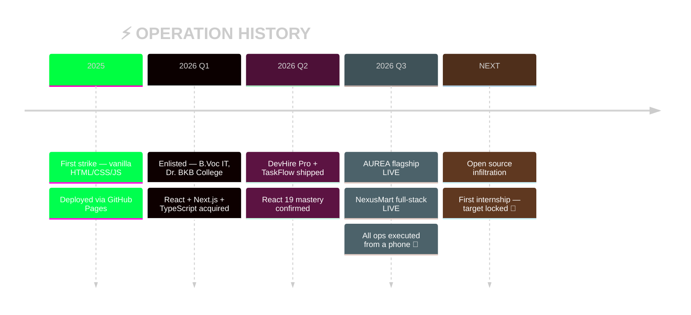

<div align="center">


[](https://manashjyoti-bora.vercel.app)


[](https://github.com/Manashjyoti-Bora?tab=followers)

</div>

```ansi
╔══════════════════════════════════════════════════════════════════╗
║  ❯ sudo access ./manashjyoti_bora.profile                        ║
║  [sudo] password: ********  → ACCESS GRANTED ✔                    ║
╠══════════════════════════════════════════════════════════════════╣
║  CODENAME......: Full Stack Developer                             ║
║  BASE..........: Nagaon, Assam, India [IST]                       ║
║  HARDWARE......: 1× Android phone. That's it. 📱                  ║
║  ARSENAL.......: React 19 · Next.js · TypeScript · Node · Mongo   ║
║  DEPLOYMENTS...: 2 live in production · 5 public repos            ║
║  TRAINING......: B.Voc IT — Dr. BKB College [2026-2030]           ║
║  MISSION.......: SDE Internship / Junior Role — RECRUITING ME     ║
║  CONTACT.......: manashjyotibora122@gmail.com — replies <24h      ║
╚══════════════════════════════════════════════════════════════════╝
```

> [!IMPORTANT]
> **⚡ RECRUITER FAST-PATH:** No laptop. No excuses. Every claim below is a clickable, live, verifiable deployment. Fastest audit: [**nexusmart-dusky.vercel.app**](https://nexusmart-dusky.vercel.app) → create account → place order. You just used my MongoDB + JWT backend.


##  ACTIVE DEPLOYMENTS

<table>
<tr>
<td width="50%" valign="top">

### 🎯 OPERATION: AUREA
`STATUS: LIVE ✔` `CLASS: FLAGSHIP`

[](https://manashjyoti-bora.vercel.app)
[](https://github.com/Manashjyoti-Bora/portfolio-website)

> Award-grade portfolio. Three.js particle field, GSAP choreography, ⌘K command palette, **hidden terminal** (`sudo hire-me` works), AI concierge, live GitHub telemetry, CSP hardened.

`Next.js 14` `TypeScript` `Three.js` `GSAP`

**⌨️ Intrusion codes:** <kbd>Ctrl</kbd>+<kbd>K</kbd> · <kbd>Ctrl</kbd>+<kbd>/</kbd> · type <kbd>iddqd</kbd> 🤫

</td>
<td width="50%" valign="top">

### 🛒 OPERATION: NEXUSMART
`STATUS: LIVE ✔` `CLASS: FULL-STACK`

[](https://nexusmart-dusky.vercel.app)
[](https://github.com/Manashjyoti-Bora/nexusmart)

> Production e-commerce. **MongoDB Atlas** · **JWT + bcrypt** (HTTP-only cookies, rate-limited) · server-computed totals (price-tamper proof) · role-gated admin panel · Zod on both sides.

`Node.js` `MongoDB` `JWT` `Zod`

**🔐 Security-first:** no user enumeration, no client trust.

</td>
</tr>
<tr>
<td width="50%" valign="top">

### 💼 OPERATION: DEVHIRE PRO
`STATUS: COMPLETE ✔`

[](https://github.com/Manashjyoti-Bora/devhire-pro-ats)

> Job portal + ATS. Triple real-time filter (keyword × skill × location), memoized React 19 rendering, pipeline tracker, glassmorphic theming.

`React 19` `Vite`

</td>
<td width="50%" valign="top">

### 📋 OPERATION: TASKFLOW
`STATUS: COMPLETE ✔`

[](https://github.com/Manashjyoti-Bora/taskflow-enterprise)

> Agile Kanban suite. Dynamic stage columns, live priority tags, centralized state — zero reloads.

`React` `State Management`

</td>
</tr>
</table>


##  WEAPONS CACHE

<div align="center">


*↑ live ammunition — they move*


</div>

| LOADOUT | AMMO | CLEARANCE |
|---|---|---|
| **React / Next.js** | 🟩🟩🟩🟩🟩🟩🟩🟩⬛⬛ | `PRIMARY WEAPON` |
| **TypeScript** | 🟩🟩🟩🟩🟩🟩🟩🟩⬛⬛ | `DAILY CARRY` |
| **Tailwind CSS** | 🟩🟩🟩🟩🟩🟩🟩🟩🟩⬛ | `FLUENT` |
| **Node.js / APIs** | 🟩🟩🟩🟩🟩🟩🟩⬛⬛⬛ | `FIELD-TESTED` |
| **MongoDB** | 🟩🟩🟩🟩🟩🟩🟩⬛⬛⬛ | `PRODUCTION-DEPLOYED` |
| **Consistency** | 🟥🟥🟥🟥🟥🟥🟥🟥🟥🟥 | `⚠ MAXIMUM — DO NOT ENGAGE` |


##  SURVEILLANCE FEED



### 🏙️ 3D OPERATION MAP (every commit = one building)


### 🐍 THE HARVESTER


<div align="center">


</div>


##  RULES OF ENGAGEMENT

```ansi
01. Ship real things — tutorials don't count, deployments do.
02. Never trust the client — totals, roles, validation live on the server.
03. Mobile-first always — most of the world attacks from a phone.
04. Learn in public — the commit graph is the only résumé that can't lie.
05. Constraints are weapons — no laptop taught me professional CI/CD.
```

> [!TIP]
> **The origin story:** Next.js dev mode can't even run on Android — the SWC binary doesn't exist for the platform. Instead of quitting, I re-architected: **Termux for code → GitHub for control → Vercel as the build machine.** The "limitation" trained me on the exact workflow professional teams use.


##  ESTABLISH UPLINK


<div align="center">

| CHANNEL | FREQUENCY |
|---|---|
| 🌐 **Command Center** | [manashjyoti-bora.vercel.app](https://manashjyoti-bora.vercel.app) |
| 📄 **Dossier (Résumé)** | [Download PDF](https://manashjyoti-bora.vercel.app/resume.pdf) |
| 📧 **Direct Line** | [manashjyotibora122@gmail.com](mailto:manashjyotibora122@gmail.com) |
| 💼 **LinkedIn** | [manashjyoti-bora](https://www.linkedin.com/in/manashjyoti-bora-323b97405) |


<details>
<summary>🥚 <b>[ENCRYPTED FILE — CLICK TO DECRYPT]</b></summary>
<br>

```text
 ╔═══════════════════════════════════════════════╗
 ║  DECRYPTION SUCCESSFUL. 🎉                    ║
 ║                                               ║
 ║  You found the hidden payload.                ║
 ║                                               ║
 ║  Classified intel: this entire operation —    ║
 ║  every repo, every deploy, every pixel —      ║
 ║  was executed without ever touching a laptop. ║
 ║                                               ║
 ║  If a phone can ship production systems,      ║
 ║  imagine the damage with real hardware.       ║
 ║                                               ║
 ║  Recruit me before someone else does. 😏      ║
 ║  → manashjyotibora122@gmail.com               ║
 ╚═══════════════════════════════════════════════╝
```

*Second payload hidden at [manashjyoti-bora.vercel.app](https://manashjyoti-bora.vercel.app) — type `iddqd`* 👀

</details>

<br>


`© 2026 MANASHJYOTI BORA` · `UPLINK: ALWAYS ONLINE` · `BUILT FROM A PHONE 📱`


</div>
