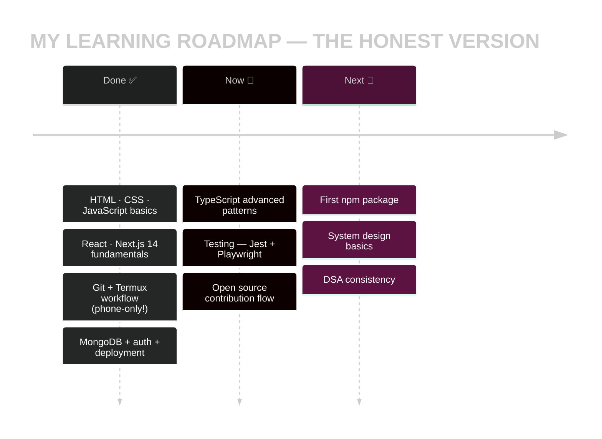
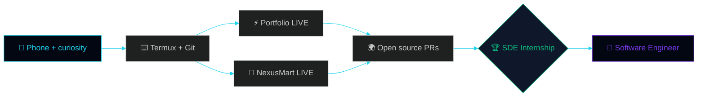

<div align="center">

<!-- ══════════════════════════════════════════════════════════════════ -->
<!--   THE LEARNING LOG — MY CODING JOURNEY, 100% FROM A PHONE 📱        -->
<!--   4 hand-coded SMIL animation files · 145+ animation techniques     -->
<!--   honestly applied · learning in public · one of one                -->
<!-- ══════════════════════════════════════════════════════════════════ -->

<!-- ═══ CUSTOM HERO — hand-coded SVG · theme-aware dark/light ═══ -->
<picture>
  <source media="(prefers-color-scheme: dark)" srcset="https://raw.githubusercontent.com/Manashjyoti-Bora/Manashjyoti-Bora/main/assets/hero-dark.svg">
  <source media="(prefers-color-scheme: light)" srcset="https://raw.githubusercontent.com/Manashjyoti-Bora/Manashjyoti-Bora/main/assets/hero-light.svg">
  
</picture>

*↑ I hand-coded this banner in pure SVG — ASCII line-reveal · typing terminal · cycling roles · glowing pills · floating orbs · particles · scanline sweep · glass panels · shimmer border · auto dark/light switch 🪄*


&nbsp;
<a href="https://github.com/Manashjyoti-Bora?tab=followers"></a>&nbsp;


[](https://manashjyoti-bora.vercel.app)&nbsp;
[](https://www.linkedin.com/in/manashjyoti-bora-323b97405)&nbsp;
[](mailto:manashjyotibora122@gmail.com)&nbsp;
[](https://manashjyoti-bora.vercel.app/resume.pdf)

<!-- Live uptime — real monitors -->
&nbsp;


</div>

> [!IMPORTANT]
> **🌱 HONEST HEADER:** I'm a student who is **still learning to code** — HTML, CSS, JavaScript, React, and beyond. I don't claim to be an expert. But while learning, I've already **shipped 2 real apps to production**, and the entire journey runs on **one Android phone**. Everything below is clickable, verifiable proof. **Learning in public. Shipping in public.** 📱

<!-- ═══ CUSTOM FX 1: HAND-CODED MATRIX RAIN DIVIDER ═══ -->


# 📖 CHAPTER 1 · MY STORY — WHY FROM A PHONE?


> No laptop. No excuses either.
>
> I'm from Nagaon, Assam — a 1st-year B.Voc IT student.
> My entire "computer lab" is **one Android phone**:
>
> - ⌨️ **Termux** — my terminal (git, node, npm live here)
> - 🌐 **GitHub web editor** — my IDE
> - ☁️ **Vercel** — my build machine (the cloud lifts the heavy stuff)
> - 👍 **Two thumbs** — my keyboard
>
> Every day I learn a little, and immediately **apply it to a real
> project** — that's why my repos aren't tutorials.
> **They're live products.**

<br clear="right"/>

```ansi
[ DAY 001 ] "Hello World" ran successfully ............ felt like magic
[ DAY 0XX ] First git push from Termux ................ hands were shaking
[ DAY 0XX ] First Vercel deploy went LIVE ............. showed the whole family
[ DAY 0XX ] Second app shipped with a real database ... okay, this is real now
[ TODAY   ] Still learning. Still shipping. ........... streak alive
```


# 🗂️ CHAPTER 2 · WHAT I'VE BUILT — REPOSITORY DIARY

<div align="center">


**Every repo = one chapter of learning. All of them are clickable:**

</div>

## ⚡ portfolio-website — *"What it taught me: the entire frontend world"*

```text
┌─ WHAT I BUILT ──────────────────────────────────────────────┐
│  AUREA — my own interactive portfolio                       │
│  🌌 3D particle hero (Three.js + React Three Fiber)         │
│  🤖 AI chatbot — ask it anything about me                   │
│  ⌨️ Ctrl+K command palette · Ctrl+/ hidden terminal         │
│  📊 Live GitHub dashboard (real API, zero fake numbers)     │
├─ WHAT I LEARNED ────────────────────────────────────────────┤
│  Next.js 14 App Router · TypeScript · Tailwind · GSAP       │
│  Framer Motion · API routes · SEO · security headers        │
└─────────────────────────────────────────────────────────────┘
```

[](https://manashjyoti-bora.vercel.app) [](https://github.com/Manashjyoti-Bora/portfolio-website)

## 🛒 nexusmart — *"What it taught me: backend + database + security"*

```text
┌─ WHAT I BUILT ──────────────────────────────────────────────┐
│  Full-stack e-commerce — sign up, cart, checkout, orders    │
│  🔐 JWT auth (HTTP-only cookies) + bcrypt password hashing  │
│  🗄️ MongoDB Atlas — real database, orders persist           │
│  👑 Admin dashboard — role-based access (403 walls)         │
├─ WHAT I LEARNED ────────────────────────────────────────────┤
│  Mongoose models · Zod validation · REST API design         │
│  auth flows · environment secrets · production debugging    │
└─────────────────────────────────────────────────────────────┘
```

[](https://nexusmart-dusky.vercel.app) [](https://github.com/Manashjyoti-Bora/nexusmart)

## 🧪 devhire-pro-ats & taskflow-enterprise — *"What they taught me: UI patterns + state"*

| REPO | WHAT I PRACTICED | LINK |
|:---|:---|:---:|
| **devhire-pro-ats** | ATS-style resume screening UI · complex layouts | [🔓 Open](https://github.com/Manashjyoti-Bora/devhire-pro-ats) |
| **taskflow-enterprise** | Task management · state handling · CRUD patterns | [🔓 Open](https://github.com/Manashjyoti-Bora/taskflow-enterprise) |

## 🤖 Manashjyoti-Bora (this repo) — *"What it taught me: CI/CD automation"*

This profile is itself a project — **3 GitHub Actions pipelines** I set up and debugged myself: snake 🐍 · 3D city 🏙️ · auto-rebuild. Plus **4 hand-coded SMIL animation files** you're watching right now.

<!-- ═══ CUSTOM FX 2: HAND-CODED COSMIC DASHBOARD ═══ -->


*↑ also hand-coded: starfield · shooting stars · aurora · fireworks · orbiting planets · DNA helix · radar scan · liquid gauge · progress ring · equalizer — all pure SVG, zero JavaScript*

<!-- ═══ CUSTOM FX 3: FX LAB — 30 techniques in one hand-coded file ═══ -->


# 🧪 BONUS CHAPTER · THE FX LAB

<div align="center">

**30 animation techniques — glitch · CRT noise · neon flicker · rainbow · marquee · 3D flip · cube · pendulum · oscilloscope · odometer · skeleton · ripple · bubbles · lava lamp · metaballs · rain · snow · lightning · laser · fire · smoke · confetti · comet · synthwave grid · halftone · moiré · kaleidoscope · path-draw ✓✗ · spotlight blinds — every panel hand-coded by me in pure SVG. No libraries. No JavaScript. Just code.**


*Why does a learner build this? Because the best way to learn SVG/animation is to make 30 of them.* 🌱

</div>

# 📚 CHAPTER 3 · WHAT I'M LEARNING RIGHT NOW

<div align="center"></div>



**Skill bars (honest self-assessment):**

```text
HTML/CSS     ██████████████████░░░░░░░  where it all started
JAVASCRIPT   ████████████████░░░░░░░░░  learning by shipping
REACT/NEXT   ██████████████████░░░░░░░  2 apps built with it
TYPESCRIPT   ██████████████░░░░░░░░░░░  strict mode always on
BACKEND/DB   ██████████████░░░░░░░░░░░  real auth + Mongo done
TESTING      ██████░░░░░░░░░░░░░░░░░░░  new chapter — honest!
CONSISTENCY  █████████████████████████  the only maxed skill
```


# 🛠️ CHAPTER 4 · MY TOOLS

<div align="center">


### Animated tech icons (they move — watch!)

&nbsp;
&nbsp;
&nbsp;
&nbsp;


<br/>


| 🧩 SLOT | ⚙️ MY GEAR |
|:---|:---|
| 💻 Machine | Android phone — my entire workstation |
| 🐧 Terminal | Termux (node · git · npm) |
| ✏️ Editor | GitHub web editor |
| ☁️ Builds | Vercel cloud |
| 🗄️ Database | MongoDB Atlas |
| 🚦 CI/CD | GitHub Actions |

</div>


# 📊 CHAPTER 5 · LIVE PROOF OF THE JOURNEY

<div align="center">


**Every widget below pulls real data on every page load — no screenshots:**


**🏙️ My commits build a 3D city — rebuilt automatically every night:**


**🐍 The snake eats my commits — dispatched at 00:00 UTC:**


**Emerald heatmap — every single day of learning:**


</div>


# 🧭 CHAPTER 6 · JOURNEY MAP



- [x] 🌱 First line of code — on a phone
- [x] ⚡ First production deploy
- [x] 🛒 First full-stack app with a real database
- [x] 🤖 First CI/CD pipelines
- [x] 🎨 First hand-coded SMIL animation files (this page!)
- [ ] 🌍 First external open-source PR — **next!**
- [ ] 📦 First npm package
- [ ] 🏆 First internship — **the goal**


# 📬 CHAPTER 7 · WANT TO JOIN THE JOURNEY?

<div align="center">


**Looking for a junior who learns fast and ships real things? I'm ready.** 🌱

[](mailto:manashjyotibora122@gmail.com?subject=Hello%20Manashjyoti)&nbsp;
[](https://www.linkedin.com/in/manashjyoti-bora-323b97405)

**Animated 3D social icons (tap them — they spin!):**

<a href="https://www.linkedin.com/in/manashjyoti-bora-323b97405"></a>&nbsp;&nbsp;
<a href="mailto:manashjyotibora122@gmail.com"></a>&nbsp;&nbsp;
<a href="https://github.com/Manashjyoti-Bora"></a>


<details>
<summary>🥚 <b>SECRET PAGE — the real lesson of this journey (tap)</b></summary>
<br/>

```ansi
╔════════════════════════════════════════════════╗
║   THE REAL LESSON 🌱                           ║
║                                                ║
║   Hardware doesn't make a developer.           ║
║   Consistency does.                            ║
║                                                ║
║   If all you have is a phone — start with      ║
║   the phone. Starting is the real skill.      ║
╚════════════════════════════════════════════════╝
```

</details>

<br/>

<samp>learning.log → day by day · commit by commit · no shortcuts</samp><br/>
<sub>© 2026 Manashjyoti Bora · Nagaon, Assam 🇮🇳 · written with two thumbs</sub>


</div>
