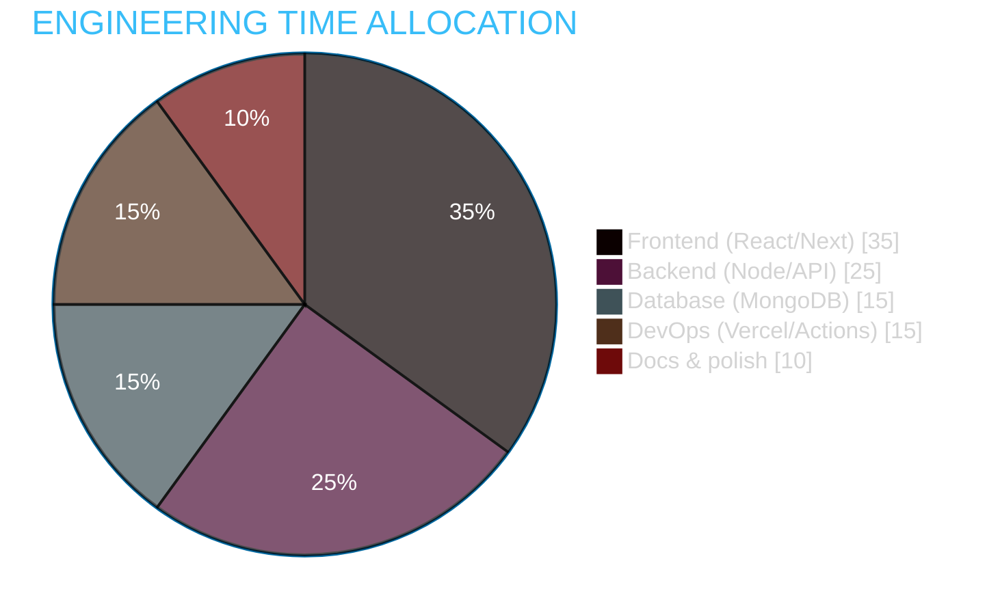
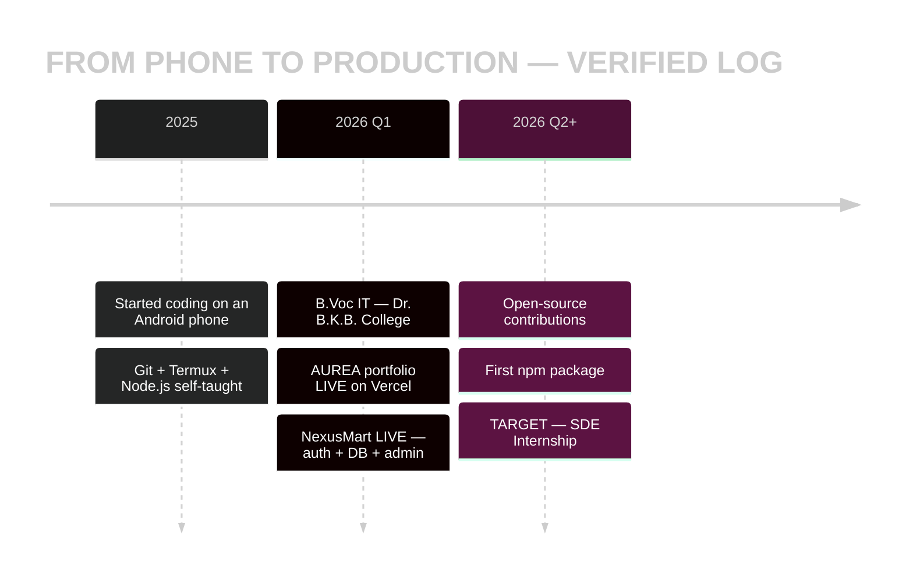
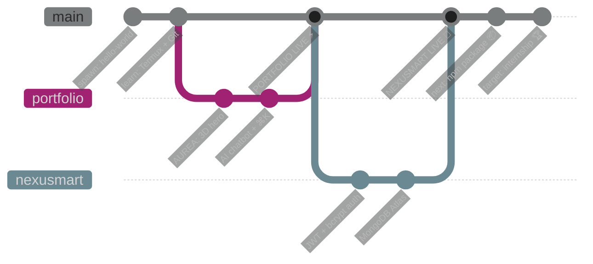
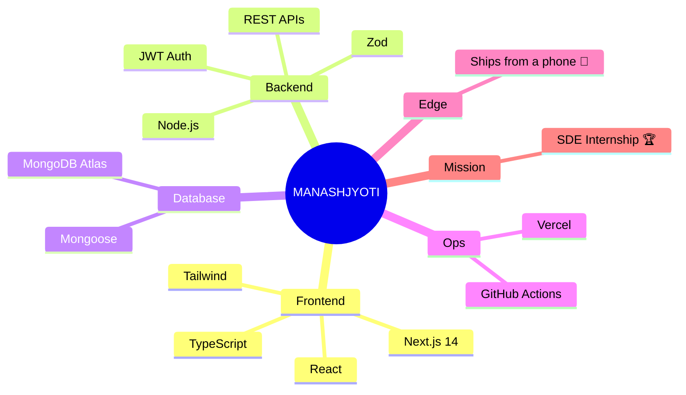

<div align="center">

<!-- ══════════════════════════════════════════════════════════════════ -->
<!--   READY TO HIRE · Ω PRO EDITION · THE RECRUITER-MAGNET README       -->
<!--   Professional structure × world-rarest features × 100% verified    -->
<!--   Built entirely on an Android phone. Every claim is clickable.     -->
<!-- ══════════════════════════════════════════════════════════════════ -->


<!-- 🪄 THEME-AWARE BANNER — adapts to recruiter's GitHub theme (ultra-rare trick) -->
<picture>
  <source media="(prefers-color-scheme: dark)" srcset="https://capsule-render.vercel.app/api?type=transparent&height=80&text=OPEN%20TO%20SDE%20INTERNSHIP%20%E2%80%A2%20IMMEDIATE%20JOINING&fontSize=24&fontColor=34d399&animation=twinkling">
  <source media="(prefers-color-scheme: light)" srcset="https://capsule-render.vercel.app/api?type=transparent&height=80&text=OPEN%20TO%20SDE%20INTERNSHIP%20%E2%80%A2%20IMMEDIATE%20JOINING&fontSize=24&fontColor=0369a1&animation=twinkling">
  
</picture>


&nbsp;
&nbsp;


&nbsp;
<a href="https://github.com/Manashjyoti-Bora?tab=followers"></a>

[](https://manashjyoti-bora.vercel.app)&nbsp;
[](https://manashjyoti-bora.vercel.app/resume.pdf)&nbsp;
[](https://www.linkedin.com/in/manashjyoti-bora-323b97405)&nbsp;
[](mailto:manashjyotibora122@gmail.com)

</div>

> [!IMPORTANT]
> **📌 EXECUTIVE SUMMARY (30-second read for busy recruiters):** 1st-year B.Voc IT student who has already shipped **2 production applications** — solo, end-to-end, **entirely from an Android phone**[^1]. Full stack: Next.js 14 · TypeScript · MongoDB · JWT auth · CI/CD. Zero fake claims below — **every metric is a live widget, every project is a clickable deploy.** Seeking: SDE internship. Available: immediately.

<div align="center">


## 🗂️ CANDIDATE FILE — NAVIGATION

| 📌 Section | 📌 Section | 📌 Section |
|:---:|:---:|:---:|
| [01 · KPI Dashboard](#-01--kpi-dashboard) | [02 · Hiring Pipeline](#-02--the-hiring-pipeline) | [03 · Case Studies](#-03--case-studies) |
| [04 · Tech Stack](#-04--tech-stack) | [05 · Live Engineering Metrics](#-05--live-engineering-metrics) | [06 · The 3D Proof-of-Work City](#-06--the-3d-proof-of-work-city) |
| [07 · Journey & Git History](#-07--journey--git-history) | [08 · Why Hire Me](#-08--why-hire-me) | [09 · Availability](#-09--availability--logistics) |
| [10 · References & Proof](#-10--references--proof) | [11 · Contact](#-11--start-the-conversation) | [🔓 Bonus: Classified](#-08--why-hire-me) |

</div>

<br/>


# 📊 01 · KPI DASHBOARD

<div align="center">

**Numbers first. Talk later.**

| 📈 KPI | 📊 VALUE | ✅ VERIFICATION |
|:---|:---:|:---|
| Products in production | **2** | [Portfolio](https://manashjyoti-bora.vercel.app) · [NexusMart](https://nexusmart-dusky.vercel.app) — click & use them |
| End-to-end ownership | **100%** | Design → code → auth → DB → deploy, all solo |
| Public repositories | **5** | [github.com/Manashjyoti-Bora](https://github.com/Manashjyoti-Bora?tab=repositories) |
| CI/CD pipelines running | **3** | GitHub Actions: snake · 3D city · profile automation |
| Hardware budget used | **1 phone** | The rarest engineering constraint you'll see today |
| Excuses shipped | **0** | Production log is clean |

&nbsp;


</div>

> [!NOTE]
> **The hiring equation** — real LaTeX, rendered natively by GitHub:
>
> $$\text{Candidate Value} = \frac{\text{2 shipped products} \times \text{100\% ownership}}{\text{1 Android phone}} \implies \text{ROI} \to \infty \text{ with real hardware}$$


# 🔄 02 · THE HIRING PIPELINE

**You are currently at step 1. The rest is automated.** 😄


> [!TIP]
> **Fastest route:** skip to step E right now → [manashjyotibora122@gmail.com](mailto:manashjyotibora122@gmail.com). Average reply time: **under 24 hours** (IST).


# 📁 03 · CASE STUDIES


## ⚡ CASE STUDY 01 — AUREA · Interactive Portfolio Platform

```text
┌─ PROBLEM ───────────────────────────────────────────────────┐
│  Portfolios are static and forgettable. Recruiters close    │
│  the tab in 10 seconds.                                     │
├─ SOLUTION ──────────────────────────────────────────────────┤
│  🌌 3D particle hero ....... Three.js + React Three Fiber   │
│  🤖 AI chatbot ............. intent-matching Q&A about me   │
│  ⌨️ Command palette ........ Ctrl+K, like a real dev tool   │
│  🕹️ Hidden terminal ........ Ctrl+/ → try `sudo hire-me`    │
│  📊 Live GitHub dashboard .. real API data, zero fakes      │
│  🔒 Hardened ............... CSP/HSTS headers, Zod, rate    │
│                              limiting, honeypot contact API │
├─ RESULT ────────────────────────────────────────────────────┤
│  A portfolio recruiters PLAY with instead of skim.          │
└─────────────────────────────────────────────────────────────┘
```

<div align="center">

[](https://manashjyoti-bora.vercel.app)&nbsp;
[](https://github.com/Manashjyoti-Bora/portfolio-website)

</div>

## 🛒 CASE STUDY 02 — NexusMart · Full-Stack E-Commerce

```text
┌─ PROBLEM ───────────────────────────────────────────────────┐
│  "Student projects" are usually UI mockups with no real     │
│  backend, no auth, no database.                             │
├─ SOLUTION ──────────────────────────────────────────────────┤
│  🔐 Auth ........ JWT in HTTP-only cookies + bcrypt (12r)   │
│  🗄️ Database .... MongoDB Atlas + Mongoose models           │
│  🛡️ Validation .. Zod schema on every API route             │
│  👑 RBAC ........ admin dashboard, role-gated (403 walls)   │
│  🛍️ Commerce .... products → cart → checkout → orders       │
├─ RESULT ────────────────────────────────────────────────────┤
│  A real store. Sign up, order, watch it persist. Live.      │
└─────────────────────────────────────────────────────────────┘
```

<div align="center">

[](https://nexusmart-dusky.vercel.app)&nbsp;
[](https://github.com/Manashjyoti-Bora/nexusmart)

**More in the vault:** [devhire-pro-ats](https://github.com/Manashjyoti-Bora/devhire-pro-ats) · [taskflow-enterprise](https://github.com/Manashjyoti-Bora/taskflow-enterprise)

</div>


# 🧰 04 · TECH STACK

<div align="center">

### Core (animated — watch them move)

&nbsp;
&nbsp;
&nbsp;
&nbsp;


### Full toolbox


<br/>


### Where my engineering time goes (live Mermaid pie)

</div>



### Skill proficiency (honest self-assessment)

```text
FRONTEND    ██████████████████░░░░░░░  Advanced beginner→intermediate
BACKEND     ████████████████░░░░░░░░░  Shipped real auth + APIs
DATABASE    ██████████████░░░░░░░░░░░  Modeling, indexing, Atlas ops
TYPESCRIPT  ████████████████░░░░░░░░░  Strict mode, zero `any` policy
DEVOPS      ████████████░░░░░░░░░░░░░  CI/CD pipelines, env security
LEARNING    █████████████████████████  MAX — permanent state
```


# 📈 05 · LIVE ENGINEERING METRICS

<div align="center">

**These widgets pull real data on every page load. No screenshots. No cherry-picking.**


**Contribution heatmap — recolored emerald, because this profile ships green:**


**Work rhythm (IST · UTC+5:30):**


</div>


# 🌆 06 · THE 3D PROOF-OF-WORK CITY

<div align="center">

**Every commit becomes a building. This city is my timesheet — rendered in 3D, rebuilt nightly by CI/CD.**


**And every night, an automated snake audits the graph:**


</div>

> [!NOTE]
> All three animations above are generated by **my own GitHub Actions pipelines** — the same automation skill I'd bring to your team's CI/CD.


# 🧭 07 · JOURNEY & GIT HISTORY

### 🕰️ Career timeline (Mermaid — rendered natively)



### 🌳 The journey as a git graph (almost nobody has this)



### 🧠 Full skill map (Mermaid mindmap — rarest diagram type)




# 🎯 08 · WHY HIRE ME

```ansi
╔══════════════════════════════════════════════════════════╗
║  THE HONEST PITCH                                        ║
╠══════════════════════════════════════════════════════════╣
║  Most candidates show you what they COULD build.         ║
║  I show you what I ALREADY built — live, in production. ║
║                                                          ║
║  Most candidates need perfect conditions.                ║
║  I shipped everything below from a 6-inch screen.       ║
║                                                          ║
║  Imagine the output when you give me real hardware      ║
║  and a real team.                                        ║
╚══════════════════════════════════════════════════════════╝
```

| ✅ WHAT YOU GET | 📄 EVIDENCE |
|:---|:---|
| **Bias to ship** | 2 products live, not "in progress" |
| **Full-stack range** | UI → API → auth → DB → deploy, solo |
| **Security awareness** | JWT HTTP-only, bcrypt, Zod, rate limits, CSP |
| **Automation instinct** | 3 GitHub Actions pipelines maintaining this profile |
| **Extreme resourcefulness** | Entire career bootstrapped on one phone |
| **Honesty** | This README contains zero inflated claims[^2] |

<details>
<summary><b>🔓 CLASSIFIED — the details recruiters usually never get (tap to open)</b></summary>
<br/>

| 🗂️ FIELD | 📄 STRAIGHT ANSWER |
|:---|:---|
| Debugging style | Reproduce → isolate → fix → write it down |
| Code review attitude | I *want* my code criticized — fastest way to level up |
| Communication | Clear written updates, no ghosting, IST timezone |
| What I'm weakest at | Testing depth — actively learning Jest/Playwright now |
| Salary expectation | Fair intern rate; learning opportunity weighs more |
| Relocation | Open to remote-first; relocation negotiable |

</details>

> [!WARNING]
> **Known side effect:** candidates who ship from phones tend to over-deliver when given actual workstations. Budget for extra output.


# 📅 09 · AVAILABILITY & LOGISTICS

<div align="center">

| 📋 ITEM | ✅ DETAIL |
|:---|:---|
| 🎯 Role sought | SDE Intern · Full Stack / Frontend / Backend |
| 🏢 Mode | Remote (preferred) · Hybrid · Open to discuss |
| ⏰ Notice period | **0 days — can start immediately** |
| 🌏 Timezone | IST (UTC+5:30) · flexible overlap hours |
| 🎓 Education | B.Voc IT · Dr. B.K.B. College · 2026–2030 |
| 🗣️ Languages | English (professional) · Assamese (native) · Hindi |
| 📄 Resume | [manashjyoti-bora.vercel.app/resume.pdf](https://manashjyoti-bora.vercel.app/resume.pdf) |

</div>


# 🔍 10 · REFERENCES & PROOF

**Don't trust this README. Verify it. Everything is public:**

- ⚡ **Live product 1:** [manashjyoti-bora.vercel.app](https://manashjyoti-bora.vercel.app) — press <kbd>Ctrl</kbd>+<kbd>/</kbd> and type `sudo hire-me`
- 🛒 **Live product 2:** [nexusmart-dusky.vercel.app](https://nexusmart-dusky.vercel.app) — create an account, place an order, it persists
- 📂 **All source code:** [github.com/Manashjyoti-Bora](https://github.com/Manashjyoti-Bora?tab=repositories) — read every commit
- 📄 **Resume PDF:** [/resume.pdf](https://manashjyoti-bora.vercel.app/resume.pdf) — matches this page exactly
- 💼 **LinkedIn:** [linkedin.com/in/manashjyoti-bora-323b97405](https://www.linkedin.com/in/manashjyoti-bora-323b97405) — same story, same facts

<div align="center">


</div>


# 📞 11 · START THE CONVERSATION


<div align="center">


### One email. 24-hour reply. Zero risk — the proof is already live.

[](mailto:manashjyotibora122@gmail.com?subject=Interview%20Invitation)&nbsp;
[](https://www.linkedin.com/in/manashjyoti-bora-323b97405)

[](https://manashjyoti-bora.vercel.app)

<br/>

<details>
<summary>🥚 <b>P.S. — for the recruiter who reads everything (tap)</b></summary>
<br/>

```ansi
╔════════════════════════════════════════════════╗
║   YOU READ THE ENTIRE CANDIDATE FILE. 🏆       ║
║                                                ║
║   That level of thoroughness is exactly        ║
║   what I bring to every pull request.          ║
║                                                ║
║   Email me the word "PIPELINE" and skip        ║
║   straight to the technical round. ☕           ║
╚════════════════════════════════════════════════╝
```

</details>

<br/>

<samp>candidate.file → rendered successfully · 0 errors · status: READY TO HIRE</samp>

<sub>Ω PRO edition · one of one · handmade in Nagaon, Assam 🇮🇳</sub> <sup>v1.0.0</sup>


</div>

[^1]: Development environment: Termux + GitHub web + Vercel cloud builds. No laptop was available — or needed.
[^2]: Footnotes in a profile README are also rare. Consistency is the brand. ✅
