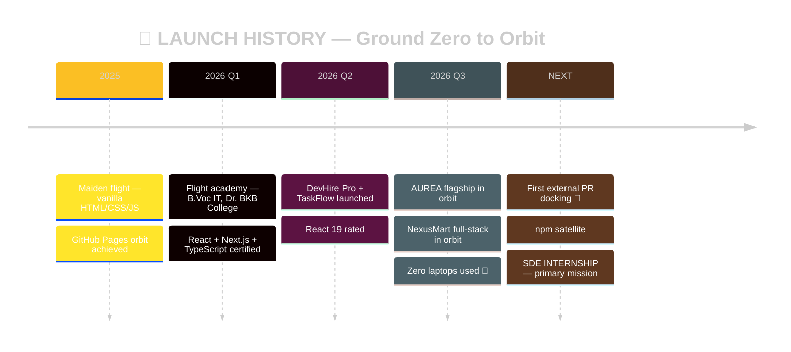

<div align="center">

<!-- ═══ LAUNCH BANNER ═══ -->


<!-- ═══ PRE-LAUNCH SEQUENCE TYPING ═══ -->
[](https://manashjyoti-bora.vercel.app)

<!-- ═══ TELEMETRY COUNTERS ═══ -->


[](https://github.com/Manashjyoti-Bora?tab=followers)

</div>

```ansi
╔═════════════════════════ FLIGHT MANIFEST ═════════════════════════╗
║  ❯ open ./astronaut_file --clearance=RECRUITER                    ║
║  VERIFYING CLEARANCE... APPROVED ✔                                ║
╠════════════════════════════════════════════════════════════════════╣
║  ASTRONAUT.....: Manashjyoti Bora                                  ║
║  CALLSIGN......: Full Stack Developer                              ║
║  LAUNCH SITE...: Nagaon, Assam, India [IST]                        ║
║  SPACECRAFT....: 1× Android phone. No backup vehicle. 📱           ║
║  FUEL..........: React 19 · Next.js · TypeScript · Node · Mongo    ║
║  ACADEMY.......: B.Voc IT — Dr. BKB College [2026-2030]            ║
║  MISSION.......: SDE INTERNSHIP — RECRUITING WINDOW OPEN           ║
║  COMMS.........: manashjyotibora122@gmail.com                      ║
╚════════════════════════════════════════════════════════════════════╝
```

> [!IMPORTANT]
> **🛰️ GROUND CONTROL — 10-SECOND FLIGHT CHECK:** Every mission below is live and verifiable. Fastest inspection → [**nexusmart-dusky.vercel.app**](https://nexusmart-dusky.vercel.app): create an account, place an order. You just docked with my real MongoDB + JWT backend. **This spacecraft has never seen a laptop.**


<!-- ═══ MISSION TELEMETRY ═══ -->
##  Mission Telemetry

<div align="center">


</div>


<!-- ═══ ORBITAL OBSERVATORY — 5 DIMENSIONS ═══ -->
##  Orbital Observatory

### 🌃 Orbit 1 — Commit Metropolis *(each launch builds a tower)*


### 🐍 Orbit 2 — The Orbital Serpent *(feeds on daily launches)*


### 👾 Orbit 3 — Asteroid Muncher


### 🌌 Orbit 4 — Seasonal Station *(rotates with Earth's seasons)*


### ⭐ Orbit 5 — Star Chart


<!-- ═══ PROPULSION SYSTEMS ═══ -->
##  Propulsion Systems

<div align="center">


*↑ engines running — live animation*


</div>

```ansi
MAIN ENGINE  — REACT/NEXT.JS   ████████████████░░░░  THRUST 80%
NAVIGATION   — TYPESCRIPT      ████████████████░░░░  THRUST 80%
HEAT SHIELD  — TAILWIND        ██████████████████░░  THRUST 90%
LIFE SUPPORT — NODE/MONGO      ██████████████░░░░░░  THRUST 70%
AFTERBURNER  — CONSISTENCY     ████████████████████  ⚠ MAXIMUM BURN
```


<!-- ═══ PAYLOADS IN ORBIT ═══ -->
##  Payloads In Orbit

<table>
<tr>
<td width="50%" valign="top">

### ✨ MISSION: AUREA `FLAGSHIP · IN ORBIT`

[](https://manashjyoti-bora.vercel.app)
[](https://github.com/Manashjyoti-Bora/portfolio-website)

> Three.js particle nebula · GSAP orbital choreography · ⌘K command deck · **hidden cockpit terminal** · AI co-pilot · live telemetry feed · CSP shielded.

**Override codes:** <kbd>Ctrl</kbd>+<kbd>K</kbd> · <kbd>Ctrl</kbd>+<kbd>/</kbd> · <kbd>iddqd</kbd> · <kbd>↑↑↓↓←→←→BA</kbd>

</td>
<td width="50%" valign="top">

### 🛒 MISSION: NEXUSMART `FULL-STACK · IN ORBIT`

[](https://nexusmart-dusky.vercel.app)
[](https://github.com/Manashjyoti-Bora/nexusmart)

> MongoDB Atlas fuel cells · JWT + bcrypt airlocks (HTTP-only) · rate-limited entry · **server-computed cargo totals** · commander-only admin bay · Zod inspections.

**Docking test:** signup → cart → order. Real database writes.

</td>
</tr>
<tr>
<td width="50%" valign="top">

### 💼 MISSION: DEVHIRE PRO
[](https://github.com/Manashjyoti-Bora/devhire-pro-ats)
> Crew-recruitment station — triple real-time scanner (keyword × skill × location), memoized React 19 thrusters.

</td>
<td width="50%" valign="top">

### 📋 MISSION: TASKFLOW
[](https://github.com/Manashjyoti-Bora/taskflow-enterprise)
> Cargo-bay Kanban — dynamic holds (To Do → In Progress → Done), priority beacons, zero-gravity state sync.

</td>
</tr>
</table>


<!-- ═══ FLIGHT LOG ═══ -->
##  Flight Log



| 🎓 Flight Academy | 💼 Flight Hours |
|---|---|
| **B.Voc Information Technology** · Dr. BKB College, Nagaon · 2026–2030 | **Full Stack Developer** (solo missions) · 4+ production launches end-to-end · 2025–now |


<!-- ═══ FLIGHT PLAN + COMMS ═══ -->
##  Flight Plan

- [x] ~~Launch flagship portfolio~~ `ORBIT ACHIEVED ✔`
- [x] ~~Launch full-stack payload (MongoDB + JWT)~~ `ORBIT ACHIEVED ✔`
- [x] 365-day launch streak `BURN CONTINUES 🔥`
- [ ] First external open-source docking (PR) `TRAJECTORY LOCKED 🎯`
- [ ] npm satellite deployment `ON LAUNCHPAD`
- [ ] SDE Internship `PRIMARY MISSION — ground control, we're ready 😏`

<div align="center">


<details>
<summary>🛸 <b>[BLACK BOX — click to open]</b></summary>
<br>

```text
 ╔═══════════════════════════════════════════════════╗
 ║  BLACK BOX RECOVERED 🎉                           ║
 ║                                                   ║
 ║  Final transmission:                              ║
 ║  "Everything you just scrolled — the 3D city,     ║
 ║   the serpent, the two live products — was        ║
 ║   launched from a device that fits in a pocket.   ║
 ║                                                   ║
 ║   No launchpad. No mission control room.          ║
 ║   No laptop. Just fuel and stubbornness.          ║
 ║                                                   ║
 ║   Give this astronaut a real spacecraft           ║
 ║   and watch what orbit we reach." 🚀              ║
 ║                                                   ║
 ║  → manashjyotibora122@gmail.com                   ║
 ╚═══════════════════════════════════════════════════╝
```

*Second black box hidden aboard AUREA — type* <kbd>iddqd</kbd> 👀

</details>

<br>

##  Establish Comms

[](https://manashjyoti-bora.vercel.app)
[](https://manashjyoti-bora.vercel.app/resume.pdf)
[](https://www.linkedin.com/in/manashjyoti-bora-323b97405)
[](mailto:manashjyotibora122@gmail.com)


`© 2026` · `LAUNCHED FROM A PHONE 📱` · `GROUND CONTROL STANDING BY`


</div>
