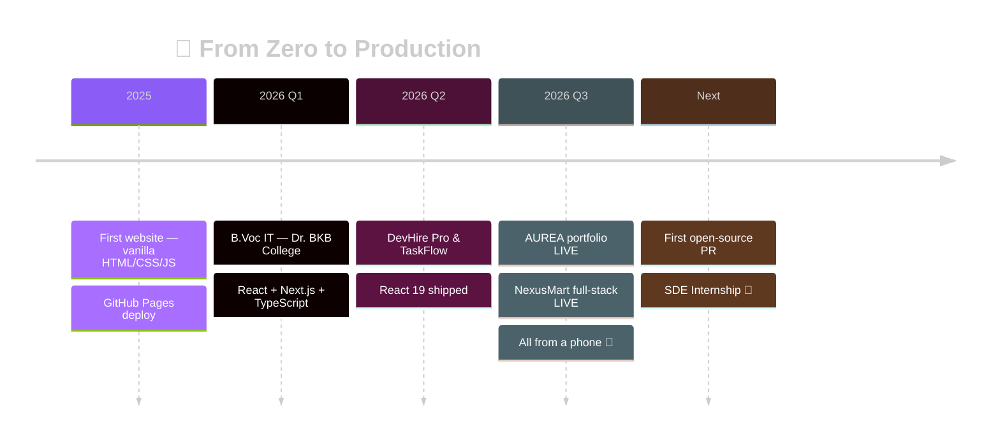

<div align="center">

<!-- ═══ 1. ANIMATED BANNER ═══ -->


<!-- ═══ 2. TYPING SVG ═══ -->
[](https://manashjyoti-bora.vercel.app)

<!-- ═══ 3. VISITOR COUNTER + LIVE BADGES ═══ -->


[](https://github.com/Manashjyoti-Bora?tab=followers)

</div>


<!-- ═══ 4. ABOUT ME ═══ -->
##  About Me

<table>
<tr>
<td width="60%" valign="top">

I'm a **Full Stack Developer** from **Nagaon, Assam, India** 🇮🇳 — and everything on this profile is **clickable proof, not claims.**

- 🚀 **2 products LIVE** in production — portfolio + full-stack e-commerce
- 📱 **100% built from an Android phone** — Termux + Git + Vercel
- 🎓 B.Voc IT @ Dr. BKB College (2026–2030)
- 🌱 Currently: Node.js depth, system design, open source
- 💡 Fun fact: Next.js dev mode can't even run on Android — so I made Vercel my build machine. The constraint taught me professional CI/CD.

</td>
<td width="40%" valign="top">


```ansi
❯ status
● AVAILABLE NOW
❯ replies_within
24 hours
```

</td>
</tr>
</table>

<!-- ═══ 5. SOCIAL LINKS + 6. CONTACT ═══ -->
<div align="center">

[](https://manashjyoti-bora.vercel.app)
[](https://www.linkedin.com/in/manashjyoti-bora-323b97405)
[](mailto:manashjyotibora122@gmail.com)
[](https://manashjyoti-bora.vercel.app/resume.pdf)

</div>


<!-- ═══ 7. TECH STACK + 8. SKILL ICONS ═══ -->
##  Tech Stack

<div align="center">


*↑ animated — watch them move!*


</div>

| Skill | Level | |
|---|---|---|
| **React / Next.js** | 🟪🟪🟪🟪🟪🟪🟪🟪⬜⬜ | `daily driver` |
| **TypeScript** | 🟦🟦🟦🟦🟦🟦🟦🟦⬜⬜ | `typed everything` |
| **Node.js / MongoDB** | 🟩🟩🟩🟩🟩🟩🟩⬜⬜⬜ | `production-deployed` |
| **Consistency** | 🟥🟥🟥🟥🟥🟥🟥🟥🟥🟥 | `superpower 🔥` |


<!-- ═══ 9. GITHUB STATS + 10. STREAK + 11. TOP LANGS + 12. ACTIVITY + 13. CONTRIB GRAPH + 14. SNAKE + 15. 3D ═══ -->
##  GitHub Analytics

<div align="center">


### 🏙️ 3D Contribution City *(every commit = one building)*


### 🐍 Contribution Snake


### 🗓️ Contribution Heatmap


</div>


<!-- ═══ 16. FEATURED PROJECTS ═══ -->
##  Featured Projects

<table>
<tr>
<td width="50%" valign="top">

### ✨ AUREA — Portfolio
`✅ LIVE` `⭐ FLAGSHIP`

[](https://manashjyoti-bora.vercel.app)
[](https://github.com/Manashjyoti-Bora/portfolio-website)

> Three.js 3D hero · GSAP · ⌘K palette · hidden terminal · AI chatbot · live GitHub dashboard · CSP hardened.

**Try:** <kbd>Ctrl</kbd>+<kbd>K</kbd> · type <kbd>iddqd</kbd> 🤫

`Next.js 14` `TypeScript` `Three.js` `GSAP`

</td>
<td width="50%" valign="top">

### 🛒 NexusMart — E-Commerce
`✅ LIVE` `⚙️ FULL-STACK`

[](https://nexusmart-dusky.vercel.app)
[](https://github.com/Manashjyoti-Bora/nexusmart)

> MongoDB Atlas · JWT + bcrypt (HTTP-only cookies) · server-computed totals · role-gated admin panel · Zod both sides.

**Try:** create account → place an order. It's real.

`Node.js` `MongoDB` `JWT` `Zod`

</td>
</tr>
<tr>
<td width="50%" valign="top">

### 💼 DevHire Pro — Job Portal & ATS
[](https://github.com/Manashjyoti-Bora/devhire-pro-ats)

> Real-time triple filtering (keyword × skill × location), memoized React 19, pipeline tracker.

`React 19` `Vite`

</td>
<td width="50%" valign="top">

### 📋 TaskFlow — Kanban Suite
[](https://github.com/Manashjyoti-Bora/taskflow-enterprise)

> Dynamic stage columns, live priority tags, centralized state — zero reloads.

`React` `State Management`

</td>
</tr>
</table>


<!-- ═══ 17. EXPERIENCE TIMELINE + 18. EDUCATION ═══ -->
##  Journey Timeline



| 🎓 Education | 💼 Experience |
|---|---|
| **B.Voc Information Technology** — Dr. BKB College, Nagaon (2026–2030) | **Full Stack Developer** — Self-driven · 4+ production apps designed, built & deployed solo (2025–Present) |


<!-- ═══ 19. FUN FACTS + INTERESTS + 20. QUOTES ═══ -->
##  Fun Zone

<div align="center">

**⌨️ My portfolio has secrets — try these at [manashjyoti-bora.vercel.app](https://manashjyoti-bora.vercel.app):**

<kbd>Ctrl</kbd>+<kbd>K</kbd> Command Palette · <kbd>Ctrl</kbd>+<kbd>/</kbd> Terminal · <kbd>i</kbd><kbd>d</kbd><kbd>d</kbd><kbd>q</kbd><kbd>d</kbd> 🤫 · <kbd>↑↑↓↓←→←→BA</kbd> 🎊


</div>

<!-- ═══ 21. UPCOMING GOALS ═══ -->
##  Upcoming Goals

- [x] ~~Ship flagship portfolio~~ ✅
- [x] ~~Ship full-stack product (MongoDB + JWT)~~ ✅
- [x] 365-day commit streak — `IN PROGRESS 🔥`
- [ ] First external open-source PR — `THIS MONTH 🎯`
- [ ] Publish first npm package
- [ ] Land SDE Internship — `PRIMARY OBJECTIVE`


<!-- ═══ 22. EASTER EGG + FOOTER ═══ -->
<div align="center">

<details>
<summary>🥚 <b>psst... click here for a secret</b></summary>
<br>

```text
 ┌─────────────────────────────────────────────┐
 │  You found it! 🎉                           │
 │                                             │
 │  This entire GitHub presence — every repo,  │
 │  every README, every deploy — was built     │
 │  without ever touching a laptop.            │
 │                                             │
 │  If a phone can ship production code,       │
 │  imagine what I'll do with a real machine.  │
 │                                             │
 │  → manashjyotibora122@gmail.com             │
 └─────────────────────────────────────────────┘
```

</details>

<br>


`© 2026` · `BUILT FROM A PHONE 📱` · `REPLIES < 24H`


</div>
