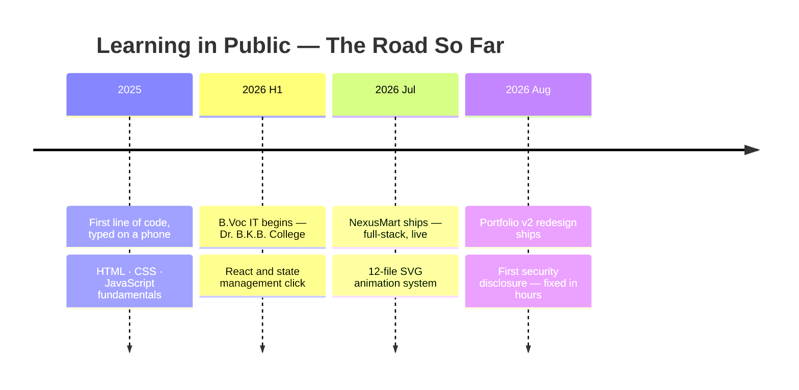
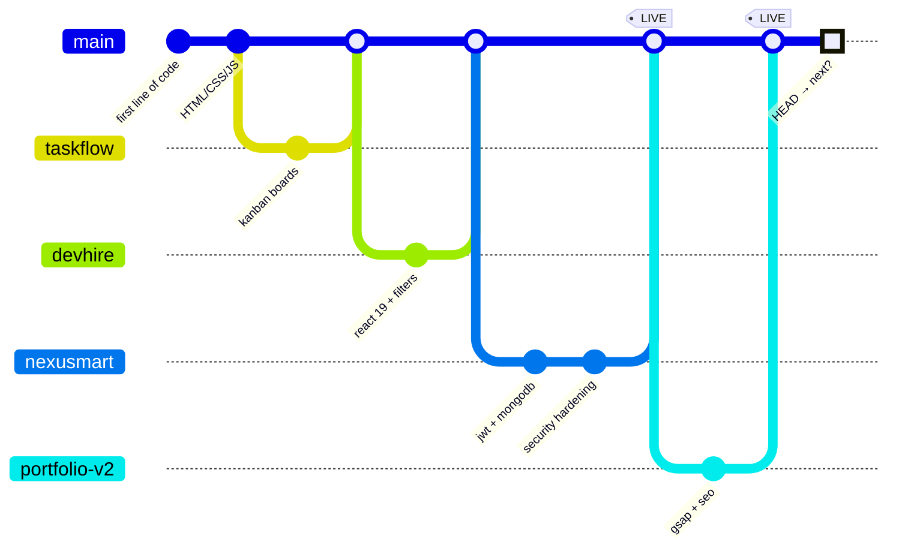
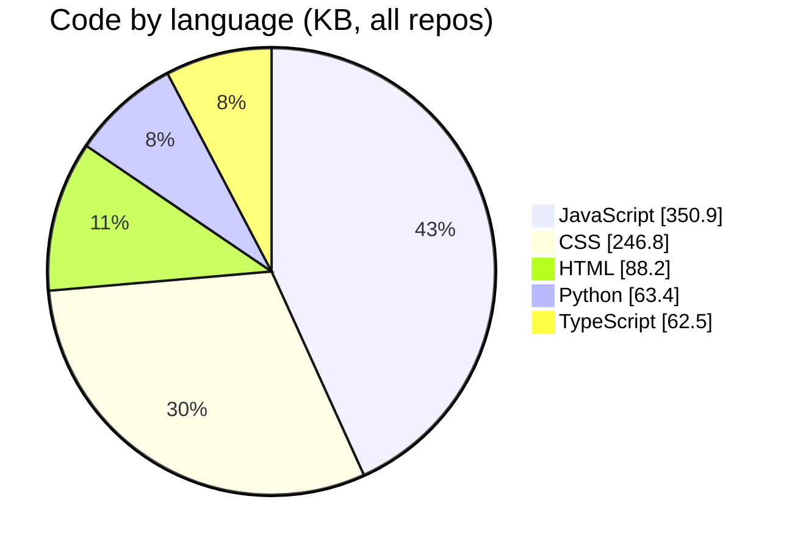
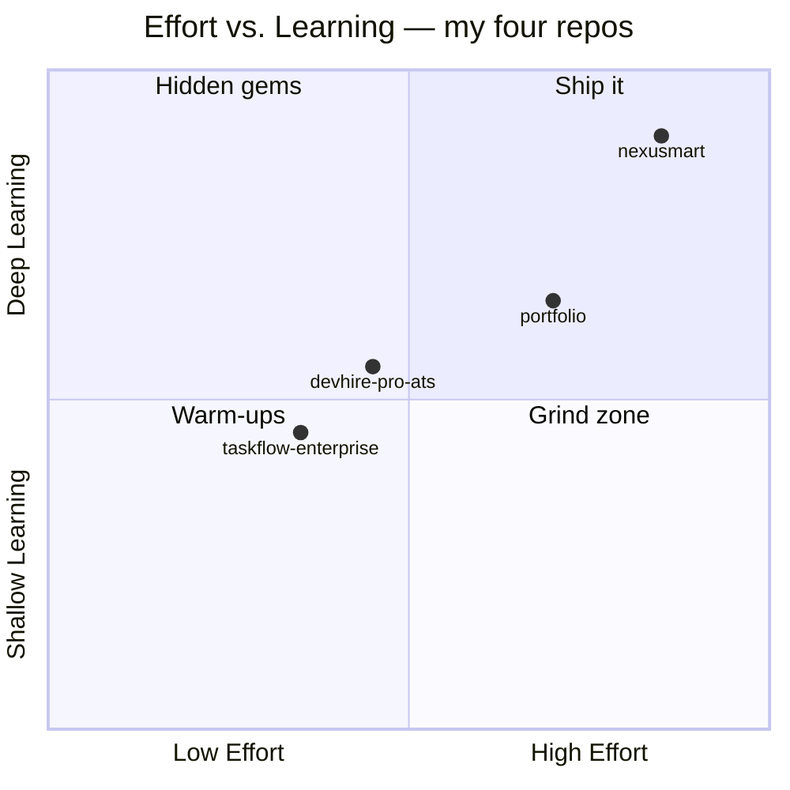
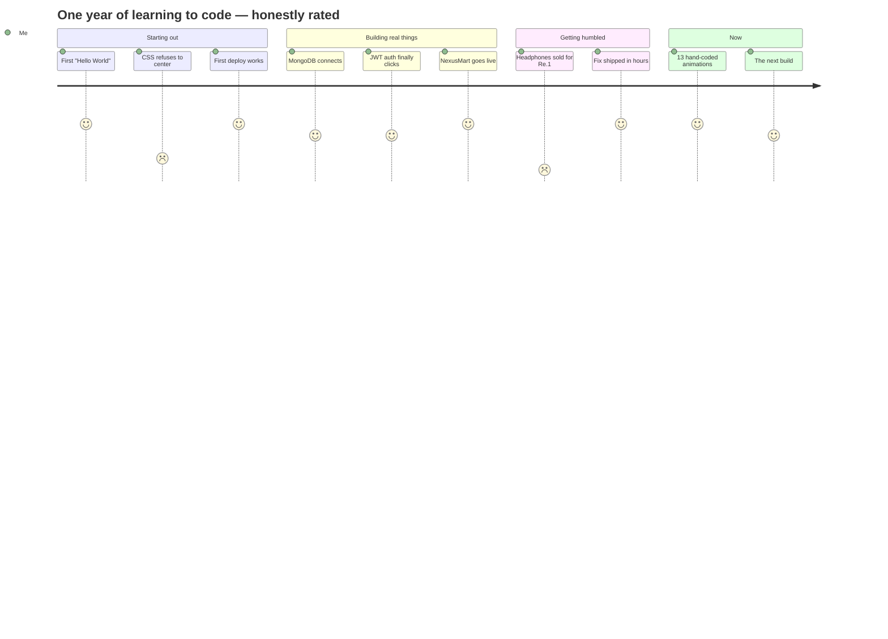
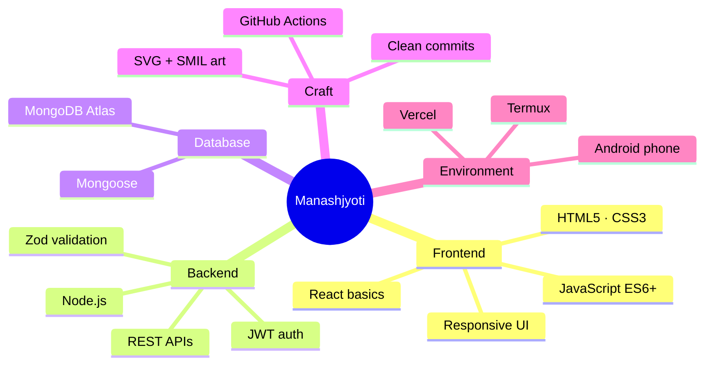

<!-- ══════════════════════════════════════════════════════════════════ -->
<!--  MANASHJYOTI BORA · PROFILE README · ULTRA-RARE EDITION             -->
<!--  Hand-built on an Android phone. Every claim links to live work.    -->
<!--  Inside: STL 3D · GeoJSON map · colored LaTeX · Assamese ruby       -->
<!--  gitGraph · XY chart · quadrant chart · timeline · mindmap          -->
<!--  5 alert types · footnotes · nested details · theme-aware SVG       -->
<!-- ══════════════════════════════════════════════════════════════════ -->

<div align="center">

<picture>
  <source media="(prefers-color-scheme: dark)" srcset="https://raw.githubusercontent.com/Manashjyoti-Bora/Manashjyoti-Bora/main/assets/hero-dark.svg">
  <source media="(prefers-color-scheme: light)" srcset="https://raw.githubusercontent.com/Manashjyoti-Bora/Manashjyoti-Bora/main/assets/hero-light.svg">
  
</picture>

<sub><ruby>মনজ্যোতি বৰা<rt>Manashjyoti Bora</rt></ruby> · Nagaon, Assam 🇮🇳 — hand-coded banner, adapts to your GitHub theme</sub>

<br><br>

&nbsp;
<a href="https://github.com/Manashjyoti-Bora?tab=followers"></a>&nbsp;


[](https://portfolio-manashjyoti-bora.vercel.app)&nbsp;
[](https://www.linkedin.com/in/manashjyoti-bora-323b97405)&nbsp;
[](mailto:manashjyotibora122@gmail.com)&nbsp;
[](https://raw.githubusercontent.com/Manashjyoti-Bora/portfolio/main/assets/resume/Manashjyoti_Bora_Resume.pdf)

&nbsp;


$${\color{#22D3EE}\textsf{Learning in public}} \cdot {\color{#7C3AED}\textsf{Building daily}} \cdot {\color{#10B981}\textsf{the work will decide}}$$

</div>

> [!IMPORTANT]
> **Summary:** First-year IT student, learning full-stack development in public. While studying, I have **designed, built, and deployed two production applications** — using only an Android phone as my development machine.[^1] Every claim on this page links to live, verifiable work.


<div align="center">

# 📖 01 · The Story — Why a Phone?

</div>

I don't own a laptop. My entire development environment is an Android phone:
**Termux** for Git and Node.js, **GitHub's web editor** for code, and **Vercel**
for cloud builds. The constraint was never a wall — it became the brand.[^2]

```diff
- Excuse:  "I'll start when I get a laptop."
+ Reality: 2 production apps shipped from a phone.
```

> [!NOTE]
> Everything on this page — the banner, dividers, dashboards — was
> hand-typed in SVG + SMIL on this same phone. Zero JavaScript.
> Zero libraries. Zero design tools.

### ⏳ The timeline (real events only)


```mermaid
timeline
    title Learning in Public — The Road So Far
    2025 : First line of code, typed on a phone
         : HTML · CSS · JavaScript fundamentals
    2026 H1 : B.Voc IT begins — Dr. B.K.B. College
            : React and state management click
    2026 Jul : NexusMart ships — full-stack, live
             : 12-file SVG animation system
    2026 Aug : Portfolio v2 redesign ships
             : First security disclosure — fixed in hours
```

### 🌿 The journey as a git graph


```mermaid
gitGraph
    commit id: "first line of code"
    commit id: "HTML/CSS/JS"
    branch taskflow
    commit id: "kanban boards"
    checkout main
    merge taskflow
    branch devhire
    commit id: "react 19 + filters"
    checkout main
    merge devhire
    branch nexusmart
    commit id: "jwt + mongodb"
    commit id: "security hardening"
    checkout main
    merge nexusmart tag: "LIVE"
    branch portfolio-v2
    commit id: "gsap + seo"
    checkout main
    merge portfolio-v2 tag: "LIVE"
    commit id: "HEAD → next?" type: HIGHLIGHT
```


<div align="center">

# 🗂️ 02 · Projects — What Each One Taught Me

**Each repository is a stage of learning. All demos are live:**

</div>

<div align="center">

## ⚡ portfolio — Frontend Engineering

</div>

```text
┌─ OVERVIEW ──────────────────────────────┐
│ Personal portfolio — 100% real data     │
│ · GSAP animations + AOS reveals         │
│ · custom cursor · offcanvas menu        │
│ · validated contact form · ATS resume   │
│ · full SEO · sitemap · mobile-first     │
├─ SKILLS APPLIED ────────────────────────┤
│ HTML5 · CSS3 · JavaScript ES6+ · Vite   │
│ GSAP · AOS · responsive design          │
│ SEO · clean code · Vercel deploy        │
└─────────────────────────────────────────┘
```

<div align="center">

[](https://portfolio-manashjyoti-bora.vercel.app)&nbsp;[](https://github.com/Manashjyoti-Bora/portfolio)

</div>

<div align="center">

## 🛒 nexusmart — Backend, Database & Security

</div>

```text
┌─ OVERVIEW ──────────────────────────────┐
│ Full-stack e-commerce: auth, cart,      │
│ checkout, orders                        │
│ · JWT (HTTP-only cookies) + bcrypt      │
│ · MongoDB Atlas, persistent orders      │
│ · Role-based admin dashboard            │
│ · Server-side price validation          │
├─ SKILLS APPLIED ────────────────────────┤
│ Mongoose models · Zod validation        │
│ REST API design · auth flows            │
│ env secrets · production debugging      │
└─────────────────────────────────────────┘
```

> [!WARNING]
> **Real lesson, learned in production:** a developer intercepted my
> checkout request and bought headphones for ₹1 — because I trusted
> client-side prices. Fixed within hours: the server now rebuilds every
> order from database prices only. *Never trust the frontend.*[^3]

<div align="center">

[](https://nexusmart-dusky.vercel.app)&nbsp;[](https://github.com/Manashjyoti-Bora/nexusmart)

</div>

<div align="center">

## 🧪 devhire-pro-ats & taskflow-enterprise

</div>

```text
┌─ UI PATTERNS & STATE ───────────────────┐
│ DevHire  · React 19 job portal + ATS    │
│          · real-time filtering          │
│ TaskFlow · Kanban boards · priorities   │
│          · optimistic UI updates        │
└─────────────────────────────────────────┘
```

<div align="center">

[](https://github.com/Manashjyoti-Bora/devhire-pro-ats)&nbsp;[](https://github.com/Manashjyoti-Bora/taskflow-enterprise)

</div>

### 🥧 Real code on my GitHub — measured, not guessed

<sub>Language bytes pulled from the GitHub API across all 5 repos (Aug 2026).</sub>


```mermaid
pie showData
    title Code by language (KB, all repos)
    "JavaScript" : 350.9
    "CSS" : 246.8
    "HTML" : 88.2
    "Python" : 63.4
    "TypeScript" : 62.5
```

### 📈 Where my repo energy went — honest self-assessment


```mermaid
quadrantChart
    title Effort vs. Learning — my four repos
    x-axis Low Effort --> High Effort
    y-axis Shallow Learning --> Deep Learning
    quadrant-1 Ship it
    quadrant-2 Hidden gems
    quadrant-3 Warm-ups
    quadrant-4 Grind zone
    nexusmart: [0.85, 0.9]
    portfolio: [0.7, 0.65]
    devhire-pro-ats: [0.45, 0.55]
    taskflow-enterprise: [0.35, 0.45]
```

> [!TIP]
> This profile is itself a project: **three GitHub Actions pipelines**
> (snake, Pac-Man, 3D city — rebuilding daily) plus **fourteen
> hand-coded SVG files** rendered on this page.


<div align="center">

# 💎 03 · The Rare Lab

**Things GitHub can render that almost nobody uses.**

</div>

### 🗺️ Where I build from — a real interactive map

Not a screenshot — GitHub renders GeoJSON as a **zoomable map**. That
marker is Nagaon, Assam, India. 🇮🇳

```geojson
{
  "type": "FeatureCollection",
  "features": [
    {
      "type": "Feature",
      "properties": { "name": "Nagaon, Assam — where the work happens" },
      "geometry": { "type": "Point", "coordinates": [92.68, 26.35] }
    }
  ]
}
```

### 🧊 A 3D model, rendered live in Markdown

GitHub renders STL as an **interactive 3D viewer** — drag to rotate.
One octahedron, hand-typed. My logo in 3D.

```stl
solid gem
facet normal 0 0 0
 outer loop
  vertex 0 0 14
  vertex 10 0 0
  vertex 0 10 0
 endloop
endfacet
facet normal 0 0 0
 outer loop
  vertex 0 0 14
  vertex 0 10 0
  vertex -10 0 0
 endloop
endfacet
facet normal 0 0 0
 outer loop
  vertex 0 0 14
  vertex -10 0 0
  vertex 0 -10 0
 endloop
endfacet
facet normal 0 0 0
 outer loop
  vertex 0 0 14
  vertex 0 -10 0
  vertex 10 0 0
 endloop
endfacet
facet normal 0 0 0
 outer loop
  vertex 0 0 -14
  vertex 0 10 0
  vertex 10 0 0
 endloop
endfacet
facet normal 0 0 0
 outer loop
  vertex 0 0 -14
  vertex -10 0 0
  vertex 0 10 0
 endloop
endfacet
facet normal 0 0 0
 outer loop
  vertex 0 0 -14
  vertex 0 -10 0
  vertex -10 0 0
 endloop
endfacet
facet normal 0 0 0
 outer loop
  vertex 0 0 -14
  vertex 10 0 0
  vertex 0 -10 0
 endloop
endfacet
endsolid gem
```

### 🧮 The consistency equation

$$\text{Skill}(t)=\int_{0}^{t}\text{commits}(\tau)\,d\tau \quad\Longrightarrow\quad \lim_{t\to\infty}\text{Skill}(t)={\color{#10B981}\text{mastery}}$$

<sub>Translation: show up every day, let the integral do its work.</sub>

### 🎢 The emotional journey (every developer knows this curve)


```mermaid
journey
    title One year of learning to code — honestly rated
    section Starting out
      First "Hello World": 5: Me
      CSS refuses to center: 2: Me
      First deploy works: 5: Me
    section Building real things
      MongoDB connects: 4: Me
      JWT auth finally clicks: 4: Me
      NexusMart goes live: 5: Me
    section Getting humbled
      Headphones sold for Re.1: 1: Me
      Fix shipped in hours: 5: Me
    section Now
      13 hand-coded animations: 5: Me
      The next build: 4: Me
```


<div align="center">

# 🛠️ 04 · Skills & Environment

</div>

### 🧠 Skill map


```mermaid
mindmap
  root((Manashjyoti))
    Frontend
      HTML5 · CSS3
      JavaScript ES6+
      React basics
      Responsive UI
    Backend
      Node.js
      REST APIs
      Zod validation
      JWT auth
    Database
      MongoDB Atlas
      Mongoose
    Craft
      SVG + SMIL art
      GitHub Actions
      Clean commits
    Environment
      Android phone
      Termux
      Vercel
```

### Core stack

<div align="center">


<br>


</div>

### The whole office fits in a pocket

| Tool | Role |
|------|------|
| <kbd>📱 Android phone</kbd> | The entire machine |
| <kbd>Termux</kbd> | Git · Node.js · Python |
| <kbd>GitHub web editor</kbd> | Code editing |
| <kbd>Vercel</kbd> | Cloud builds & deploys |
| <kbd>MongoDB Atlas</kbd> | Database |


<div align="center">

# 📊 05 · Live Metrics

<sub>All numbers pulled live from the GitHub API — nothing typed by hand.</sub>

<br>

<!--AUTO-UPDATE:START-->
```text
┌─ DAILY SNAPSHOT ────────────────────────┐
│ Updated ....... 03 Sep 2026 07:20 UTC   │
│ Public repos .... 5                     │
│ Followers ....... 12                    │
│ Total stars ..... 3                     │
│ Recent commits .. 0                     │
│ Last push ....... 2026-09-02            │
│ Top language .... JavaScript            │
├─────────────────────────────────────────┤
│ Generated by GitHub Actions — no        │
│ hands were involved.                    │
└─────────────────────────────────────────┘
```
<!--AUTO-UPDATE:END-->

<br><br>


**🐍 The snake — regenerated daily at 00:00 UTC:**


**👾 Pac-Man, eating the same graph:**


**🏙️ Contributions as a 3D city:**


</div>


<div align="center">

# 🧭 06 · Roadmap

</div>

> [!CAUTION]
> I haven't locked a career path — deliberately. No fake titles here.
> The plan below is real, small, and checked off in public.

- [x] Ship a full-stack app with real auth (NexusMart)
- [x] Hand-code an SVG/SMIL animation system (14 files)
- [x] Rebuild portfolio with 100% real data
- [x] Survive a real security disclosure — and fix it fast
- [ ] First open-source pull request
- [ ] Publish a tiny npm package
- [ ] Next.js App Router — deeper patterns
- [ ] **THE NEXT BUILD** — the work will decide 🧭


<div align="center">

# 📬 07 · Contact

</div>


<div align="center">


<sub>📱 Real scannable QR — point your camera at it. Meta: you're probably already on a phone, like this whole profile.</sub>

</div>

<div align="center">

[](mailto:manashjyotibora122@gmail.com?subject=Hello%20Manashjyoti)&nbsp;
[](https://www.linkedin.com/in/manashjyoti-bora-323b97405)

</div>

<details>
<summary>🔍 <b>How this page was built (tap to open)</b></summary>

<br>

| Layer | Detail |
|-------|--------|
| Banner | Hand-coded SVG + SMIL, ASCII portrait, theme-aware |
| Dividers & cards | 14 hand-typed SVG files, zero JS |
| Map | Native GitHub GeoJSON rendering |
| QR code | Generated + styled by hand — scannable |
| 3D gem | Native GitHub STL viewer |
| Math | Native GitHub LaTeX (with colors!) |
| Diagrams | Mermaid timeline · gitGraph · journey · mindmap · quadrant · pie (real API data) |
| Pipelines | 4 GitHub Actions (snake · Pac-Man · 3D city · daily self-update) |
| Hardware | One Android phone 📱 |

<details>
<summary>🥚 <b>One level deeper? (a nested easter egg)</b></summary>

<br>

You found it. 🎉 Fun facts nobody scrolls far enough to read:

- The ASCII portrait in the banner is **thousands of characters**, generated by a Python pipeline I run in Termux.
- The aurora divider above is **2.2 KB of hand-typed SMIL** — the ribbon colors cycle through my three brand colors every 8 seconds.
- My name in Assamese is <ruby>মনজ্যোতি<rt>Monojyoti</rt></ruby> — the <code>&lt;ruby&gt;</code> tag you just saw render is also rare on GitHub. 😄

<sub>If you read this far — say hi. I reply within 24h.</sub>

</details>
</details>


<div align="center">

<samp>manashjyoti@android:~$ echo "the work will decide" 🌱</samp>

<br><br>

<sub><kbd>↑</kbd> <kbd>↑</kbd> <kbd>↓</kbd> <kbd>↓</kbd> <kbd>←</kbd> <kbd>→</kbd> <kbd>←</kbd> <kbd>→</kbd> <kbd>B</kbd> <kbd>A</kbd> — you know the code. There's an easter egg above. 🥚</sub>

</div>

[^1]: Termux (Git, Node.js, Python) + GitHub web editor + Vercel cloud builds. No laptop was used for anything on this profile.
[^2]: The full story lives on my [portfolio](https://portfolio-manashjyoti-bora.vercel.app) — rebuilt in Aug 2026 with 100% real data.
[^3]: Responsible disclosure by a developer on LinkedIn. The fix commit is public in the [nexusmart repo](https://github.com/Manashjyoti-Bora/nexusmart).
