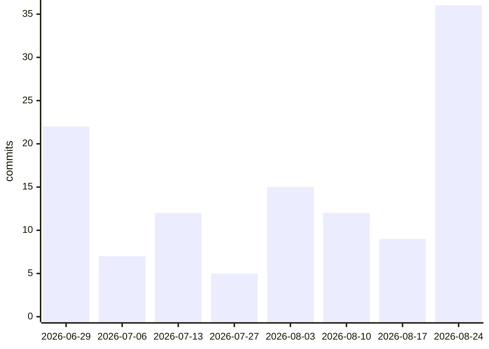
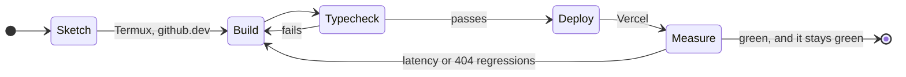
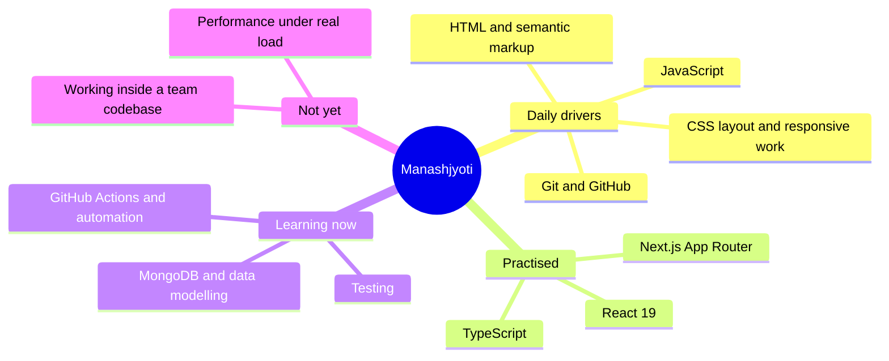

<div align="center">

<picture>
  <source media="(prefers-color-scheme: dark)" srcset="https://raw.githubusercontent.com/Manashjyoti-Bora/Manashjyoti-Bora/main/assets/sheet-dark.svg">
  <source media="(prefers-color-scheme: light)" srcset="https://raw.githubusercontent.com/Manashjyoti-Bora/Manashjyoti-Bora/main/assets/sheet-light.svg">
  
</picture>

**DRAWING No. MJB-001** · [Parts list](#parts-list) · [Bill of materials](#bill-of-materials) · [Test report](#test-report) · [As-built log](#as-built-log) · [Section A-A](#section-a-a) · [Tolerances](#tolerances-and-honest-limits) · [Sign the drawing](#sign-the-drawing)

<sub>Every mark above is generated by Python files in this repository. No badge service, no stat service, no chart service, no image editor. The sheet redraws itself every six hours.</sub>

</div>

> [!IMPORTANT]
> **The twenty-second version.** I am **Manashjyoti Bora**, a front-end developer from Nagaon, Assam, India. In the first year of a B.Voc in Information Technology at Dr. B.K.B. College. **81 commits across 5 repositories in 52 days, 4 projects built, 3 of them live in production right now** — all typed on a single **6.1-inch Android phone** in Termux, because that is the computer I have. I am open to junior front-end work, internships and freelance builds, and I reply within 24 hours. Résumé and live sites are linked at the bottom of this sheet.

---

## Sheet index

| # | Sheet | What you get from it | Time |
|:--|:--|:--|:--|
| 1 | [Parts list](#parts-list) | the eight layers I actually build with, item by item | 60 s |
| 2 | [Bill of materials](#bill-of-materials) | every repository, its commit count, its state | 60 s |
| 3 | [Test report](#test-report) | measured uptime and latency of my live deployments | 30 s |
| 4 | [As-built log](#as-built-log) | my real commit log, written by a robot, not by me | 30 s |
| 5 | [Section A-A](#section-a-a) | how a project moves from an idea to a URL | 90 s |
| 6 | [Tolerances](#tolerances-and-honest-limits) | what I promise, what I do not, what I cannot yet | 60 s |
| 7 | [Sign the drawing](#sign-the-drawing) | leave your name on this sheet, from your browser | 20 s |
| 8 | [Title block](#title-block) | résumé, email, LinkedIn, live sites | 20 s |

---

## Parts list

The eight balloons on the sheet are not decoration. Each number on the drawing is a row here, and each row points at code you can open.

| Item | Part | What I do with it | Seen in |
|:--:|:--|:--|:--|
| **01** | HTML + CSS | hand-written semantic markup, custom layout, no UI framework, no template | [portfolio](https://github.com/Manashjyoti-Bora/portfolio) |
| **02** | JavaScript | events, state, scroll and reveal motion, keyboard handling | [portfolio](https://github.com/Manashjyoti-Bora/portfolio) |
| **03** | React 19 | one job per component, memoised lists, optimistic UI on drag | [taskflow-enterprise](https://github.com/Manashjyoti-Bora/taskflow-enterprise) |
| **04** | Next.js App Router | server and client components split on purpose, route handlers | [nexusmart](https://github.com/Manashjyoti-Bora/nexusmart) |
| **05** | Zod schemas | every mutation validated before it reaches the database | [nexusmart](https://github.com/Manashjyoti-Bora/nexusmart) |
| **06** | JWT + bcrypt | hashed passwords, httpOnly cookies, role-gated admin routes | [nexusmart](https://github.com/Manashjyoti-Bora/nexusmart) |
| **07** | MongoDB Atlas | typed access layer, indexed queries, no raw queries in components | [nexusmart](https://github.com/Manashjyoti-Bora/nexusmart) |
| **08** | GitHub Actions + Vercel | typecheck and build on push, then deploy; this sheet is also a job | [this repository](https://github.com/Manashjyoti-Bora/Manashjyoti-Bora/tree/main/.github/workflows) |

<details>
<summary><b>Detail A (2:1) — the gap between two plates</b></summary>

<br>

The detail view on the sheet magnifies the space between two layers and dimensions it as **GAP**. That gap is deliberate. Here is what is inside it today:

- **Testing.** I have written no meaningful test suite yet. I lean on TypeScript and manual passes. This is the next thing I am fixing.
- **Accessibility.** I use semantic HTML and keyboard-reachable controls, but I have not run a full audit with a screen reader.
- **Scale.** My projects have been used by tens of people, not thousands. I have never tuned a database under real load.
- **Teams.** Every commit in this repository is mine. I have never worked inside someone else's codebase or review process.

A drawing that hides its gaps is a sales brochure. This one is a drawing.

</details>

---

## Bill of materials

Commit counts below are exact. They come from `git rev-list --count HEAD` on each default branch, not from an estimate and not from a badge.

| Repository | Commits | Stack | State | Live |
|:--|--:|:--|:--|:--|
| [**portfolio**](https://github.com/Manashjyoti-Bora/portfolio) | **27** | HTML, CSS, JavaScript | shipped, maintained | [manashbora.vercel.app](https://manashbora.vercel.app) |
| [**taskflow-enterprise**](https://github.com/Manashjyoti-Bora/taskflow-enterprise) | **17** | React, drag and drop Kanban | source only, no demo | — |
| [**devhire-pro-ats**](https://github.com/Manashjyoti-Bora/devhire-pro-ats) | **16** | React 19, Vite | shipped | [devhire-pro-ats.vercel.app](https://devhire-pro-ats.vercel.app) |
| [**nexusmart**](https://github.com/Manashjyoti-Bora/nexusmart) | **13** | Next.js, TypeScript, MongoDB, JWT | shipped | [nexusmart-dusky.vercel.app](https://nexusmart-dusky.vercel.app) |
| [**Manashjyoti-Bora**](https://github.com/Manashjyoti-Bora/Manashjyoti-Bora) | **8** | Python, SVG, GitHub Actions | this sheet | you are here |
| | **81** | | **4 projects · 3 live** | |

> [!NOTE]
> `taskflow-enterprise` has **no live demo**, and I will not invent one. It is a source-only study of drag-and-drop state. If a row here says a project is live, you can click it and it answers.

<details>
<summary><b>What is actually inside the three live ones</b></summary>

<br>

**nexusmart** — a full-stack commerce app. Next.js App Router with TypeScript, MongoDB Atlas behind a typed access layer, authentication with JWT in httpOnly cookies and bcrypt-hashed passwords, Zod validation on every mutation, role-gated admin routes, and a CI job that typechecks and builds on every push.

**devhire-pro-ats** — an applicant tracking interface in React 19 and Vite. Multi-attribute filtering across roles, skills and stage, glassmorphic theming, and a candidate pipeline of Applied → Screening → Interview → Assessment → Offer.

**portfolio** — my own site, written from an empty file: my layout, my copy, my motion. Twenty-seven commits between 2026-08-04 and 2026-08-15, and it has answered every check since.

</details>

---

## Test report

<div align="center">

<picture>
  <source media="(prefers-color-scheme: dark)" srcset="https://raw.githubusercontent.com/Manashjyoti-Bora/Manashjyoti-Bora/main/assets/testreport-dark.svg">
  <source media="(prefers-color-scheme: light)" srcset="https://raw.githubusercontent.com/Manashjyoti-Bora/Manashjyoti-Bora/main/assets/testreport-light.svg">
  
</picture>

</div>

Every six hours a scheduled Action in this repository sends **real HTTPS GET requests** to each deployment, records the status code and the round-trip time, keeps the last 24 readings per target, and redraws the strip above. Nobody types those numbers, including me.

Availability shown on the strip is the plain ratio of successful checks to recorded checks:

$$A=\frac{1}{n}\sum_{i=1}^{n}\mathbb{1}\left[s_i=200\right]\qquad\bar{t}=\frac{1}{n}\sum_{i=1}^{n}t_i$$

where $s_i$ is the status code of check $i$, $t_i$ its latency in milliseconds and $n$ the number of readings actually stored — never a padded or invented one.

<details>
<summary><b>Reading the strip honestly</b></summary>

<br>

- The latency bar is scaled **0–400 ms**, coloured mint under 150 ms, gold up to 400 ms, coral above.
- The sparkline plots only readings that exist. With one reading you get one dot, not a fake trend line.
- Latency is measured from a GitHub runner, not from your phone in Nagaon or your laptop in Berlin. It shows that the deployment answers quickly, nothing more.
- If a site goes down, the row turns coral and stays coral until it recovers. I did not build an escape hatch.

</details>

---

## As-built log

Drawings get marked up on site. This is the real log, written into this file by the Action that clones each repository and reads its history. If I stop committing, this block goes stale in public.

<!-- ASBUILT:START -->
```text
2026-08-30  Manashjyoti-Bora      chore: refresh live telemetry
2026-08-30  Manashjyoti-Bora      chore: update 3D contribution graph
2026-08-30  Manashjyoti-Bora      chore: update blueprint sheets
2026-08-30  Manashjyoti-Bora      chore(sheet): redraw signature margin
2026-08-30  Manashjyoti-Bora      chore: refresh live telemetry
2026-08-29  Manashjyoti-Bora      chore: update blueprint sheets
2026-08-29  Manashjyoti-Bora      chore: refresh live telemetry
2026-08-29  Manashjyoti-Bora      chore: update blueprint sheets
2026-08-29  Manashjyoti-Bora      chore(sheet): redraw signature margin
2026-08-29  Manashjyoti-Bora      chore: refresh live telemetry
2026-08-29  Manashjyoti-Bora      chore: update 3D contribution graph
2026-08-29  Manashjyoti-Bora      feat(profile): drawing no. MJB-001
2026-08-29  Manashjyoti-Bora      chore: update 3D contribution graph
2026-08-29  Manashjyoti-Bora      Update README.md
2026-08-29  Manashjyoti-Bora      chore: refresh live telemetry
2026-08-28  Manashjyoti-Bora      chore: refresh live telemetry
2026-08-28  Manashjyoti-Bora      chore: update 3D contribution graph
2026-08-28  Manashjyoti-Bora      chore: refresh live telemetry
```
<!-- ASBUILT:END -->

Commits per week, plotted from the same clone:

<!-- WEEKLY:START -->

```mermaid
xychart-beta
    x-axis ["2026-06-29", "2026-07-06", "2026-07-13", "2026-07-27", "2026-08-03", "2026-08-10", "2026-08-17", "2026-08-24"]
    y-axis "commits" 0 --> 36
    bar [22, 7, 12, 5, 15, 12, 9, 36]
```
<!-- WEEKLY:END -->

> [!TIP]
> The zero week is not a rendering bug. **2026-07-20 has no commits.** I was reading, not shipping. A profile that only shows good weeks is a filtered profile.

---

## Section A-A

A section cut through how a project actually gets from my head to a URL, on a phone, with no laptop anywhere in the chain.


```mermaid
stateDiagram-v2
    direction LR
    [*] --> Sketch
    Sketch --> Build : Termux, github.dev
    Build --> Typecheck
    Typecheck --> Build : fails
    Typecheck --> Deploy : passes
    Deploy --> Measure : Vercel
    Measure --> Build : latency or 404 regressions
    Measure --> [*] : green, and it stays green
```

<details>
<summary><b>The workbench, part by part</b></summary>

<br>

<kbd>Termux</kbd> <kbd>node</kbd> <kbd>npm</kbd> <kbd>git</kbd> <kbd>github.dev</kbd> <kbd>Vercel</kbd> <kbd>MongoDB Atlas</kbd> <kbd>GitHub Actions</kbd> <kbd>Python 3</kbd>

- **Termux** is my terminal: node, npm and git on Android, no emulator.
- **github.dev** is my editor when a file gets too wide for a phone screen.
- **Vercel** builds from `main`; a broken typecheck never reaches production.
- **GitHub Actions** measures my own sites and redraws this page. It is the only part of my setup that works while I sleep.
- **Python 3** draws every SVG here: the sheet, the test report, the signature margin, the barcode.

Three principles I actually follow, taken from my portfolio and kept here word for word: **learn by building**, **design with purpose**, **build in public**.

</details>

---

## Skills, drawn as a map rather than a percentage

Percentage bars on a profile mean nothing — nobody is 82% good at React. This is what I reach for first, versus what I am still practising.


```mermaid
mindmap
  root((Manashjyoti))
    Daily drivers
      HTML and semantic markup
      CSS layout and responsive work
      JavaScript
      Git and GitHub
    Practised
      React 19
      Next.js App Router
      TypeScript
    Learning now
      MongoDB and data modelling
      GitHub Actions and automation
      Testing
    Not yet
      Working inside a team codebase
      Performance under real load
```

---

## Tolerances and honest limits

| Item | Guaranteed | Typical | Not offered |
|:--|:--|:--|:--|
| First reply | within 24 h | same day, IST hours | instant replies at 03:00 |
| Deployment | live URL before I call it done | Vercel, from `main` | on-premise or Docker fleets |
| Code you receive | readable, commented where it is not obvious | small commits with real messages | code I cannot explain line by line |
| Claims on this page | measured, reproducible | timestamped in the JSON files | rounded up numbers |

```diff
  Manashjyoti Bora, revision history in two lines
- 2026-06  no repositories, no deployments, no idea what a route handler was
+ 2026-08  5 repositories, 81 commits, 3 live deployments, one self-measuring profile
```

> [!WARNING]
> **I have zero years of paid industry experience.** One year of self-directed building, no employer, no team, no code review from a senior. If your role needs someone who has already survived a production incident at scale, I am not that person yet. If it needs someone who ships, measures, and writes down what is broken, keep reading.

> [!CAUTION]
> Do not read the commit counts on this page as a productivity score. Fifty-two days of commits is a start, not a career. I am showing them because they are true and checkable, not because they are impressive.

### Revision history

| Rev | Date | Change |
|:--:|:--|:--|
| A | 2026-07-02 | first two repositories exist: `taskflow-enterprise`, `devhire-pro-ats` |
| B | 2026-07-04 | `nexusmart` begins: Next.js, TypeScript, MongoDB Atlas |
| C | 2026-07-28 | all three project repositories reach a stopping point, 46 commits in July |
| D | 2026-08-04 | `portfolio` begins; ships 2026-08-15 and has answered every check since |
| E | 2026-08-23 | this profile becomes a drawing that measures and redraws itself |

---

## Sign the drawing

Real drawings carry signatures in the margin. So does this one, and the margin is open.

**[▸ Sign this drawing](https://github.com/Manashjyoti-Bora/Manashjyoti-Bora/issues/new?title=sign%3A%20&body=Replace%20the%20title%20after%20%22sign%3A%22%20with%20a%20short%20note%20-%20up%20to%2034%20characters%20-%20then%20submit.%20A%20GitHub%20Action%20will%20write%20your%20name%20into%20the%20signature%20margin%20of%20the%20drawing%20within%20a%20few%20minutes.%20Nothing%20else%20from%20the%20issue%20is%20published.)** — it opens a pre-filled GitHub issue. Put a short note after `sign:` and submit. A workflow in this repository reads the issue, sanitises it, writes your name into the table below and draws it onto the margin sheet. No form, no database, no third-party guestbook service — just issues and a Python file.

<div align="center">

<picture>
  <source media="(prefers-color-scheme: dark)" srcset="https://raw.githubusercontent.com/Manashjyoti-Bora/Manashjyoti-Bora/main/assets/signatures-dark.svg">
  <source media="(prefers-color-scheme: light)" srcset="https://raw.githubusercontent.com/Manashjyoti-Bora/Manashjyoti-Bora/main/assets/signatures-light.svg">
  
</picture>

</div>

<!-- SIGN:START -->

No signatures yet. The margin is blank and waiting.

Total signatures: **0**

<!-- SIGN:END -->

<sub>Only your GitHub login, the date, and up to 34 sanitised characters are published. Logins are filtered to letters, digits and hyphens; notes are stripped of markup and control characters before they are drawn.</sub>

---

## Title block

| Field | Value |
|:--|:--|
| Name | **Manashjyoti Bora** |
| Title | Creative Developer & Learner |
| Location | Nagaon, Assam, India · IST (UTC+5:30) |
| Education | B.Voc Information Technology, year 1 of 3, Dr. B.K.B. College |
| Languages | English, Assamese, Hindi |
| Email | [manashjyotibora122@gmail.com](mailto:manashjyotibora122@gmail.com) |
| LinkedIn | [manashjyoti-bora](https://www.linkedin.com/in/manashjyoti-bora-323b97405) |
| Résumé | [Manashjyoti_Bora_Resume.pdf](https://raw.githubusercontent.com/Manashjyoti-Bora/portfolio/main/assets/resume/Manashjyoti_Bora_Resume.pdf) |
| Portfolio | [manashbora.vercel.app](https://manashbora.vercel.app) |
| Open to | junior front-end roles · internships · freelance builds |

**Services I can do today:** responsive website development · portfolio design · front-end UI implementation · GitHub project setup and CI.

<details>
<summary><b>How this sheet is made, if you want to steal the technique</b></summary>

<br>

| File | What it draws |
|:--|:--|
| `build_sheet.py` | the whole drawing: grid, frame, exploded assembly, dimension lines with real arrowheads, detail view, notes, stamp, signature, barcode |
| `code39.py` | a **Code 39 barcode encoder**, 70 lines, no dependency — the bars in the title block are real and scannable, and they decode to `MANASHBORA.VERCEL.APP` |
| `.github/scripts/testreport.py` | the HTTPS checks, the rolling history, the instrument strip |
| `.github/scripts/asbuilt.py` | clones each repository, writes the log and the weekly chart into this file |
| `.github/scripts/guestbook.py` | reads `sign:` issues, sanitises them, draws the signature margin |

Rules I gave myself: standard library only, both a dark and a light variant of every asset, animation with SMIL so it works as a plain image, ASCII-safe text, and **no number on this page that I cannot reproduce with a command**. Total third-party services used to render this profile: **zero**.[^1]

</details>

[^1]: The only external things this page touches are GitHub's own API and my own deployments. There is no shields.io, no readme-stats, no visitor counter, no QR or barcode API, no chart service, and no analytics. If GitHub is up, this page is exactly as accurate as its last run.

<div align="center">
<sub>DRAWING No. MJB-001 · REV E · SHEET 1 OF 1 · DRAWN BY M. BORA ON A 6.1-INCH PHONE · TOLERANCE ON CLAIMS ±0</sub>
</div>
