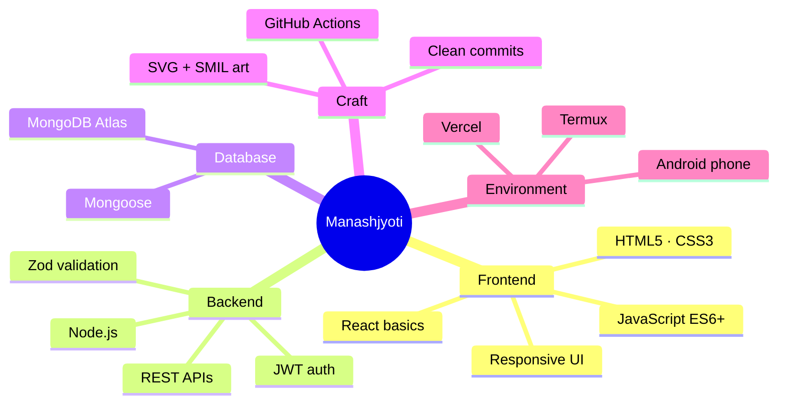

<!-- ══════════════════════════════════════════════════════════════════ -->
<!--  MANASHJYOTI BORA · PROFILE README · RARE EDITION                   -->
<!--  Manashjyoti Bora · Full-Stack Development Student                  -->
<!--  Hand-built on an Android phone. Every claim links to live work.    -->
<!--  Rare tech inside: STL 3D viewer · GeoJSON map · LaTeX · Mermaid    -->
<!--  timeline & mindmap · 5 alert types · footnotes · theme-aware SVG   -->
<!-- ══════════════════════════════════════════════════════════════════ -->

<div align="center">

<picture>
  <source media="(prefers-color-scheme: dark)" srcset="https://raw.githubusercontent.com/Manashjyoti-Bora/Manashjyoti-Bora/main/assets/hero-dark.svg">
  <source media="(prefers-color-scheme: light)" srcset="https://raw.githubusercontent.com/Manashjyoti-Bora/Manashjyoti-Bora/main/assets/hero-light.svg">
  
</picture>

<sub>Hand-coded SVG banner — adapts to your GitHub light/dark theme.</sub>

<br><br>

&nbsp;
<a href="https://github.com/Manashjyoti-Bora?tab=followers"></a>&nbsp;


[](https://portfolio-manashjyoti-bora.vercel.app)&nbsp;
[](https://www.linkedin.com/in/manashjyoti-bora-323b97405)&nbsp;
[](mailto:manashjyotibora122@gmail.com)&nbsp;
[](https://raw.githubusercontent.com/Manashjyoti-Bora/portfolio/main/assets/resume/Manashjyoti_Bora_Resume.pdf)

&nbsp;


</div>

> [!IMPORTANT]
> **Summary:** First-year IT student, learning full-stack development in public. While studying, I have **designed, built, and deployed two production applications** — using only an Android phone as my development machine.[^1] Every claim on this page links to live, verifiable work. Where this journey leads next — the work will decide.

<!-- ═══ CUSTOM FX: HAND-CODED MATRIX RAIN DIVIDER ═══ -->


<div align="center">

# 📖 01 · The Story — Why a Phone?

</div>

<div align="center">


</div>

I don't own a laptop. My entire development environment is an Android phone:
**Termux** for Git and Node.js, **GitHub's web editor** for code, and **Vercel**
for cloud builds. The constraint was never a wall — it became the brand.[^2]

```diff
- Excuse:  "I'll start when I get a laptop."
+ Reality: 2 production apps shipped from a phone.
```

> [!NOTE]
> Everything on this page — the animated banner, the dividers, the
> dashboards — was hand-typed in SVG + SMIL on this same phone.
> Zero JavaScript. Zero libraries. Zero design tools.

### ⏳ The timeline (real events only)


```mermaid
timeline
    title Learning in Public — The Road So Far
    2025 : First line of code, typed on a phone
         : HTML · CSS · JavaScript fundamentals
    2026 H1 : B.Voc IT begins — Dr. B.K.B. College
            : React and state management click
    2026 Jul : NexusMart ships — full-stack, live
             : 12-file SVG animation system
    2026 Aug : Portfolio v2 redesign ships
             : First real security lesson — fixed in hours
```


<div align="center">

# 🗂️ 02 · Projects — What Each One Taught Me

**Each repository is a stage of learning. All demos are live:**

</div>

<div align="center">

## ⚡ portfolio — Frontend Engineering

</div>

```text
┌─ OVERVIEW ──────────────────────────────┐
│ Personal portfolio — 100% real data     │
│ · GSAP animations + AOS reveals         │
│ · custom cursor · offcanvas menu        │
│ · validated contact form · ATS resume   │
│ · full SEO · sitemap · mobile-first     │
├─ SKILLS APPLIED ────────────────────────┤
│ HTML5 · CSS3 · JavaScript ES6+ · Vite   │
│ GSAP · AOS · responsive design          │
│ SEO · clean code · Vercel deploy        │
└─────────────────────────────────────────┘
```

<div align="center">

[](https://portfolio-manashjyoti-bora.vercel.app)&nbsp;[](https://github.com/Manashjyoti-Bora/portfolio)

</div>

<div align="center">

## 🛒 nexusmart — Backend, Database & Security

</div>

```text
┌─ OVERVIEW ──────────────────────────────┐
│ Full-stack e-commerce: auth, cart,      │
│ checkout, orders                        │
│ · JWT (HTTP-only cookies) + bcrypt      │
│ · MongoDB Atlas, persistent orders      │
│ · Role-based admin dashboard            │
│ · Server-side price validation          │
├─ SKILLS APPLIED ────────────────────────┤
│ Mongoose models · Zod validation        │
│ REST API design · auth flows            │
│ env secrets · production debugging      │
└─────────────────────────────────────────┘
```

> [!WARNING]
> **Real lesson, learned in production:** a developer intercepted my
> checkout request and bought headphones for ₹1 — because I trusted
> client-side prices. Fixed within hours: the server now rebuilds every
> order from database prices only. *Never trust the frontend.*[^3]

<div align="center">

[](https://nexusmart-dusky.vercel.app)&nbsp;[](https://github.com/Manashjyoti-Bora/nexusmart)

</div>

<div align="center">

## 🧪 devhire-pro-ats & taskflow-enterprise

</div>

```text
┌─ UI PATTERNS & STATE ───────────────────┐
│ DevHire  · React 19 job portal + ATS    │
│          · real-time filtering          │
│ TaskFlow · Kanban boards · priorities   │
│          · optimistic UI updates        │
└─────────────────────────────────────────┘
```

<div align="center">

[](https://github.com/Manashjyoti-Bora/devhire-pro-ats)&nbsp;[](https://github.com/Manashjyoti-Bora/taskflow-enterprise)

</div>

> [!TIP]
> This profile is itself a project: **three GitHub Actions pipelines**
> (snake, Pac-Man, 3D city — all rebuilding daily) plus **twelve
> hand-coded SMIL animation files** rendered on this page.

<!-- ═══ CUSTOM FX: FX LAB ═══ -->


<div align="center">

# 💎 03 · The Rare Lab

**Things GitHub can render that almost nobody uses.**

</div>

### 🗺️ Where I build from — a real interactive map

This is not a screenshot. GitHub renders GeoJSON as a **zoomable map**
— tap it. That marker is Nagaon, Assam, India. 🇮🇳

```geojson
{
  "type": "FeatureCollection",
  "features": [
    {
      "type": "Feature",
      "properties": { "name": "Nagaon, Assam — where the work happens" },
      "geometry": { "type": "Point", "coordinates": [92.68, 26.35] }
    }
  ]
}
```

### 🧊 A 3D model, rendered live in Markdown

GitHub renders STL files as an **interactive 3D viewer** — drag to
rotate. One octahedron, hand-typed. Consider it my logo in 3D.

```stl
solid gem
facet normal 0 0 0
 outer loop
  vertex 0 0 14
  vertex 10 0 0
  vertex 0 10 0
 endloop
endfacet
facet normal 0 0 0
 outer loop
  vertex 0 0 14
  vertex 0 10 0
  vertex -10 0 0
 endloop
endfacet
facet normal 0 0 0
 outer loop
  vertex 0 0 14
  vertex -10 0 0
  vertex 0 -10 0
 endloop
endfacet
facet normal 0 0 0
 outer loop
  vertex 0 0 14
  vertex 0 -10 0
  vertex 10 0 0
 endloop
endfacet
facet normal 0 0 0
 outer loop
  vertex 0 0 -14
  vertex 0 10 0
  vertex 10 0 0
 endloop
endfacet
facet normal 0 0 0
 outer loop
  vertex 0 0 -14
  vertex -10 0 0
  vertex 0 10 0
 endloop
endfacet
facet normal 0 0 0
 outer loop
  vertex 0 0 -14
  vertex 0 -10 0
  vertex -10 0 0
 endloop
endfacet
facet normal 0 0 0
 outer loop
  vertex 0 0 -14
  vertex 10 0 0
  vertex 0 -10 0
 endloop
endfacet
endsolid gem
```

### 🧮 The consistency equation (yes, GitHub renders LaTeX)

$$\text{Skill}(t)=\int_{0}^{t}\text{commits}(\tau)\,d\tau \quad\Longrightarrow\quad \lim_{t\to\infty}\text{Skill}(t)=\text{mastery}$$

<sub>Translation: show up every day, let the integral do its work.</sub>


<div align="center">

# 🛠️ 04 · Skills & Environment

</div>

### 🧠 Skill map


```mermaid
mindmap
  root((Manashjyoti))
    Frontend
      HTML5 · CSS3
      JavaScript ES6+
      React basics
      Responsive UI
    Backend
      Node.js
      REST APIs
      Zod validation
      JWT auth
    Database
      MongoDB Atlas
      Mongoose
    Craft
      SVG + SMIL art
      GitHub Actions
      Clean commits
    Environment
      Android phone
      Termux
      Vercel
```

### Core stack

<div align="center">


<br>


</div>

### The whole office fits in a pocket

| Tool | Role |
|------|------|
| <kbd>📱 Android phone</kbd> | The entire machine |
| <kbd>Termux</kbd> | Git · Node.js · Python |
| <kbd>GitHub web editor</kbd> | Code editing |
| <kbd>Vercel</kbd> | Cloud builds & deploys |
| <kbd>MongoDB Atlas</kbd> | Database |


<div align="center">

# 📊 05 · Live Metrics

<sub>All numbers below are pulled live from the GitHub API — nothing is typed by hand.</sub>

<br><br>


 


<br><br>

**🐍 The snake — regenerated daily at 00:00 UTC:**


**👾 Pac-Man, eating the same graph:**


**🏙️ Contributions as a 3D city:**


</div>


<div align="center">

# 🧭 06 · Roadmap

</div>

> [!CAUTION]
> I haven't locked a career path, and that is deliberate. No fake
> titles here. The plan below is real, small, and checked off in public.

- [x] Ship a full-stack app with real auth (NexusMart)
- [x] Hand-code an SVG/SMIL animation system (12 files)
- [x] Rebuild portfolio with 100% real data
- [x] Survive a real security disclosure — and fix it fast
- [ ] First open-source pull request
- [ ] Publish a tiny npm package
- [ ] Next.js App Router — deeper patterns
- [ ] **THE NEXT BUILD** — the work will decide 🧭


<div align="center">

# 📬 07 · Contact

</div>


<div align="center">

[](mailto:manashjyotibora122@gmail.com?subject=Hello%20Manashjyoti)&nbsp;
[](https://www.linkedin.com/in/manashjyoti-bora-323b97405)

<br>


</div>

<details>
<summary>🔍 <b>How this page was built (tap to open)</b></summary>

<br>

| Layer | Detail |
|-------|--------|
| Banner | Hand-coded SVG + SMIL, ASCII portrait, theme-aware |
| Dividers & cards | 12 hand-typed animation files, zero JS |
| Map | Native GitHub GeoJSON rendering |
| 3D gem | Native GitHub STL viewer |
| Math | Native GitHub LaTeX |
| Diagrams | Mermaid `timeline` + `mindmap` |
| Pipelines | 3 GitHub Actions (snake · Pac-Man · 3D city) |
| Hardware | One Android phone 📱 |

</details>


<div align="center">

<sub>Where this journey leads next — the work will decide. 🌱</sub>

</div>

[^1]: Termux (Git, Node.js, Python) + GitHub web editor + Vercel cloud builds. No laptop was used for anything on this profile.
[^2]: The full story lives on my [portfolio](https://portfolio-manashjyoti-bora.vercel.app) — rebuilt in Aug 2026 with 100% real data.
[^3]: Responsible disclosure by a developer on LinkedIn. The fix commit is public in the [nexusmart repo](https://github.com/Manashjyoti-Bora/nexusmart).
