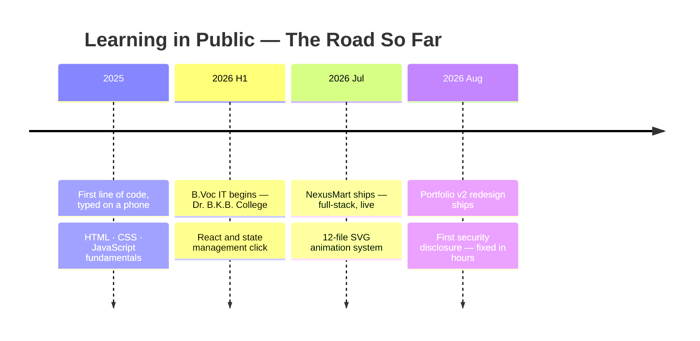

<!--
  MANASHJYOTI BORA · PROFILE README
  ───────────────────────────────────────────────────────────────
  • Photo banner ..... assets/photo.jpg  (original 720×718, never scaled)
  • Daily snapshot ... auto-written by .github/workflows/daily-update.yml  (02:30 UTC)
  • Live telemetry ... auto-written by .github/workflows/live-stats.yml    (every 6 h)
  • Animations ....... snake.yml · pacman.yml · profile-3d.yml             (daily)
  ⚠ Do NOT hand-edit anything between the AUTO-UPDATE markers — the bot owns it.
-->

<div align="center">


<br>

<h1>Manashjyoti Bora</h1>

**Full-Stack Developer (learning in public) · B.Voc IT — Dr. B.K.B. College**

<sub>মনজ্যোতি বৰা · Nagaon, Assam, India 🇮🇳</sub>

<br>

<p>
  
  <a href="https://github.com/Manashjyoti-Bora?tab=followers"></a>
  
  
</p>

<p>
  <a href="https://portfolio-manashjyoti-bora.vercel.app"></a>&nbsp;
  <a href="https://www.linkedin.com/in/manashjyoti-bora-323b97405"></a>&nbsp;
  <a href="mailto:manashjyotibora122@gmail.com"></a>&nbsp;
  <a href="https://raw.githubusercontent.com/Manashjyoti-Bora/portfolio/main/assets/resume/Manashjyoti_Bora_Resume.pdf"></a>
</p>

*Learning in public · Building daily · the work will decide*

</div>

---

## 👋 About

First-year IT student, learning full-stack development in public. The unusual part: **my entire dev environment is an Android phone** — Termux for Git & Node.js, the GitHub web editor for code, Vercel for cloud builds. No laptop. Two production apps shipped anyway. The constraint became the brand.

```diff
- Excuse:  "I'll start when I get a laptop."
+ Reality: 2 production apps shipped from a phone.
```

### ⏳ Timeline — real events only


```mermaid
timeline
    title Learning in Public — The Road So Far
    2025 : First line of code, typed on a phone
         : HTML · CSS · JavaScript fundamentals
    2026 H1 : B.Voc IT begins — Dr. B.K.B. College
            : React and state management click
    2026 Jul : NexusMart ships — full-stack, live
             : 12-file SVG animation system
    2026 Aug : Portfolio v2 redesign ships
             : First security disclosure — fixed in hours
```

---

## 🚀 Projects

### ⚡ `portfolio` — Frontend Engineering

Personal portfolio rebuilt with 100% real data — GSAP + AOS animations, custom cursor, off-canvas menu, validated contact form, ATS-friendly resume, full SEO + sitemap, mobile-first.

**HTML5 · CSS3 · JavaScript ES6+ · Vite · GSAP · AOS · Vercel**

<div align="center">

[](https://portfolio-manashjyoti-bora.vercel.app)&nbsp;[](https://github.com/Manashjyoti-Bora/portfolio)

</div>

### 🛒 `nexusmart` — Backend, Database & Security

Full-stack e-commerce — auth, cart, checkout, orders. JWT in HTTP-only cookies + bcrypt, MongoDB Atlas with persistent orders, role-based admin dashboard, server-side price validation.

**Node.js · Express · MongoDB · Mongoose · Zod · REST**

<div align="center">

[](https://nexusmart-dusky.vercel.app)&nbsp;[](https://github.com/Manashjyoti-Bora/nexusmart)

</div>

> [!TIP]
> **Biggest lesson, learned in production:** a developer intercepted my checkout and bought headphones for ₹1 because I trusted client-side prices. Fixed within hours — the server now rebuilds every order from database prices only. *Never trust the frontend.*

### 🧪 Practice repos — UI patterns & state

| Repo | What it is |
|------|------------|
| [`devhire-pro-ats`](https://github.com/Manashjyoti-Bora/devhire-pro-ats) | React 19 job portal + ATS, real-time filtering |
| [`taskflow-enterprise`](https://github.com/Manashjyoti-Bora/taskflow-enterprise) | Kanban boards, priorities, optimistic UI updates |

---

## 🛠️ Tech Stack

<div align="center">


<br>


</div>

### The whole office fits in a pocket

| Tool | Role |
|------|------|
| <kbd>📱 Android phone</kbd> | The entire machine |
| <kbd>Termux</kbd> | Git · Node.js · Python |
| <kbd>GitHub web editor</kbd> | Code editing |
| <kbd>Vercel</kbd> | Cloud builds & deploys |
| <kbd>MongoDB Atlas</kbd> | Database |

---

## 📊 Live Metrics

*Every number below is pulled from the GitHub API by GitHub Actions — nothing hand-typed.*

<picture>
  <source media="(prefers-color-scheme: dark)" srcset="https://raw.githubusercontent.com/Manashjyoti-Bora/Manashjyoti-Bora/main/assets/live-dark.svg">
  <source media="(prefers-color-scheme: light)" srcset="https://raw.githubusercontent.com/Manashjyoti-Bora/Manashjyoti-Bora/main/assets/live-light.svg">
  
</picture>

<!--AUTO-UPDATE:START-->
```text
┌─ DAILY SNAPSHOT ────────────────────────┐
│ Updated ....... 03 Sep 2026 13:14 UTC   │
│ Public repos .... 5                     │
│ Followers ....... 12                    │
│ Total stars ..... 3                     │
│ Recent commits .. 0                     │
│ Last push ....... 2026-09-02            │
│ Top language .... JavaScript            │
├─────────────────────────────────────────┤
│ Generated by GitHub Actions — no        │
│ hands were involved.                    │
└─────────────────────────────────────────┘
```
<!--AUTO-UPDATE:END-->

<div align="center">


</div>

---

## 🐍 Contribution Playground — regenerated daily

<div align="center">

**The snake, eating my contribution graph (00:00 UTC daily):**


**Pac-Man, same graph, same appetite:**


**Contributions as a 3D city:**


</div>

---

## 💎 The Rare Lab

*Things GitHub can render that almost nobody uses.*

### 🗺️ A real, zoomable map

Not a screenshot — GitHub renders this GeoJSON as an **interactive map**. The marker is Nagaon, Assam, India. 🇮🇳

```geojson
{
  "type": "FeatureCollection",
  "features": [
    {
      "type": "Feature",
      "properties": { "name": "Nagaon, Assam — where the work happens" },
      "geometry": { "type": "Point", "coordinates": [92.68, 26.35] }
    }
  ]
}
```

### 🧊 A 3D model in plain Markdown

GitHub renders STL as a **drag-to-rotate 3D viewer**. One octahedron — my logo in 3D.

```stl
solid gem
facet normal 0 0 0
 outer loop
  vertex 0 0 14
  vertex 10 0 0
  vertex 0 10 0
 endloop
endfacet
facet normal 0 0 0
 outer loop
  vertex 0 0 14
  vertex 0 10 0
  vertex -10 0 0
 endloop
endfacet
facet normal 0 0 0
 outer loop
  vertex 0 0 14
  vertex -10 0 0
  vertex 0 -10 0
 endloop
endfacet
facet normal 0 0 0
 outer loop
  vertex 0 0 14
  vertex 0 -10 0
  vertex 10 0 0
 endloop
endfacet
facet normal 0 0 0
 outer loop
  vertex 0 0 -14
  vertex 0 10 0
  vertex 10 0 0
 endloop
endfacet
facet normal 0 0 0
 outer loop
  vertex 0 0 -14
  vertex -10 0 0
  vertex 0 10 0
 endloop
endfacet
facet normal 0 0 0
 outer loop
  vertex 0 0 -14
  vertex 0 -10 0
  vertex -10 0 0
 endloop
endfacet
facet normal 0 0 0
 outer loop
  vertex 0 0 -14
  vertex 10 0 0
  vertex 0 -10 0
 endloop
endfacet
endsolid gem
```

---

## 🗺️ Roadmap

> [!NOTE]
> No fake career titles here — a small, real plan, checked off in public.

- [x] Ship a full-stack app with real auth (NexusMart)
- [x] Hand-code an SVG/SMIL animation system
- [x] Rebuild portfolio with 100% real data
- [x] Survive a real security disclosure — and fix it fast
- [ ] First open-source pull request
- [ ] Publish a tiny npm package
- [ ] Next.js App Router — deeper patterns
- [ ] **THE NEXT BUILD** — the work will decide 🧭

---

## 📬 Contact

<div align="center">

<a href="mailto:manashjyotibora122@gmail.com?subject=Hello%20Manashjyoti"></a>&nbsp;
<a href="https://www.linkedin.com/in/manashjyoti-bora-323b97405"></a>

<br><br>

<samp>manashjyoti@android:~$ echo "the work will decide" 🌱</samp>

</div>


