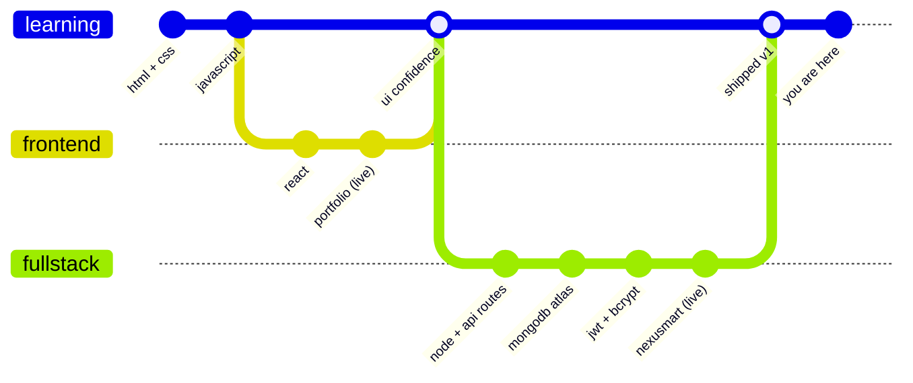
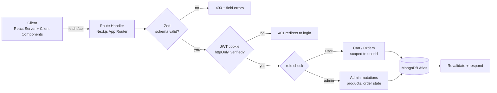

<!-- ─────────────────────────────────────────────────────────────────────────────
     mjb.os — profile README of Manashjyoti Bora
     Every animation on this page is hand-written SVG + SMIL, generated by
     scripts in this repo. No third-party badge, stat or card services are used.
     Boot sequence: assets/boot-*.svg · Live telemetry: assets/live-*.svg
     ───────────────────────────────────────────────────────────────────────── -->

<div align="center">

<picture>
  <source media="(prefers-color-scheme: dark)"  srcset="https://raw.githubusercontent.com/Manashjyoti-Bora/Manashjyoti-Bora/main/assets/boot-dark.svg">
  <source media="(prefers-color-scheme: light)" srcset="https://raw.githubusercontent.com/Manashjyoti-Bora/Manashjyoti-Bora/main/assets/boot-light.svg">
  
</picture>

<sub><b>mjb.os</b> · a profile that boots · three acts, one 18-second hand-coded timeline · adapts to your GitHub theme</sub>

</div>

> [!NOTE]
> **First-year IT student. Two production apps, live and monitored. Zero laptops involved.**
> Everything below was designed, coded, committed and deployed from a 6.1-inch Android screen — Termux for the shell, `github.dev` for the editor, Vercel for the deploy. Every claim on this page links to something you can open, click and break.

---

<div align="center">

### `/Applications`

<table border="0" cellspacing="8" cellpadding="0"><tr>
<td><a href="https://portfolio-manashjyoti-bora.vercel.app"></a></td>
<td><a href="https://nexusmart-dusky.vercel.app"></a></td>
<td><a href="https://github.com/Manashjyoti-Bora/devhire-pro-ats"></a></td>
<td><a href="https://github.com/Manashjyoti-Bora/taskflow-enterprise"></a></td>
<td><a href="mailto:manashjyotibora122@gmail.com"></a></td>
</tr></table>

<sub>Five hand-animated tiles. Each one is a link — click any of them.</sub>

</div>

---

## `01` The constraint

I do not own a development machine. That was going to be the reason I never started, so I made it the specification instead.

```console
mjb@os:~$ cat /etc/constraints
device      Android phone, 6.1 inch
shell       Termux (node, npm, git)
editor      github.dev
ram         shared with WhatsApp
budget      0
excuses     unsupported on this platform
```

Working this way removed every comfortable option. No local Docker, no 20-tab debugging, no split-screen. What survived was the part that actually matters: reading errors carefully, keeping state small enough to hold in one head, and shipping in commits small enough to type with two thumbs.


```mermaid
%%{init: {'gitGraph': {'showCommitLabel': true, 'mainBranchName': 'learning'}}}%%
gitGraph
    commit id: "html + css"
    commit id: "javascript"
    branch frontend
    commit id: "react"
    commit id: "portfolio (live)"
    checkout learning
    merge frontend id: "ui confidence"
    branch fullstack
    commit id: "node + api routes"
    commit id: "mongodb atlas"
    commit id: "jwt + bcrypt"
    commit id: "nexusmart (live)"
    checkout learning
    merge fullstack id: "shipped v1"
    commit id: "you are here"
```

---

## `02` Live telemetry

This panel is not a badge service. A GitHub Action in this repository queries the GitHub API every six hours, computes the numbers, redraws both SVGs and commits them back to `main`. The chart you are looking at was rendered by code in `.github/scripts/live_stats.py`.

<div align="center">
<picture>
  <source media="(prefers-color-scheme: dark)"  srcset="https://raw.githubusercontent.com/Manashjyoti-Bora/Manashjyoti-Bora/main/assets/live-dark.svg">
  <source media="(prefers-color-scheme: light)" srcset="https://raw.githubusercontent.com/Manashjyoti-Bora/Manashjyoti-Bora/main/assets/live-light.svg">
  
</picture>
</div>

> [!TIP]
> Self-hosted stats have a nice property: they cannot rate-limit you, they cannot go down, and nobody else decides what your profile is allowed to say.

---

## `03` Shipped work

| Project | What it is | What it proves | Open |
|:--|:--|:--|:--|
| **nexusmart** | Full-stack store — Next.js App Router, TypeScript, MongoDB Atlas | JWT in HTTP-only cookies, bcrypt hashing, Zod validation on every mutation, role-gated admin, orders that persist | [live](https://nexusmart-dusky.vercel.app) · [code](https://github.com/Manashjyoti-Bora/nexusmart) |
| **portfolio** | Personal site, 100% real data | GSAP + AOS motion, custom cursor, validated contact form, full SEO and sitemap, mobile-first | [live](https://portfolio-manashjyoti-bora.vercel.app) · [code](https://github.com/Manashjyoti-Bora/portfolio) |
| **devhire-pro-ats** | Job portal / applicant tracker UI, React 19 + Vite | Real-time multi-attribute filtering, glassmorphic light-dark theming, pipeline state | [code](https://github.com/Manashjyoti-Bora/devhire-pro-ats) |
| **taskflow-enterprise** | Kanban productivity app, React | Dynamic boards, live priority tagging, sprint tracking, CRUD without a backend crutch | [code](https://github.com/Manashjyoti-Bora/taskflow-enterprise) |
| **this repository** | The README you are reading | Hand-written SMIL animation, scheduled Actions, generated SVG — no badge services | [code](https://github.com/Manashjyoti-Bora/Manashjyoti-Bora) |

<details>
<summary><b>Request lifecycle I had to actually understand for nexusmart</b></summary>


```mermaid
flowchart LR
    A["Client<br/>React Server + Client Components"] -->|"fetch /api"| B["Route Handler<br/>Next.js App Router"]
    B --> C{"Zod<br/>schema valid?"}
    C -- no --> E["400 + field errors"]
    C -- yes --> D{"JWT cookie<br/>httpOnly, verified?"}
    D -- no --> F["401 redirect to login"]
    D -- yes --> G{"role check"}
    G -- "user" --> H["Cart / Orders<br/>scoped to userId"]
    G -- "admin" --> I["Admin mutations<br/>products, order state"]
    H --> J[("MongoDB Atlas")]
    I --> J
    J --> K["Revalidate + respond"]
```

Getting a 401 wrong for two days taught me more than any tutorial: the cookie was being set, but never sent, because I had the wrong `sameSite` on a cross-origin preview deployment.

</details>

---

## `04` Stack, honestly rated

I would rather show you the gap than pretend it is not there.

| | Comfortable | Working on it | Next |
|:--|:--|:--|:--|
| **Language** | JavaScript, HTML, CSS | TypeScript | testing patterns |
| **Frontend** | React, Tailwind, GSAP | React Server Components | accessibility audits |
| **Backend** | Next.js route handlers, REST | auth flows, Zod | rate limiting, caching |
| **Data** | MongoDB Atlas, Mongoose | schema design, indexes | migrations |
| **Ops** | Git, Vercel, GitHub Actions | CI checks | observability |

$$
\text{shipping rate} \;=\; \frac{\text{small commits} \times \text{errors read to the end}}{\text{tools I convinced myself I needed}}
$$

Two years of budget-free learning compressed into one honest ratio: the denominator is where beginners lose, and it is the one variable a phone forces you to keep at one.

---

## `05` What I am looking for

```console
mjb@os:~$ ./availability --verbose
role        internship · junior frontend or full-stack
stack       react · next.js · typescript · node · mongodb
mode        remote, or relocate anywhere in India
notice      immediate
reply       under 24 hours, always
```

<details>
<summary><b>How this README is built (for anyone who wants to steal the technique)</b></summary>

Nothing here is a widget. The pipeline is:

1. `build_hero.py`, `build_dock.py`, `build_footer.py` emit plain SVG with SMIL (`<animate>`, `<animateMotion>`, `<animateTransform>`) on a single shared timeline, so the three acts of the banner cross-fade in sync instead of drifting.
2. Both a dark and a light variant are generated for every wide asset, then served through `<picture>` + `prefers-color-scheme`, which GitHub honours.
3. The dock tiles are ordinary `` elements wrapped in `<a>` inside a table — that is the only way to make an animated SVG clickable on GitHub.
4. `.github/workflows/live-stats.yml` runs on a cron, calls the GitHub API, regenerates `assets/live-*.svg` and commits the diff back. Failures fall back to zeros so a rate limit never breaks the page.
5. Text is measured before it is drawn (`0.6 × font-size` per monospace character), which is why nothing overflows a panel on any screen width.

Constraints, again: no external image hosts, no analytics pixels, no third-party stat cards, no fonts that need downloading. It loads on a bad 4G connection in Nagaon, which is the only benchmark I trust.

</details>

<div align="center">

<picture>
  <source media="(prefers-color-scheme: dark)"  srcset="https://raw.githubusercontent.com/Manashjyoti-Bora/Manashjyoti-Bora/main/assets/footer-dark.svg">
  <source media="(prefers-color-scheme: light)" srcset="https://raw.githubusercontent.com/Manashjyoti-Bora/Manashjyoti-Bora/main/assets/footer-light.svg">
  
</picture>

**[email](mailto:manashjyotibora122@gmail.com)** · **[linkedin](https://www.linkedin.com/in/manashjyoti-bora-323b97405)** · **[portfolio](https://portfolio-manashjyoti-bora.vercel.app)** · **[resume](https://raw.githubusercontent.com/Manashjyoti-Bora/portfolio/main/assets/resume/Manashjyoti_Bora_Resume.pdf)**

<sub>Built on a 6.1-inch screen, in Nagaon, Assam. If the constraint shows in the work, good — that was the point.</sub>

</div>
